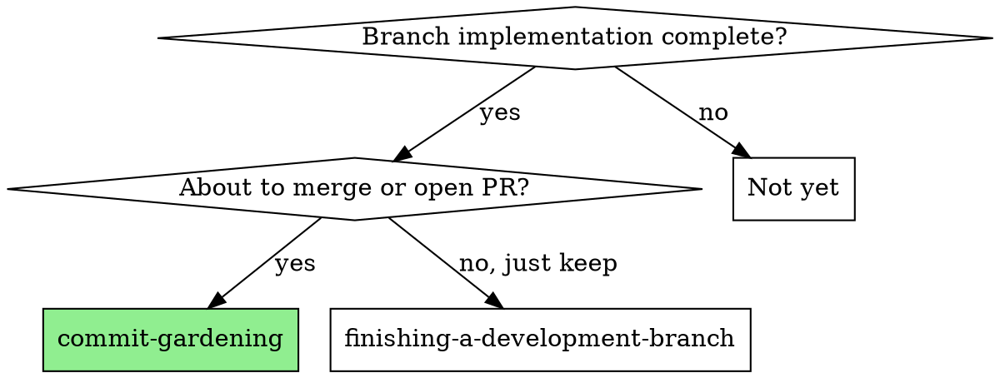
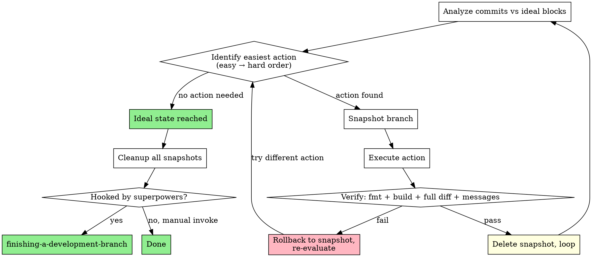

# Commit Gardening

## Overview

Prune, shape, and organize commits on a feature branch before merge/PR. The skill runs a gradient-descent loop: analyze the current commit structure, identify the easiest squash/split/reorder action that moves toward an ideal block structure, snapshot, execute, verify, and loop until no more actions are needed. Each action is guarded by a git-branch snapshot with rollback on failure. When the ideal state is reached, clean up all snapshots. If invoked via the superpowers hook (from `finishing-a-development-branch`'s caller, e.g. SDD), hand off to `finishing-a-development-branch`; if invoked manually (e.g. `/commit-gardening`), do not.

## When to Use



**REQUIRED SUB-SKILL:** The agent must know `superpowers:finishing-a-development-branch` — this skill may hand off to it (see Step 9 for the conditional rule).

## The Gradient-Descent Loop



## Setup

Before starting the loop, determine the base commit (the fork point from the main branch):

```bash
BASE=$(git merge-base <base-branch> HEAD)
```

Confirm the base with the user if ambiguous. Then create the tracking file for snapshots:

```bash
mkdir -p .superpowers/commit-gardening
echo "" > .superpowers/commit-gardening/snapshots.txt
```

This file is the ONLY source of truth for which snapshot branches this skill session created.

## Step 1 — Analyze

Review the current commit structure:

```bash
git log --oneline ${BASE}..HEAD
git diff --stat ${BASE}..HEAD
```

Group the changes into ideal logical blocks. Each block should be:
- **High cohesion within, low coupling between**: a feature and its own docs/tests belong in ONE commit; only split into separate commits if they are genuinely independent concerns (e.g., a feature + a separate refactor that happened to be needed). Do NOT split by file type (feat vs test vs docs) if they serve the same feature.
- Independently verifiable (builds + tests pass — aspirational, not always enforceable).
- Self-contained for cherry-pick (includes its own docs/tests, not split across blocks).

Document the ideal block structure in the tracking file:

```
# Ideal blocks:
# 1. feat: <concern A> (files: ...)
# 2. test: <concern A tests> (files: ...)
# 3. feat: <concern B> (files: ...)
# ...
```

## Step 2 — Identify the Easiest Action

Compare current commits vs ideal blocks. Pick the easiest action that moves toward ideal. Difficulty order (always do easy first):

| Difficulty | Action | How |
|---|---|---|
| 1 (easiest) | Squash adjacent same-purpose commits | `git reset --soft <target>`, re-commit with combined message |
| 2 | Squash non-adjacent same-purpose commits | Cherry-pick sequence to reorder, then squash |
| 3 | Reorder commits to group related changes | `git checkout <base>`, cherry-pick commits in ideal order, force-reset branch |
| 4 | Split a commit by file | `git reset --mixed <target>`, re-stage by file group, re-commit each group |
| 5 (hardest) | Split a commit by hunk | `git add -p` or interactive staging — skip if the project discourages interactive git |

If no action is needed (current structure matches ideal), go to Step 7.

## Step 3 — Snapshot

Before executing any action, create a snapshot branch:

```bash
SEQ=$(($(wc -l < .superpowers/commit-gardening/snapshots.txt) + 1))
BRANCH=$(git rev-parse --abbrev-ref HEAD)
SNAP_NAME="cg-snap/${BRANCH}/$(printf '%02d' ${SEQ})"
git branch "${SNAP_NAME}"
echo "${SNAP_NAME}" >> .superpowers/commit-gardening/snapshots.txt
```

The snapshot is a named branch pointing at the current HEAD. If the action fails, you rollback to this exact state.

## Step 4 — Execute

Perform the chosen action. Use `git reset --soft` + re-commit for squash; cherry-pick sequences for reorder; `git reset --mixed` + selective `git add` for file-level split.

Commit messages must follow the project's conventions (imperative mood, `Assisted-by:` trailer if the project requires it, `--no-gpg-sign` if needed).

## Step 5 — Verify

After each action, verify ALL of:

1. **Format**: `cargo fmt --check` (or the project's formatter) passes.
2. **Build**: `cargo build` (or the project's build) passes.
3. **Diff integrity (strict)**: `git diff ${BASE}..HEAD` must be byte-for-byte identical to the snapshot branch's `git diff ${BASE}..${SNAP_NAME}`. Compare the full patch, not just `--stat`. Any content change (even a single line) means the action altered content, not just commit boundaries — rollback.
4. **Messages**: each new commit message is sensible (imperative mood, describes what changed, follows project trailer conventions).

If ALL pass: the action succeeded.
If ANY fail: the action failed — rollback.

## Step 6 — Branch (Success or Rollback)

**On success:**
```bash
git branch -D "${SNAP_NAME}"
# Remove from tracking file
sed -i "/^${SNAP_NAME}$/d" .superpowers/commit-gardening/snapshots.txt
```
Go to Step 1 (re-analyze with the new commit structure).

**On failure:**
```bash
git reset --hard "${SNAP_NAME}"
git branch -D "${SNAP_NAME}"
sed -i "/^${SNAP_NAME}$/d" .superpowers/commit-gardening/snapshots.txt
```
Re-evaluate: try a different action, or conclude no more safe actions are possible.

## Step 7 — Termination

The loop ends when ANY of:
- No more actions identified (current structure matches ideal).
- Remaining actions are all difficulty 5 (hunk-split) and the project discourages interactive git.
- The same action type failed twice — don't loop forever.

Report the final commit structure to the user.

## Step 8 — Cleanup All Snapshots

Read `.superpowers/commit-gardening/snapshots.txt`. For each entry:

```bash
while IFS= read -r snap; do
    [ -z "$snap" ] && continue
    if git rev-parse --verify "$snap" >/dev/null 2>&1; then
        git branch -D "$snap"
    fi
done < .superpowers/commit-gardening/snapshots.txt
```

Then delete the tracking file:

```bash
rm -f .superpowers/commit-gardening/snapshots.txt
rmdir .superpowers/commit-gardening 2>/dev/null || true
```

**Post-cleanup verification:**

```bash
git branch --list 'cg-snap/*'
```

This MUST return empty. If it does not, report the remaining branches to the user. Do NOT auto-delete untracked ones — they may belong to another session.

## Step 9 — Handoff (conditional)

If this skill was invoked as part of a superpowers flow (e.g., SDD's terminal handoff to `finishing-a-development-branch`, which calls commit-gardening instead), invoke `superpowers:finishing-a-development-branch` to handle the merge/PR/keep decision. This is the terminal step — do not re-invoke commit-gardening.

If this skill was invoked manually (e.g., the user typed `/commit-gardening`), do NOT invoke `finishing-a-development-branch`. Report the final commit structure and stop. The user decides what to do next.

## Snapshot Safety Rules

- **Naming**: `cg-snap/<feature-branch>/<NN>` — includes the feature branch name so snapshots from different branches do not collide.
- **Tracking file**: `.superpowers/commit-gardening/snapshots.txt` — one branch name per line. The ONLY source of truth for which branches this skill created.
- **Cleanup scope**: ONLY delete branches listed in the tracking file. NEVER `git branch -D` a branch not in the file. NEVER use wildcards (`git branch -D 'cg-snap/*'` is forbidden — it could delete another session's snapshots).
- **Pre-cleanup check**: before deleting, verify each branch exists (`git rev-parse --verify`). If already deleted (e.g., by the success path), skip silently.
- **Post-cleanup verification**: `git branch --list 'cg-snap/*'` must return empty. If not, report to the user; do NOT auto-delete.

## Common Mistakes

| Mistake | Reality |
|---------|---------|
| "I'll squash everything into one commit" | One giant commit loses reviewability. Group by logical concern, not by "everything I did". |
| "I'll skip the snapshot, it's just a squash" | A bad squash loses commits permanently. Always snapshot. |
| "The diff stat matches, so it's fine" | Full `git diff` must match the snapshot, not just `--stat`. A stat match can hide content changes. |
| "I'll split feat + test + docs for the same feature into separate commits" | High cohesion within commits: a feature and its own docs/tests belong in ONE commit. Only split genuinely independent concerns. |
| "I'll use git rebase -i" | Interactive rebase is blocked in this harness. Use `git reset --soft` + re-commit, or cherry-pick sequences. |
| "I'll delete all cg-snap/* branches at the end" | Wildcard delete risks another session's snapshots. Only delete branches in the tracking file. |
| "I'll do the hard action first, it's more important" | Always do the easiest action first. Easy successes build momentum and reduce risk. |

## Common Rationalizations

| Excuse | Reality |
|--------|---------|
| "The commits are fine as-is" | If there are fixup/follow-up commits that should be squashed into their parent, the history is not clean. At least try one pass. |
| "Splitting by hunk is too hard, skip it" | If the project discourages interactive git, skip hunk-splits. But file-level splits are always doable. |
| "I don't need snapshots for a simple squash" | Even a simple squash can go wrong (wrong base, lost commit). The snapshot costs one `git branch` call. |
| "The tracking file is overhead" | Without it, you cannot guarantee cleanup. A stray snapshot branch is clutter forever. |
| "I'll do all actions at once, then verify" | One action per snapshot-verify cycle. If action 3 fails, you don't lose the gains from actions 1-2. |
