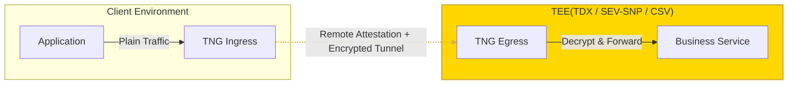

# TNG
[](/../../actions/workflows/build-docker.yml)
[](/../../actions/workflows/build-rpm.yml)
[](https://opensource.org/licenses/Apache-2.0)
[](https://www.rust-lang.org)
[](https://codecov.io/gh/inclavare-containers/TNG)

[中文文档](README_zh.md)

## What is TNG?

TNG (Trusted Network Gateway) is a transparent gateway tool for establishing secure communication tunnels in confidential computing environments. It enables end-to-end encrypted channels by configuring different Ingress and Egress endpoints, automatically verifying the trustworthiness of the communication peer's environment using Remote Attestation mechanisms, all without requiring modifications to existing applications.

## Data in Transit Security for Confidential Computing

In confidential computing environments, the security of processing private data is guaranteed by the hardware itself, but data security during network transmission remains insufficient. IETF RFC 9334 standardizes the overall architecture and participant roles for Remote Attestation (RATS), providing a general model for "how to prove an environment is trustworthy." Based on this model, for services running in confidential computing environments, we can use the "instance's own state (including running code and execution environment)" to prove who it is and what environment it is in, rather than just relying on an X.509 certificate. By introducing Remote Attestation into the key exchange process between both parties, combined with appropriate Remote Attestation Policies, we can achieve identity verification and security checks of the server's runtime environment. This approach effectively replaces traditional PKI trust systems, eliminates potential trust weaknesses, and thus bridges the gap in data transmission security in confidential computing scenarios, significantly improving overall security levels.

TNG is designed to package the "Remote Attestation + Encrypted Tunnel" capability based on the RFC 9334 standard into an easy-to-deploy, business-transparent gateway component. As shown in the deployment scenario diagram below, by deploying TNG instances in the trusted domains of both communication parties (configured as Ingress and Egress respectively), peer environment verification and end-to-end data encryption can be automatically completed at the network layer **without modifying business code**.



## Comparison with Other Solutions

- **Traditional TLS (PKI)**: Relies on Certificate Authorities (CA) to issue X.509 certificates for each service, establishing trust through a certificate chain. In practice, certificate application, distribution, installation, and regular rotation are cumbersome. Incorrect configuration or private key leakage can create weak links in the trust chain that are hard to detect promptly. Additionally, these solutions only verify "who the certificate belongs to" and cannot directly reflect whether the current runtime environment is authentic and untampered.
- **Various RA TLS Implementations (e.g., [rats-tls](https://github.com/inclavare-containers/rats-tls), [attested_tls](https://github.com/openenclave/openenclave/tree/master/samples/attested_tls))**: Usually require manual integration of corresponding libraries into user programs, leading to high integration costs. Configuration can also become very complex when fine-grained verification of the internal software environment is required. TNG can work with the Confidential Containers community's open-source remote attestation components [`guest-components`](https://github.com/confidential-containers/guest-components) and the remote attestation service [`trustee`](https://github.com/confidential-containers/trustee), supporting fine-grained, configurable remote attestation policy definitions. We also provide built-in RA TLS protocol support, implemented in pure Rust for better security. If you are preparing to use or are already using RA TLS, you can switch to this project without integrating RA TLS libraries in your business code.
- **Service Mesh Gateways**: Some solutions (like Envoy / Istio combined with SPIFFE) can establish end-to-end TLS tunnels between nodes by issuing X.509 certificates to workloads, but they do not incorporate remote attestation into the root of trust, still primarily relying on the validity of the certificates themselves. In contrast, besides supporting TLS-based tunnels, TNG also supports Oblivious HTTP (OHTTP) for message-level encryption and directly verifies whether the peer runtime environment is trustworthy through remote attestation, making it more suitable for scenarios requiring end-to-end "environment trust + data encryption."

## Key Features

- **Support for Multiple Encryption Protocols**: Provides support for protocols like RA-TLS for arbitrary TCP traffic and Oblivious HTTP (OHTTP) for HTTP message-level encryption, allowing various types of applications to uniformly access the remote attestation-based secure communication system.
- **Zero Business Intrusiveness**: Through transparent proxy (netfilter) or application-layer proxy (HTTP proxy, Socks5, etc.), TNG avoids changing existing business code and deployment structures, handling plaintext traffic at the network layer into the tunnel with encryption and remote attestation.
- **Various Deployment Forms**: We provide binary programs, SDKs, and other integration methods to flexibly choose deployment plans based on different business architectures, for example:
  - Running as a daemon in VMs or container instances in IaaS scenarios.
  - Providing transparent encryption for each Pod as a Sidecar container in Kubernetes / Service Mesh.
  - Making encrypted requests directly from the client side for browsers via the SDK.
- **Flexible Remote Attestation Models**: Supports combinations of unidirectional, bidirectional, and "reverse unidirectional" remote attestation. You can write configuration files based on business trust relationships, freely choosing whether the "client verifies the server," "both sides verify each other," or "server verifies the client."

If you want to understand more specific deployment methods and configuration examples, you can check the typical scenario documentation in the [docs/scenarios/](docs/scenarios/) directory.

## Installation and Usage

### Command Line Usage

TNG primarily starts gateway services through the `launch` subcommand. You can run it by loading a JSON configuration file or directly passing the configuration content on the command line:

```txt
Usage: tng launch [OPTIONS]

Options:
  -c, --config-file <CONFIG_FILE>
      --config-content <CONFIG_CONTENT>
  -h, --help                             Print help
```

You need to prepare a JSON format configuration file to start TNG.

> [!TIP]
> Before starting, it is recommended to read [Core Concepts and Workflow](docs/architecture.md) to understand TNG's working model, remote attestation roles, and encryption protocols, then refer to the [Detailed Configuration Manual](docs/configuration.md) to learn how to write configuration files.
> 
> Additionally, we provide some [examples](docs/scenarios/) of typical scenarios for your reference.

### Running TNG with Container Images

You can directly use our provided pre-built images, for example:

```sh
docker run -it --rm --privileged --network host --cgroupns=host \
  ghcr.io/inclavare-containers/tng:latest \
  tng launch --config-content='<your config json string>'
```


### Installing TNG via Package or Binary

You can obtain pre-compiled RPM packages or binary executables from the project's [Releases](https://github.com/inclavare-containers/TNG/releases) page.

- **Binary**: Simply download and extract to run.
- **RPM Package**: Suitable for distributions supporting RPM (e.g., Anolis OS, CentOS):

```sh
sudo rpm -ivh tng-<version>.rpm
sudo tng launch --config-file=/etc/tng/config.json
```

### Getting JavaScript SDK (Browser Side)

Browser environments can use the JavaScript SDK provided by `tng-wasm`. See [tng-wasm/README.md](tng-wasm/README.md) for acquisition methods and more complete examples. Below is a simple installation example:

```sh
# Assuming tng-<version>.tgz has been built under tng-wasm/pkg
npm install tng-<version>.tgz
```


## More Documentation

- **Detailed Configuration Manual**: For meanings of each configuration field and common templates, please refer to [docs/configuration.md](docs/configuration.md).
- **Core Concepts and Workflow**: Detailed introduction to TNG's Ingress/Egress model, remote attestation roles (AA/AS), and encryption protocols like RATS-TLS/OHTTP, please refer to [docs/architecture.md](docs/architecture.md).
- **Typical Scenarios**: Scenario documents containing topology diagrams and full configuration instructions, please refer to the [docs/scenarios/](docs/scenarios/) directory.
- **Developer Guide**: Instructions on building (Docker/RPM), deployment, and integration testing, please refer to [docs/developer.md](docs/developer.md).
- **Version Compatibility**: Detailed version compatibility notes (including data plane implementation changes between major versions), please refer to [docs/version_compatibility.md](docs/version_compatibility.md).
- **Integration Test Cases**: For more end-to-end test scenarios, refer to the source code under the [tng-testsuite/](tng-testsuite/) directory.
- **JavaScript SDK**: For acquisition and usage in browser environments, please refer to [tng-wasm/README.md](tng-wasm/README.md).

## Contribution

Community contributions are welcome to make TNG a better tool for confidential computing scenarios! If you have any questions or suggestions, please feel free to submit an Issue or Pull Request.

## License

Apache-2.0
