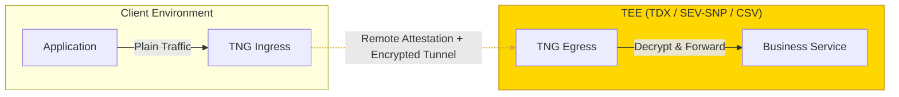

# TNG

[](/../../actions/workflows/build-docker.yml)
[](/../../actions/workflows/build-rpm.yml)
[](/../../actions/workflows/build-python-sdk.yml)
[](/../../actions/workflows/build-wasm-sdk.yml)
[](/../../actions/workflows/test.yml)
[](https://codecov.io/gh/inclavare-containers/TNG)
[](https://opensource.org/licenses/Apache-2.0)
[](https://www.rust-lang.org)

[中文文档](README_zh.md)

> **Trusted Network Gateway** — a transparent gateway that establishes **end-to-end encrypted tunnels with remote attestation** for confidential computing environments. Zero code changes required.

## Quick Start

```sh
# Run TNG with a single command — just provide a JSON config
docker run -it --rm --privileged --network host --cgroupns=host \
  ghcr.io/inclavare-containers/tng:latest \
  tng launch --config-content='<your config json>'
```

See [Installation](#installation) for Docker, RPM, binary, and SDK options.

---

## Table of Contents

- [What is TNG?](#what-is-tng)
- [How It Works](#how-it-works)
- [Key Features](#key-features)
- [Why TNG vs. Other Solutions?](#why-tng-vs-other-solutions)
- [Installation](#installation)
- [Project Structure](#project-structure)
- [Documentation](#documentation)
- [Contributing](#contributing)
- [License](#license)

---

## What is TNG?

TNG (Trusted Network Gateway) is a transparent gateway tool that brings **remote attestation + encrypted tunnel** capability to confidential computing, based on the [IETF RFC 9334](https://datatracker.ietf.org/doc/rfc9334/) (RATS) standard.

It enables two parties to automatically verify each other's runtime environment — *"who you are and what code you're running"* — and establish an end-to-end encrypted channel, **without modifying any business code**.


```mermaid
graph LR
    subgraph ClientEnv [Client Environment]
        App[Application]
        TNG_In[TNG Ingress]
    end

    subgraph TrustedEnv ["TEE (TDX / SEV-SNP / CSV)"]
        TNG_Eg[TNG Egress]
        Service[Business Service]
    end

    App -- Plain Traffic --> TNG_In
    TNG_In -. Remote Attestation + Encrypted Tunnel .-> TNG_Eg
    TNG_Eg -- Decrypt & Forward --> Service

    style TrustedEnv fill:#ffd700,stroke:#d4af37,stroke-width:2px
    linkStyle 1 stroke:#d4af37,stroke-width:2px
```

## How It Works

1. **Deploy** a pair of TNG instances — one as **Ingress** (tunnel entry, on the client side) and one as **Egress** (tunnel exit, on the server side in a TEE).

   > **Naming note:** "Ingress" means traffic *entering the tunnel*, not "incoming to a server." Think of it as the tunnel's front door — the client-side endpoint where plaintext traffic gets encrypted and sent through the tunnel. Egress is the opposite end where traffic exits the tunnel and reaches the destination service.
2. **Remote Attestation** — the Ingress verifies the Egress's TEE hardware, software hashes, and runtime configuration via the [Attestation Agent (AA)](docs/architecture.md#remote-attestation) and Attestation Service (AS).
3. **Encrypted Tunnel** — once verified, an end-to-end encrypted tunnel is established (RA-TLS or OHTTP).
4. **Transparent Forwarding** — plaintext traffic from the client application is automatically encrypted, forwarded through the tunnel, and decrypted at the server side — all at the network layer.

The entire process is **driven by a single JSON config file**. No SDK integration, no code changes, no certificate management.

## Key Features

| | |
|---|---|
| 🔐 **Multiple Protocols** | RA-TLS for arbitrary TCP traffic, OHTTP for HTTP message-level encryption |
| 🚫 **Zero Intrusiveness** | Transparent proxy via netfilter, HTTP proxy, or Socks5 — no business code changes |
| 📦 **Flexible Deployment** | VM daemon, K8s Sidecar, browser SDK — one binary, many forms |
| 🔀 **Bidirectional RA** | Unidirectional, bidirectional, or reverse-RA — configurable per your trust model |
| 🦀 **Pure Rust** | Built-in RA-TLS implemented in Rust for memory safety |
| 🧩 **CoCo Ecosystem** | Works with [`guest-components`](https://github.com/confidential-containers/guest-components) & [`trustee`](https://github.com/confidential-containers/trustee) |

## Why TNG vs. Other Solutions?

| Aspect | Traditional TLS (PKI) | RA-TLS Libraries | Service Mesh (SPIFFE) | **TNG** |
|---|---|---|---|---|
| **Trust Root** | CA-issued X.509 certs | TEE hardware evidence | CA-issued SPIFFE certs | **TEE hardware evidence** |
| **Runtime Verification** | No | Manual integration required | No | **Built-in, fine-grained** |
| **Code Changes** | App must handle TLS | App must link RA-TLS lib | Infrastructure-level | **None** |
| **Cert Management** | Apply, distribute, rotate | Manual | Automated via mesh | **Not needed** |
| **Deployment** | Per-app config | Per-app integration | Full mesh infra | **Single JSON config** |
| **Protocol Support** | TLS only | TLS variant | TLS only | **RA-TLS + OHTTP** |

## Installation

### Option 1: Docker (Recommended)

```sh
docker run -it --rm --privileged --network host --cgroupns=host \
  ghcr.io/inclavare-containers/tng:latest \
  tng launch --config-content='<your config json>'
```

### Option 2: RPM Package

```sh
sudo rpm -ivh tng-<version>.rpm
sudo tng launch --config-file=/etc/tng/config.json
```

### Option 3: Binary

Download the pre-built binary from [Releases](https://github.com/inclavare-containers/TNG/releases) and run directly.

### Option 4: JavaScript SDK (Browser)

```sh
npm install tng-wasm-<version>.tgz
```

Full SDK docs: [tng-wasm/README.md](tng-wasm/README.md)

### Option 5: Python SDK

```sh
pip install tng-python
```

Full SDK docs: [tng-python/README.md](tng-python/README.md)

> [!TIP]
> **New to TNG?** Start with [Core Concepts & Workflow](docs/architecture.md) to understand the Ingress/Egress model and remote attestation roles, then check the [Configuration Reference](docs/configuration.md) for all available fields.

## Project Structure

```
tng/             Core gateway binary (CLI) — the main entry point
rats-cert/       Certificate generation and management library
tng-wasm/        WebAssembly module + JavaScript SDK for browsers
tng-python/      Python SDK for programmatic integration
tng-testsuite/   Integration and e2e test cases
scripts/         Build, deploy, and CI helper scripts
docs/            Architecture, configuration, scenarios, and developer guides
```

## Documentation

| Document | Description |
|---|---|
| [Core Concepts & Workflow](docs/architecture.md) | Ingress/Egress model, RA roles (AA/AS), RATS-TLS & OHTTP protocols |
| [Configuration Reference](docs/configuration.md) | Complete field-by-field reference with examples |
| [Scenario Guides](docs/scenarios/) | Real-world deployment topologies with full configs |
| [Developer Guide](docs/developer.md) | Build from source (Docker/RPM), run tests, integrate |
| [Version Compatibility](docs/version_compatibility.md) | Breaking changes and migration notes between versions |
| [JavaScript SDK](tng-wasm/README.md) | Browser-side SDK usage and examples |
| [Python SDK](tng-python/README.md) | Python SDK usage and examples |

## Contributing

Contributions are welcome! Please feel free to submit an [Issue](https://github.com/inclavare-containers/TNG/issues) or [Pull Request](https://github.com/inclavare-containers/TNG/pulls).

Before pushing, ensure:

```bash
make clippy && cargo fmt --check && cargo build
```

See [Developer Guide](docs/developer.md) for detailed build and test instructions.

## License

[Apache-2.0](LICENSE)
