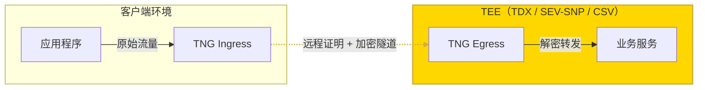

# TNG
[](/../../actions/workflows/build-docker.yml)
[](/../../actions/workflows/build-rpm.yml)
[](https://opensource.org/licenses/Apache-2.0)
[](https://www.rust-lang.org)
[](https://codecov.io/gh/inclavare-containers/TNG)

## What is TNG?

TNG (Trusted Network Gateway) 是一个用于在机密计算环境下建立安全通信隧道的透明网关工具。它能够在无需修改已有应用程序的同时，通过配置不同的入口（Ingress）和出口（Egress）端点，利用远程证明（Remote Attestation）机制自动验证通信对端环境的可信度，并建立端到端的加密通道。

## 机密计算的传输中数据安全 (Data in Transit)

在机密计算环境中，隐私数据的处理安全已由硬件环境本身提供保障，但在网络传输环节，数据的安全性仍然存在不足。IETF 在 RFC 9334 中对远程证明（RATS）的整体架构和参与角色做了标准化定义，为“如何证明一个运行环境是可信的”提供了通用模型。结合这一模型，对于运行在机密计算环境中的服务，我们可以利用“实例自身的状态（包括运行代码和执行环境）”来证明它是谁、处在什么环境，而不仅仅是依赖一张X.509证书。通过在通信双方的密钥协商过程中引入远程证明（Remote Attestation）机制，配合适当的远程证明策略（Policy），可以实现对服务端运行环境的身份验证以及安全性检查。这种方法能够有效替代传统的PKI信任体系，消除其潜在的信任弱点，从而弥补机密计算场景下数据传输安全的短板，显著提升整体安全水平。

TNG 正是为了将上述基于 RFC 9334 标准的“远程证明 + 加密隧道”能力打包成一个易部署、业务透明的网关组件。如下方部署场景示意图所示，通过在通信双方的可信域内分别部署 TNG 实例（分别配置为Ingress 与 Egress），即可在**无需修改业务代码**的前提下，在网络层自动完成对端环境验证与端到端的数据加密传输。



## 与其他方案的对比

- **传统 TLS (PKI)**：依赖证书颁发机构（CA）为每个服务签发 X.509 证书，通过证书链来建立信任关系。实际运维中，证书的申请、分发、安装和定期轮换都比较繁琐，一旦配置错误或证书私钥泄露，就会在信任链中形成难以及时发现的薄弱环节；同时，这类方案只验证“证书是谁的”，很难直接反映当前运行环境是否真实、未被篡改。
- **各种 RA TLS 实现 (如 [rats-tls](https://github.com/inclavare-containers/rats-tls), [attested_tls](https://github.com/openenclave/openenclave/tree/master/samples/attested_tls))**：通常需要用户程序手动集成相应的 library，接入成本较高。在对内部软件环境做精细验证时配置也会变得十分复杂。而 TNG 可以与 Confidential Containers 社区的开源远程证明组件 [`guest-components`](https://github.com/confidential-containers/guest-components)、远程证明服务 [`trustee`](https://github.com/confidential-containers/trustee) 配合，支持细粒度、可配置的远程证明策略定义；同时，我们也提供了内建的 RA TLS 协议支持，采用纯 Rust 实现，更加安全。如果您准备或正在使用 RA TLS，可以切换到本项目，无需在业务代码中集成 RA TLS 库。
- **Service Mesh 网关**：一些方案（如 Envoy / Istio 结合 SPIFFE）可以通过为工作负载颁发 X.509 证书，在节点间建立端到端 TLS 隧道，但它们并未把远程证明纳入信任根，仍然主要依赖证书本身的有效性；相比之下，TNG 在支持基于 TLS 的隧道之外，还支持消息级加密的 OHTTP，并通过远程证明直接验证对端运行环境是否可信，更适合需要端到端“环境可信 + 数据加密”的场景。

## 关键特性

- **支持多种加密传输协议**：提供面向任意 TCP 流量的 RA-TLS 以及面向 HTTP 消息级加密的 Oblivious HTTP 等协议支持，让各种类型的应用都能统一接入基于远程证明的安全通信体系。
- **对业务无侵入**：通过透明代理（netfilter）或应用层代理（HTTP 代理、Socks5 等）方式，TNG 可以尽量不改动现有业务代码和部署结构，在网络层把明文流量接入隧道、完成加解密和远程证明。
- **多种部署形态**：我们提供二进制程序、SDK等方式集成，可以根据不同的业务架构灵活选择部署方案，例如：
  - 在 IaaS 场景可以作为守护进程运行在虚拟机或容器实例中。
  - 在 Kubernetes / Service Mesh 中可以以 Sidecar 容器的方式为每个 Pod 提供透明加密。
  - 对于浏览器等客户端，还可以通过 SDK在端侧直接发起加密请求。
- **灵活的远程证明模型**：支持单向、双向以及“逆单向”的远程证明组合，您可根据业务信任关系编写配置文件，自由选择是“客户端验证服务端”、“双方互相验证”还是“服务端验证客户端”。

如果希望了解更具体的部署方式和配置示例，可以查看 [docs/scenarios/](docs/scenarios/) 目录下的典型场景说明文档。

## 安装与使用

### 基本命令行用法

TNG 主要通过 `launch` 子命令来启动网关服务。你可以通过加载 JSON 配置文件或直接在命令行中传入配置内容来运行：

```txt
Usage: tng launch [OPTIONS]

Options:
  -c, --config-file <CONFIG_FILE>
      --config-content <CONFIG_CONTENT>
  -h, --help                             Print help
```

你需要准备一个 JSON 格式的配置文件用来启动TNG。

> [!TIP]
> 在开始之前，建议您先阅读 [核心概念与工作原理](docs/architecture_zh.md) 以了解 TNG 的工作模型、远程证明角色及加密协议，之后您可以参考 [详细配置手册](docs/configuration_zh.md)了解如何编写配置文件。
> 
> 此外，我们还提供了一些典型场景的[示例](docs/scenarios/)供您参考

### 使用容器镜像运行 TNG

可以直接使用我们提供的预构建镜像，例如：

```sh
docker run -it --rm --privileged --network host --cgroupns=host \
  ghcr.io/inclavare-containers/tng:latest \
  tng launch --config-content='<your config json string>'
```


### 通过软件包或二进制文件安装 TNG

你可以从项目的 [Releases](https://github.com/inclavare-containers/TNG/releases) 页面获取预编译的 RPM 包或二进制可执行文件。

- **二进制文件**：下载并解压后即可直接运行。
- **RPM 包**：适合在支持 RPM 的发行版（如 Anolis OS、CentOS 等）上运行：

```sh
sudo rpm -ivh tng-<version>.rpm
sudo tng launch --config-file=/etc/tng/config.json
```

### 获取 JavaScript SDK（浏览器侧）

浏览器环境可以使用 `tng-wasm` 提供的 JavaScript SDK，获取方式和更完整的示例见 [tng-wasm/README_zh.md](tng-wasm/README_zh.md)。下面是一个简单的安装示例：

```sh
# 假设已经在 tng-wasm/pkg 下构建出了 tng-<version>.tgz
npm install tng-<version>.tgz
```


## 更多参考文档

- **详细配置手册**：关于每个配置字段的含义及常用模板，请参考 [docs/configuration_zh.md](docs/configuration_zh.md)。
- **核心概念与工作原理**：详细介绍 TNG 的 Ingress/Egress 模型、远程证明角色 (AA/AS) 以及 RATS-TLS/OHTTP 等加密协议原理，请参考 [docs/architecture_zh.md](docs/architecture_zh.md)。
- **典型场景详解**：包含拓扑图和完整配置说明的场景文档，请参考 [docs/scenarios/](docs/scenarios/) 目录。
- **开发者指南**：关于构建（Docker/RPM）、部署、集成测试的说明，请参考 [docs/developer_zh.md](docs/developer_zh.md)。
- **版本兼容性**：详细的版本兼容性说明（包括不同大版本的数据面实现变更），请参考 [docs/version_compatibility_zh.md](docs/version_compatibility_zh.md)。
- **集成测试用例**：更多端到端的测试场景，可参考 [tng-testsuite/](tng-testsuite/) 目录下的源代码。
- **JavaScript SDK**：浏览器环境下的获取与使用方式，请参考 [tng-wasm/README_zh.md](tng-wasm/README_zh.md)。


## 贡献

欢迎社区贡献，让TNG成为机密计算场景下更好的工具！如果有任何问题或建议，请随时提交 Issue 或 Pull Request。

## 许可证

Apache-2.0
