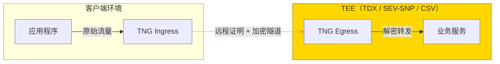

# TNG

[](/../../actions/workflows/build-docker.yml)
[](/../../actions/workflows/build-rpm.yml)
[](/../../actions/workflows/build-python-sdk.yml)
[](/../../actions/workflows/build-wasm-sdk.yml)
[](/../../actions/workflows/test.yml)
[](https://codecov.io/gh/inclavare-containers/TNG)
[](https://opensource.org/licenses/Apache-2.0)
[](https://www.rust-lang.org)

[English](README.md)

> **可信网络网关 (Trusted Network Gateway)** — 为机密计算环境提供**端到端远程证明加密隧道**的透明网关，业务代码零修改。

## 快速开始

```sh
# 一条命令启动 TNG — 只需提供 JSON 配置字符串
docker run -it --rm --privileged --network host --cgroupns=host \
  ghcr.io/inclavare-containers/tng:latest \
  tng launch --config-content='<your config json>'
```

详见下方 [安装](#安装) 部分，了解 Docker、RPM、二进制和 SDK 等多种安装方式。

---

## 目录

- [什么是 TNG？](#什么是-tng)
- [工作原理](#工作原理)
- [核心特性](#核心特性)
- [与其他方案对比](#与其他方案对比)
- [安装](#安装)
- [项目结构](#项目结构)
- [文档索引](#文档索引)
- [贡献](#贡献)
- [许可证](#许可证)

---

## 什么是 TNG？

TNG（Trusted Network Gateway，可信网络网关）是一个基于 [IETF RFC 9334](https://datatracker.ietf.org/doc/rfc9334/)（RATS）标准的透明网关工具，将**远程证明 + 加密隧道**能力打包成易部署、业务透明的网关组件。

它使通信双方能够自动验证对端的运行环境——*"你是谁，运行了什么代码"*——并建立端到端加密通道，**无需修改任何业务代码**。


```mermaid
graph LR
    subgraph ClientEnv [客户端环境]
        App[应用程序]
        TNG_In[TNG Ingress]
    end

    subgraph TrustedEnv ["TEE（TDX / SEV-SNP / CSV）"]
        TNG_Eg[TNG Egress]
        Service[业务服务]
    end

    App -- 原始流量 --> TNG_In
    TNG_In -. 远程证明 + 加密隧道 .-> TNG_Eg
    TNG_Eg -- 解密转发 --> Service

    style TrustedEnv fill:#ffd700,stroke:#d4af37,stroke-width:2px
    linkStyle 1 stroke:#d4af37,stroke-width:2px
```

## 工作原理

1. **部署** — 在通信双方各部署一个 TNG 实例，分别配置为 **Ingress**（隧道入口，客户端侧）和 **Egress**（隧道出口，TEE 服务端）。

   > **命名说明：** "Ingress" 在此表示流量**进入隧道**，而非"流量进入服务器"（如 Kubernetes Ingress 的含义）。它是隧道的前门——客户端将明文流量送入 Ingress 后，Ingress 将其加密并通过隧道发出。Egress 则是隧道的另一端，流量从隧道出来后被转发到目标服务。请从隧道的角度来理解这两个概念。
2. **远程证明** — Ingress 通过[证明代理 (AA)](docs/architecture_zh.md#远程证明)和证明服务 (AS) 验证 Egress 的 TEE 硬件、软件哈希和运行时配置。
3. **加密隧道** — 验证通过后，建立端到端加密隧道（RA-TLS 或 OHTTP）。
4. **透明转发** — 客户端应用的明文流量在网络层被自动加密、经隧道转发、在服务端解密——全程对业务透明。

整个过程由**一个 JSON 配置文件驱动**，无需 SDK 集成、无需代码改动、无需证书管理。

## 核心特性

| | |
|---|---|
| 🔐 **多种协议支持** | 面向 TCP 的 RA-TLS + 面向 HTTP 消息级加密的 OHTTP |
| 🚫 **业务零侵入** | 通过 netfilter 透明代理、HTTP 代理或 Socks5 接入，无需修改业务代码 |
| 📦 **灵活部署** | VM 守护进程、K8s Sidecar、浏览器 SDK — 一个二进制，多种形态 |
| 🔀 **双向远程证明** | 单向、双向、反向 RA — 根据信任模型灵活配置 |
| 🦀 **纯 Rust 实现** | 内置 RA-TLS 协议，纯 Rust 实现，内存安全 |
| 🧩 **CoCo 生态** | 与 [`guest-components`](https://github.com/confidential-containers/guest-components) 和 [`trustee`](https://github.com/confidential-containers/trustee) 配合使用 |

## 与其他方案对比

| 维度 | 传统 TLS (PKI) | RA-TLS 库 | Service Mesh (SPIFFE) | **TNG** |
|---|---|---|---|---|
| **信任根** | CA 签发的 X.509 证书 | TEE 硬件证据 | CA 签发的 SPIFFE 证书 | **TEE 硬件证据** |
| **运行时验证** | 不支持 | 需手动集成库 | 不支持 | **内建，细粒度可配置** |
| **代码改动** | 应用需处理 TLS | 应用需链接 RA-TLS 库 | 基础设施级别 | **无需改动** |
| **证书管理** | 申请、分发、轮换繁琐 | 手动管理 | 通过 Mesh 自动化 | **无需证书** |
| **部署方式** | 每个应用单独配置 | 每个应用集成 | 完整 Mesh 基础设施 | **单个 JSON 配置** |
| **协议支持** | 仅 TLS | TLS 变体 | 仅 TLS | **RA-TLS + OHTTP** |

## 安装

### 方式一：Docker（推荐）

```sh
docker run -it --rm --privileged --network host --cgroupns=host \
  ghcr.io/inclavare-containers/tng:latest \
  tng launch --config-content='<your config json>'
```

### 方式二：RPM 包

```sh
sudo rpm -ivh tng-<version>.rpm
sudo tng launch --config-file=/etc/tng/config.json
```

### 方式三：二进制文件

从 [Releases](https://github.com/inclavare-containers/TNG/releases) 页面下载预编译二进制文件，解压后即可运行。

### 方式四：JavaScript SDK（浏览器端）

```sh
npm install @inclavare-containers/tng
```

完整 SDK 文档：[tng-wasm/README_zh.md](tng-wasm/README_zh.md)

### 方式五：Python SDK

```sh
pip install tng-sdk
```

完整 SDK 文档：[tng-python/README_zh.md](tng-python/README_zh.md)

> [!TIP]
> **刚接触 TNG？** 建议先阅读 [核心概念与工作原理](docs/architecture_zh.md) 了解 Ingress/Egress 模型和远程证明角色，然后查看 [配置参考](docs/configuration_zh.md) 了解所有可用字段。

## 项目结构

```
tng/             核心网关二进制（CLI）— 主要入口
rats-cert/       证书生成与管理库
tng-hook/        LD_PRELOAD 钩子库（libtng_hook.so），用于 `tng exec` 透明端口拦截
tng-wasm/        WebAssembly 模块 + 浏览器 JavaScript SDK
tng-python/      Python SDK，用于程序化集成
tng-testsuite/   集成测试和端到端测试用例
scripts/         构建、部署和 CI 辅助脚本
docs/            架构、配置、场景和开发者指南
```

## 文档索引

| 文档 | 描述 |
|---|---|
| [核心概念与工作原理](docs/architecture_zh.md) | Ingress/Egress 模型、RA 角色 (AA/AS)、RATS-TLS 与 OHTTP 协议 |
| [配置参考](docs/configuration_zh.md) | 逐字段的完整配置参考与示例 |
| [场景指南](docs/scenarios/) | 真实部署拓扑与完整配置示例 |
| [开发者指南](docs/developer_zh.md) | 源码构建 (Docker/RPM)、运行测试、集成说明 |
| [版本兼容性](docs/version_compatibility_zh.md) | 大版本间的变更和迁移说明 |
| [JavaScript SDK](tng-wasm/README_zh.md) | 浏览器端 SDK 使用指南与示例 |
| [Python SDK](tng-python/README_zh.md) | Python SDK 使用指南与示例 |

## 贡献

欢迎社区贡献，让 TNG 成为机密计算场景下更好的工具！请随时提交 [Issue](https://github.com/inclavare-containers/TNG/issues) 或 [Pull Request](https://github.com/inclavare-containers/TNG/pulls)。

推送前确保通过以下检查：

```bash
make clippy && cargo fmt --check && cargo build
```

详细的构建和测试说明见 [开发者指南](docs/developer_zh.md)。

## 许可证

[Apache-2.0](LICENSE)
