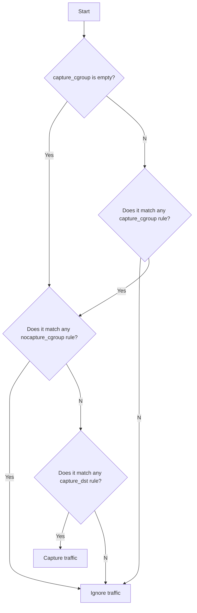

# Parameter Manual

## Top-Level Configuration Object

- **`control_interface`** (ControlInterface): The configuration of the control plane for the TNG instance.
- **`metrics`** (Metrics)：Specifies the configuration for Metrics, which is disabled by default.
- **`add_ingress`** (array [Ingress]): Add ingress endpoints of the tng tunnel in the `add_ingress` array. Depending on the client-side user scenario, you can choose the appropriate inbound traffic method.
- **`add_egress`** (array [Egress]): Add egress endpoints of the tng tunnel in the `add_egress` array. Depending on the server-side user scenario, you can choose the appropriate outbound traffic method.
- (Deprecated) **`admin_bind`** (AdminBind): Configuration for the Admin Interface of the Envoy instance. If this option is not specified, the Admin Interface feature will not be enabled.

## Ingress

The `Ingress` object is used to configure the ingress endpoints of the tng tunnel and control how traffic enters the tng tunnel. It supports multiple inbound traffic methods.

### Field Descriptions

- **`ingress_mode`** (IngressMode): Specifies the method for inbound traffic, which can be `mapping`, `http_proxy`, or `netfilter`.
- **`encap_in_http`** (EncapInHttp, optional): HTTP encapsulation configuration.
- (Deprecated) **`web_page_inject`** (boolean, optional, default is `false`): When enabled, this option injects a header bar at the top of the webpage to display the remote attestation status of the current page, providing strong awareness of remote attestation to browser users. Note that this feature requires the `encap_in_http` field to be specified simultaneously.
    > Notes: This feature is currently only supported in version before 2.0.0.
- **`no_ra`** (boolean, optional, default is `false`): Whether to disable remote attestation. Setting this option to `true` indicates that the tng uses a standard X.509 certificate for communication at this tunnel endpoint without triggering the remote attestation process. Please note that this certificate is a fixed, embedded P256 X509 self-signed certificate within the tng code and does not provide confidentiality, hence **this option is for debugging purposes only and should not be used in production environments**. This option cannot coexist with `attest` or `verify`.
- **`attest`** (Attest, optional): If this field is specified, it indicates that the tng acts as an Attester at this tunnel endpoint.
- **`verify`** (Verify, optional): If this field is specified, it indicates that the tng acts as a Verifier at this tunnel endpoint.

## IngressMode

### mapping: Port Mapping Mode

In this scenario, tng listens on a local TCP port (`in.host`, `in.port`) and encrypts all TCP requests before sending them to a specified TCP endpoint (`out.host`, `out.port`). Therefore, the user's client program needs to change its TCP request target to (`in.host`, `in.port`).

#### Field Descriptions

- **`r#in`** (Endpoint):
    - **`host`** (string, optional, default is `0.0.0.0`): The host address to listen on.
    - **`port`** (integer): The port number to listen on.
- **`out`** (Endpoint):
    - **`host`** (string): The target host address.
    - **`port`** (integer): The target port number.

Example:

```json
{
    "add_ingress": [
        {
            "mapping": {
                "in": {
                    "host": "0.0.0.0",
                    "port": 10001
                },
                "out": {
                    "host": "127.0.0.1",
                    "port": 20001
                }
            },
            "verify": {
                "as_addr": "http://127.0.0.1:8080/",
                "policy_ids": [
                    "default"
                ]
            }
        }
    ]
}
```

### http_proxy: HTTP Proxy Mode

In this scenario, tng listens on a local HTTP proxy port. User containers can route traffic through the proxy to the tng client’s listening port by setting the `http_proxy` environment variable (or explicitly setting the `http_proxy` proxy when sending requests in the application code). The tng client then encrypts all user TCP requests and sends them to the original target address. Therefore, the user's client program does not need to modify its TCP request targets.

#### Field Descriptions

- **`proxy_listen`** (Endpoint): Specifies the listening address (`host`) and port (`port`) values for the `http_proxy` protocol exposed by tng.
    - **`host`** (string, optional, default is `0.0.0.0`): The local address to listen on.
    - **`port`** (integer): The port number to listen on.
- **`dst_filters`** (array [EndpointFilter], optional, default is an empty array): This specifies a filtering rule indicating the combination of target domain (or IP) and port that needs to be protected by the tng tunnel. Traffic not matched by this filtering rule will not enter the tng tunnel and will be forwarded in plaintext (ensuring that regular traffic requests that do not need protection are sent out normally). If this field is not specified or is an empty array, all traffic will enter the tng tunnel.
    - **`domain`** (string, optional, default is `*`): The target domain to match. This field does not support regular expressions but does support certain types of wildcards (*). For specific syntax, please refer to the [description document](https://www.envoyproxy.io/docs/envoy/latest/api-v3/config/route/v3/route_components.proto#config-route-v3-virtualhost) for the `domains` field of the `config.route.v3.VirtualHost` type in the envoy documentation.
    - **`domain_regex`** (string, optional, default is `.*`): This field specifies a regular expression for matching target domains. It supports full regular expression syntax. The `domain_regex` field and the `domain` field are mutually exclusive; only one of them can be specified simultaneously.
    - **`port`** (integer, optional, default is `80`): The target port to match. If not specified, the default is port 80.
- (Deprecated) **`dst_filter`** (EndpointFilter): Used in TNG version 1.0.1 and earlier as a required parameter, now replaced by `dst_filters`. This is retained for compatibility with older configurations.

Example:

```json
{
    "add_ingress": [
        {
            "http_proxy": {
                "proxy_listen": {
                    "host": "0.0.0.0",
                    "port": 41000
                },
                "dst_filters": [
                    {
                        "domain": "*.pai-eas.aliyuncs.com",
                        "port": 80
                    }
                ]
            },
            "verify": {
                "as_addr": "http://127.0.0.1:8080/",
                "policy_ids": [
                    "default"
                ]
            }
        }
    ]
}
```

### socks5: Socks5 Proxy Mode

In this scenario, TNG creates a local SOCKS5 proxy server port. User applications can connect to this SOCKS5 proxy server, thereby proxying requests to TNG, which is responsible for encrypting all user TCP requests and sending them to the original destination address. In this process, the user's client program only needs to configure a SOCKS5 proxy option and does not need to modify the target of its TCP requests.

#### Field Descriptions

- **`proxy_listen`** (Endpoint): Specifies the listening address (`host`) and port (`port`) values for the `socks5` protocol port exposed by TNG.
  - **`host`** (string, optional, default is `0.0.0.0`): The local address to listen on.
  - **`port`** (integer): The port number to listen on.
- **`auth`** (Socks5Auth, optional): Specifies the authentication method required for accessing the locally listened SOCKS5 port. You can use this option to restrict access to the SOCKS5 proxy port to only those programs that know the password.
  - **`username`** (string): The username required for SOCKS5 proxy authentication.
  - **`password`** (string): The password required for SOCKS5 proxy authentication.
- **`dst_filters`** (array [EndpointFilter], optional, default is an empty array): This specifies a filtering rule indicating the combination of target domain (or IP) and port that needs to be protected by the tng tunnel. Traffic not matched by this filtering rule will not enter the tng tunnel and will be forwarded in plaintext (ensuring that regular traffic requests that do not need protection are sent out normally). If this field is not specified or is an empty array, all traffic will enter the tng tunnel.
    - **`domain`** (string, optional, default is `*`): The target domain to match. This field does not support regular expressions but does support certain types of wildcards (*). For specific syntax, please refer to the [description document](https://www.envoyproxy.io/docs/envoy/latest/api-v3/config/route/v3/route_components.proto#config-route-v3-virtualhost) for the `domains` field of the `config.route.v3.VirtualHost` type in the envoy documentation.
    - **`domain_regex`** (string, optional, default is `.*`): This field specifies a regular expression for matching target domains. It supports full regular expression syntax. The `domain_regex` field and the `domain` field are mutually exclusive; only one of them can be specified simultaneously.
    - **`port`** (integer, optional, default is `80`): The target port to match. If not specified, the default is port 80.

> [!NOTE]
> There are two versions of the SOCKS5 protocol, which are referred to as:
> - `socks5`: SOCKS5 protocol where domain name resolution is performed on the client side.
> - `socks5h`: SOCKS5 protocol where domain name resolution is performed on the proxy server side.
> If your client uses `socks5` instead of `socks5h`, the SOCKS5 proxy server in tng will not be able to obtain the original domain name of the client request, but only the destination IP address. This may cause your `dst_filters` rules to be ineffective. Fortunately, most modern clients implement the `socks5h` version, or provide both options (e.g., curl). If your client does not support `socks5h`, please add matching rules based on IP addresses, or switch to another type of ingress such as `http_proxy`.

Examples:

```json
{
    "add_ingress": [
        {
            "socks5": {
                "proxy_listen": {
                    "host": "0.0.0.0",
                    "port": 1080
                }
            },
            "verify": {
                "as_addr": "http://192.168.1.254:8080/",
                "policy_ids": [
                    "default"
                ]
            }
        }
    ]
}
```

```json
{
    "add_ingress": [
        {
            "socks5": {
                "proxy_listen": {
                    "host": "0.0.0.0",
                    "port": 1080
                },
                "auth": {
                    "username": "user",
                    "password": "ppppppwd"
                }
            },
            "verify": {
                "as_addr": "http://192.168.1.254:8080/",
                "policy_ids": [
                    "default"
                ]
            }
        }
    ]
}
```

```json
{
    "add_ingress": [
        {
            "socks5": {
                "proxy_listen": {
                    "host": "0.0.0.0",
                    "port": 1080
                },
                "dst_filters": [
                    {
                        "domain": "*.example.com",
                        "port": 30001
                    }
                ]
            },
            "verify": {
                "as_addr": "http://192.168.1.254:8080/",
                "policy_ids": [
                    "default"
                ]
            }
        }
    ]
}
```

### netfilter: Transparent Proxy Mode

In this mode, tng will listen on a local TCP port and forward user traffic to the port listened to by the tng client by configuring iptables rules. The latter is responsible for encrypting all user TCP requests and sending them to the original destination address. Therefore, the user's client program does not need to modify its TCP request target.

Precise control over the traffic to be captured can be achieved by configuring options such as the target TCP port and the cgroup where the program resides.

#### Field Descriptions

- **`capture_dst`** (array, optional, default is an empty array): Specifies the destination address and port of the traffic that needs to be captured by the tng tunnel. If this field is not specified or is set to an empty array, all traffic will be captured by the tng tunnel.

  This field contains multiple objects in the form of an array, each representing a matching rule used to match the destination address and port information of outbound TCP requests. The specific rule fields are as follows:

  - **Destination IP Address**: Can be specified in one of the following two ways. If not specified, it indicates a match for all destination IP addresses:
    - Specify a target IP address or CIDR block:
      - **`host`** (string): The target IP address or CIDR block to match. CIDR notation is supported. Examples include: `192.168.1.1`, `192.168.1.1/32`, `192.168.1.0/24`.
    - Specify an ipset group containing the target IPs:
      - **`ipset`** (string): The name of the ipset group to match.

  - **Destination Port** (optional): If not specified, it indicates a match for all destination port numbers.
    - **`port`** (integer): The target port number.
- **`capture_cgroup`** (array [string], optional, default is an empty array): Specifies the cgroup of the traffic that needs to be captured by the tng tunnel. If this field is not specified or is set to an empty array, the `capture_cgroup` rules will be ignored.
- **`nocapture_cgroup`** (array [string], optional, default is an empty array): Specifies the cgroup of the traffic that does not need to be captured by the tng tunnel.

> [!NOTE]
> - The `capture_cgroup` and `nocapture_cgroup` fields are only supported when your system uses **cgroup v2**.
> - **Relation to cgroup namespace**: Due to netfilter implementation limitations [\[[1\]](https://github.com/torvalds/linux/blob/ec7714e4947909190ffb3041a03311a975350fe0/net/netfilter/xt_cgroup.c#L105) [\[[2\]](https://github.com/torvalds/linux/blob/ec7714e4947909190ffb3041a03311a975350fe0/kernel/cgroup/cgroup.c#L6995-L6996), the cgroup path specified here is interpreted from the perspective of the cgroup namespace in which the TNG process itself resides. Therefore, if you run TNG separately in a container and need to configure the `capture_cgroup` and `nocapture_cgroup` fields, please use Docker's `--cgroupns=host` option accordingly.

- **`listen_port`** (integer, optional): Specifies the port number that tng listens on to receive captured requests, usually no manual specification is required. If this field is not specified, tng will randomly assign a port number.
- **`so_mark`** (integer, optional, default value is 565): The SO_MARK value of the socket corresponding to the TCP request carrying the cyphertext traffic after encryption by the tng, used to prevent the encrypted traffic from being redirected to this ingress again by netfilter.

Traffic capture follows the rules below:



> **Note**：This mode can only capture TCP traffic and will not capture traffic destined for address owned by any interfaces on the local machine.

Example:

```json
{
    "add_ingress": [
        {
            "netfilter": {
                "capture_dst": [
                    {
                        "host": "127.0.0.1",
                        "port": 30001
                    }
                ],
                "capture_cgroup": ["/tng_capture.slice"],
                "nocapture_cgroup": ["/tng_nocapture.slice"],
                "listen_port": 50000
            },
            "verify": {
                "as_addr": "http://127.0.0.1:8080/",
                "policy_ids": [
                    "default"
                ]
            }
        }
    ]
}
```

```json
{
    "add_ingress": [
        {
            "netfilter": {
                "capture_dst": [
                    {
                        "host": "192.168.1.0/24",
                        "port": 30001
                    }
                ],
                "capture_cgroup": ["/tng_capture.slice"],
                "nocapture_cgroup": ["/tng_nocapture.slice"],
                "listen_port": 50000
            },
            "verify": {
                "as_addr": "http://127.0.0.1:8080/",
                "policy_ids": [
                    "default"
                ]
            }
        }
    ]
}
```

```json
{
    "add_ingress": [
        {
            "netfilter": {
                "capture_dst": [
                    {
                        "ipset": "myset1",
                        "port": 30001
                    },
                    {
                        "ipset": "myset2",
                        "port": 30001
                    }
                ],
                "capture_cgroup": ["/tng_capture.slice"],
                "nocapture_cgroup": ["/tng_nocapture.slice"],
                "listen_port": 50000
            },
            "verify": {
                "as_addr": "http://127.0.0.1:8080/",
                "policy_ids": [
                    "default"
                ]
            }
        }
    ]
}
```

## Egress

Add egress endpoints of the tng tunnel in the `add_egress` array. Depending on the server-side user scenario, you can choose the appropriate outbound traffic method.

### Field Descriptions

- **`egress_mode`** (EgressMode): Specifies the outbound traffic method, which can be `mapping` or `netfilter`.
- **`decap_from_http`** (DecapFromHttp, optional): HTTP decapsulation configuration.
- **`no_ra`** (boolean, optional, default is `false`): Whether to disable remote attestation. Setting this option to `true` indicates that the tng uses a standard X.509 certificate for communication at this tunnel endpoint without triggering the remote attestation process. Please note that this certificate is a fixed, embedded P256 X509 self-signed certificate within the tng code and does not provide confidentiality, hence **this option is for debugging purposes only and should not be used in production environments**. This option cannot coexist with `attest` or `verify`.
- **`attest`** (Attest, optional): If this field is specified, it indicates that the tng acts as an Attester at this tunnel endpoint.
- **`verify`** (Verify, optional): If this field is specified, it indicates that the tng acts as a Verifier at this tunnel endpoint.

## EgressMode

### mapping: Port Mapping Mode

In this scenario, tng listens on a local TCP port (`in.host`, `in.port`) and decrypts all TCP requests before sending them to a specified TCP endpoint (`out.host`, `out.port`). The user's server program needs to change its TCP listening port to listen on (`out.host`, `out.port`).

#### Field Descriptions

- **`in`** (Endpoint): Specifies the local TCP port that tng listens on.
    - **`host`** (string, optional, default is `0.0.0.0`): The local address to listen on.
    - **`port`** (integer): The port number to listen on.
- **`out`** (Endpoint): Specifies the target endpoint where decrypted TCP requests are sent.
    - **`host`** (string): The target address.
    - **`port`** (integer): The target port number.

Example:

```json
{
    "add_egress": [
        {
            "mapping": {
                "in": {
                    "host": "127.0.0.1",
                    "port": 20001
                },
                "out": {
                    "host": "127.0.0.1",
                    "port": 30001
                }
            },
            "attest": {
                "aa_addr": "unix:///run/confidential-containers/attestation-agent/attestation-agent.sock"
            }
        }
    ]
}
```

### netfilter: Port Hijacking Mode

In this scenario, the user's server program is already listening on a certain port on the local machine, and due to business reasons, it is inconvenient to change the port number or add new open ports for the tng. To allow the tng to decrypt TCP traffic sent to the server program's port (`capture_dst.host`, `capture_dst.port`), it is necessary to use the capabilities provided by the kernel's netfilter to redirect the traffic to the `listen_port` on which the tng is listening. After decrypting the traffic, the tng sends the TCP traffic to the original target (`capture_dst.host`, `capture_dst.port`).

#### Field Descriptions

- **`capture_dst`** (Endpoint): Specifies the target endpoint that needs to be captured by the tng.
    - **`host`** (string, optional, defaults to matching all local IP addresses on all ports): The target address. If not specified, it defaults to matching all local IP addresses on all ports on the machine (see the iptables option `-m addrtype --dst-type LOCAL`: [iptables-extensions.man.html](https://ipset.netfilter.org/iptables-extensions.man.html)).
    - **`port`** (integer): The target port number.
- **`capture_local_traffic`** (boolean, optional, default is `false`): If set to `false`, requests with a source IP that is the local machine's IP will be ignored during capture and not redirected to `listen_port`. If set to `true`, requests with a source IP that is the local machine's IP will also be captured.
- **`listen_port`** (integer, optional, default starts incrementing from port 40000): The port number on which the tng listens to receive traffic redirected by netfilter.
- **`so_mark`** (integer, optional, default value is 565): The SO_MARK value of the socket corresponding to the TCP request carrying the plaintext traffic after decryption by the tng, used to prevent the decrypted traffic from being redirected to this egress again by netfilter.

Example:

```json
{
    "add_egress": [
        {
            "netfilter": {
                "capture_dst": {
                    "host": "127.0.0.1",
                    "port": 30001
                },
                "capture_local_traffic": false,
                "listen_port": 40000,
                "so_mark": 565
            },
            "attest": {
                "aa_addr": "unix:///run/confidential-containers/attestation-agent/attestation-agent.sock"
            }
        }
    ]
}
```

## Attester

Parameters required to configure the TNG endpoint as a remote attestation Attester role.

> Currently, only supports obtaining evidence through the [Attestation Agent](https://github.com/confidential-containers/guest-components/tree/main/attestation-agent).

### Field Descriptions

- **`aa_addr`** (string): Specifies the address of the Attestation Agent (AA).
- **`refresh_interval`** (int, optional, default value is 600): Specifies the frequency of obtaining evidence from the Attestation Agent and updating its own X.509 certificate (in seconds). If set to 0, it requests the latest evidence each time a secure session is established.

Example:

```json
            "attest": {
                "aa_addr": "unix:///run/confidential-containers/attestation-agent/attestation-agent.sock"
            }
```

```json
            "attest": {
                "aa_addr": "unix:///run/confidential-containers/attestation-agent/attestation-agent.sock",
                "refresh_interval": 600
            }
```

## Verifier

Parameters required to configure the TNG endpoint as a remote attestation Verifier role.

> Currently, only supports consuming and verifying evidence received from the peer through the [Attestation Service](https://github.com/confidential-containers/trustee/tree/main/attestation-service).

### Field Descriptions

- **`as_addr`** (string): Specifies the URL of the Attestation Service (AS) to connect to. Supports connecting to the Attestation Service with both gRPC protocol and Restful HTTP protocol. By default, it is parsed as a Restful HTTP URL, which can be controlled by the `as_is_grpc` option.
- **`as_is_grpc`** (boolean, optional, default is false): If set to `true`, interprets `as_addr` as a gRPC URL.
- **`policy_ids`** (array of strings): Specifies the list of policy IDs to use.
- **`trusted_certs_paths`** (array of strings, optional, default is empty): Specifies the paths to root CA certificates used to verify the signature and certificate chain in the AS token. If multiple root CA certificates are specified, verification succeeds if any one of them verifies successfully. If this field is not specified or is set to an empty array, certificate verification is skipped.


Example: Connecting to a Restful HTTP type AS service

```json
            "verify": {
                "as_addr": "http://127.0.0.1:8080/",
                "policy_ids": [
                    "default"
                ]
            }
```

Example: Connecting to a gRPC type AS service

```json
            "verify": {
                "as_addr": "http://127.0.0.1:5000/",
                "as_is_grpc": true,
                "policy_ids": [
                    "default"
                ]
            }
```

Example: Specifying Root Certificate Paths for AS Token Verification

```json
            "verify": {
                "as_addr": "http://127.0.0.1:8080/",
                "policy_ids": [
                    "default"
                ],
                "trusted_certs_paths": [
                    "/tmp/as-ca.pem"
                ]
            }
```

## Attester and Verifier Combinations and Bidirectional Remote Attestation

By configuring different combinations of `attest` and `verify` properties at both ends of the tunnel (including ingress and egress), a flexible trust model can be achieved.

| Remote Attestation Scenario | TNG Client Configuration | TNG Server Configuration | Description |
|---|---|---|---|
| Unidirectional | `verify` | `attest` | Most common scenario, where the TNG server is in a TEE, and the TNG client is in a normal environment. |
| Bidirectional | `attest`, `verify` | `attest`, `verify` | The TNG server and TNG client are in two different TEEs. |
| (Reverse) Unidirectional | `attest` | `verify` | The TNG server is in a normal environment, and the TNG client is in a TEE. In this case, only the client certificate is verified. During the TLS handshake, the TNG server will use a fixed P256 X509 self-signed certificate embedded in the TNG code as its certificate. |
| No TEE (For Debugging Purposes Only) | `no_ra` | `no_ra` | Both the TNG server and TNG client are in non-TEE environments. In this case, a normal TLS session is established between the TNG client and TNG server through unidirectional verification. |

## Disguising as Layer 7 Traffic

In modern server-side development, communication between app clients and app servers commonly uses the HTTP protocol, and the link may pass through HTTP middleware (such as nginx reverse proxy, or Layer 7-only load balancing services). However, TNG's rats-tls traffic might not pass through these HTTP middlewares. To integrate TNG with minimal burden in the business, we offer a feature to disguise TNG's rats-tls traffic as Layer 7 HTTP traffic.

This feature can be achieved by configuring `EncapInHttp` in Ingress and `DecapFromHttp` in Egress.

Considering the characteristics of these intermediate components, TNG needs to retain some fields of the original traffic after being disguised as HTTP traffic to ensure normal operation of functions like routing and load balancing. However, for data confidentiality, the fields in the disguised HTTP traffic should not contain sensitive information. Therefore, TNG provides some rules to configure the fields of the disguised HTTP traffic:

1. The request method of the disguised HTTP traffic is uniformly `POST`.
2. The request path of the disguised HTTP traffic defaults to `/`, but it can be rewritten to the path of the disguised HTTP traffic using the `path_rewrites` field based on the path of the protected business HTTP request inside, using regular expressions.
3. The Host (or `:authority`) of the disguised HTTP traffic remains consistent with the protected business HTTP request inside.
4. The disguised HTTP traffic carries a request header named `tng`, which can be used to distinguish between normal traffic and disguised traffic. Meanwhile, the request headers in the original business traffic will be concealed.

> [!WARNING]  
> If the "Disguising as Layer 7 Traffic" feature is enabled, the protected business inside must be HTTP traffic, not ordinary TCP traffic.

### EncapInHttp: Disguising Inbound Traffic

The disguising capability can be enabled by specifying the `encap_in_http` field in the `add_ingress` object. If `encap_in_http` is not specified, the disguising capability will not be enabled.

#### Field Descriptions

- **`path_rewrites`** (array [PathRewrite], optional, default: empty array): This field specifies a list of parameters for rewriting the path of traffic using regular expressions. All rewrites will be applied in the order they appear in the `path_rewrites` list, and only one match will be performed per request. If an HTTP request does not match any valid member of the `path_rewrites` list, the default path for the encapsulated HTTP traffic will be set to `/`.

    - **`match_regex`** (string): A regular expression used to match the path of the inner protected HTTP request. The value of this field will be used to match the entire path string, not just a part of it.

    - **`substitution`** (string): When the original path of an HTTP request matches `match_regex`, the path of the encapsulated HTTP traffic will be replaced entirely with the value of `substitution`.

> [!NOTE]
> For syntax information about regular expressions, please refer to the <a href="#regex">Regular Expressions</a> section.

> [!NOTE]
> - Prior to version 2.0.0, the `substitution` field supported referencing captured groups using `\integer` (where `integer` starts from 1). For example, `\1` would be replaced by the content of the first captured group. Refer to the corresponding `substitution` field description in Envoy [here](https://www.envoyproxy.io/docs/envoy/latest/api-v3/type/matcher/v3/regex.proto#type-matcher-v3-regexmatchandsubstitute).
> - Starting from version 2.0.0, the above referencing rule has been deprecated. Instead, `$ref` syntax is supported to reference captured groups, where `ref` can be an integer (index of the capturing group) or a name (for named groups). Refer to [this documentation](https://docs.rs/regex/1.11.1/regex/struct.Regex.html#method.replace). Additionally, the `\integer` referencing rule is still supported for backward compatibility.

Example:

In this example, we add a PathRewrite rule that matches all user HTTP requests with paths that can be matched by `^/foo/bar/([^/]+)([/]?.*)$`. The path of the TNG tunnel's HTTP outer traffic will be rewritten to `/foo/bar/$1` (note that `$1` is a regular expression replacement rule).

```json
{
    "add_ingress": [
        {
            "mapping": {
                "in": {
                    "host": "0.0.0.0",
                    "port": 10001
                },
                "out": {
                    "host": "127.0.0.1",
                    "port": 20001
                }
            },
            "encap_in_http": {
                "path_rewrites": [
                    {
                        "match_regex": "^/foo/bar/([^/]+)([/]?.*)$",
                        "substitution": "/foo/bar/$1"
                    }
                ]
            },
            "verify": {
                "as_addr": "http://127.0.0.1:8080/",
                "policy_ids": [
                    "default"
                ]
            }
        }
    ]
}
```

### DecapFromHttp: Disguising Outbound Traffic

Corresponding to the inbound configuration, the outbound side can enable the dismantling of already disguised traffic by specifying the `decap_from_http` field in the `add_egress` object. If the `decap_from_http` field is not specified, it will not be enabled.

Additionally, by configuring the `allow_non_tng_traffic_regexes` sub-item, you can allow non-encrypted HTTP request traffic to enter the endpoint in addition to the encrypted TNG traffic. This can meet scenarios where both types of traffic are needed (such as health checks). The value of this sub-item is a JSON string list, where each item is a regular expression match statement. Only non-encrypted HTTP request traffic whose HTTP request PATH completely matches these regular expression statements will be allowed by TNG. The default value of the sub-item is `[]`, which means any non-encrypted HTTP requests are denied.

#### Field Descriptions

- **`allow_non_tng_traffic_regexes`** (array [string], optional, default is an empty array): This field specifies a list of regular expressions that allow non-encrypted HTTP request traffic to enter. Each element is a regular expression string, and only when the HTTP request path matches these regular expressions will non-encrypted HTTP request traffic be allowed.

> [!NOTE]
> For syntax information about regular expressions, please refer to the <a href="#regex">Regular Expressions</a> section.

Example:

```json
{
    "add_egress": [
        {
            "mapping": {
                "in": {
                    "host": "127.0.0.1",
                    "port": 20001
                },
                "out": {
                    "host": "127.0.0.1",
                    "port": 30001
                }
            },
            "decap_from_http": {
                "allow_non_tng_traffic_regexes": ["/api/builtin/.*"]
            },
            "attest": {
                "aa_addr": "unix:///run/confidential-containers/attestation-agent/attestation-agent.sock"
            }
        }
    ]
}
```

## Control Interface

> [!NOTE]
> This interface is distinct from the <a href="#envoy_admin_interface">Envoy Admin Interface</a> below. The latter is Envoy's built-in management interface, which we plan to remove in future versions.

### Field Description
- **`control_interface`** (ControlInterface, optional, default is empty): This field specifies the listening address and port for the control interface.
    - **`restful`** (Endpoint, optional, default is empty): This field specifies the configuration for the RESTful API. It includes the following subfields:
        - **`host`** (string, optional, default is `0.0.0.0`): The local address to listen on.
        - **`port`** (integer): The port number, required.

Example:

```json
                "control_interface": {
                    "restful": {
                        "host": "0.0.0.0",
                        "port": 50000
                    }
                }
```

In this example, tng will enable the Control Interface, and its RESTful API will listen on port `50000` at `0.0.0.0`.

### RESTful API

Exposes RESTful API endpoints, supporting the following operations:
- **`/livez`**: This endpoint returns the liveness status of the tng instance. If it returns `200 OK`, it indicates that the instance is running.
- **`/readyz`**: This endpoint returns the readiness status of the tng instance. If it returns `200 OK`, it indicates that the instance is running and ready to handle traffic.

## Envoy Admin Interface
<span id = "envoy_admin_interface"></span>

> [!WARNING]
> Due to the removal of Envoy, this option has been deprecated. Configuring this option will have no effect.

The `admin_bind` option can be used to enable the [Admin Interface](https://www.envoyproxy.io/docs/envoy/latest/operations/admin) capability of the Envoy instance.

> [!WARNING]  
> As this port does not use authentication, do not use this option in a production environment.

#### Field Descriptions

- **`admin_bind`** (Endpoint, optional, default is empty): This field specifies the listening address and port for the Envoy admin interface. It includes the following sub-fields:
    - **`host`** (string, optional, default is `0.0.0.0`): The local address to listen on.
    - **`port`** (integer): The port number to listen on, required.

Example:

In this example, the `admin_bind` field specifies that the Envoy admin interface listens on the address `0.0.0.0` and port `9901`.

```json
{
    "admin_bind": {
        "host": "0.0.0.0",
        "port": 9901
    }
}
```

## Observability

Observability refers to the monitoring of the system's operational status to help operations personnel understand the system's running conditions and take appropriate measures. The concept of observability includes three aspects: Log, Metric, and Trace.

### Log

The current version of TNG defaults to enabling the capability of outputting logs to standard output. Users can control the log level of tng by setting the value of the `RUST_LOG` environment variable. Supported levels include `error`, `warn`, `info`, `debug`, `trace`, and a special level `off`.

By default, the log level is set to `info`, and logging from all third-party libraries is disabled.

> [!NOTE]
> In addition to simple log levels, complex configurations are also supported. Please refer to the documentation for the [tracing-subscriber](https://docs.rs/tracing-subscriber/0.3.19/tracing_subscriber/filter/struct.EnvFilter.html#directives) crate.

### Metric

Observability refers to the monitoring of system runtime status to help operations personnel understand the system's operating conditions and take appropriate measures. The concept of observability includes three levels: Log, Metric, and Tracing. TNG currently includes support for Metrics.

In TNG, we provide the following Metrics:

<table>
    <tr>
        <th>Scope</th>
        <th>Name</th>
        <th>Type</th>
        <th>Labels</th>
        <th>Description</th>
    </tr>
    <tr>
        <td>Instance</td>
        <td><code>live</code></td>
        <td>Gauge</td>
        <td>None</td>
        <td><code>1</code> to indicates the server is alive, or <code>0</code> otherwise</td>
    </tr>
    <tr>
        <td rowspan="6">ingress/egress</td>
        <td><code>tx_bytes_total</code></td>
        <td>Counter</td>
        <td rowspan="6"><a href="#metric_labels">See below table</a></td>
        <td>The total number of bytes sent</td>
    </tr>
    <tr>
        <td><code>rx_bytes_total</code></td>
        <td>Counter</td>
        <td>The total number of bytes received</td>
    </tr>
    <tr>
        <td><code>cx_active</code></td>
        <td>Gauge</td>
        <td>The number of active connections</td>
    </tr>
    <tr>
        <td><code>cx_total</code></td>
        <td>Counter</td>
        <td>Total number of connections handled since the instance started</td>
    </tr>
    <tr>
        <td><code>cx_failed</code></td>
        <td>Counter</td>
        <td>Total number of failed connections since the instance started</td>
    </tr>
</table>

<span id="metric_labels">Export labels for ingress/egress</span> are as follows:

| Scope | Type | Labels | 
| --- | --- | --- |
| ingress | `mapping` | `ingress_type=mapping,ingress_id={id},ingress_in={in.host}:{in.port},ingress_out={out.host}:{out.port}` |
| ingress | `http_proxy` | `ingress_type=http_proxy,ingress_id={id},ingress_proxy_listen={proxy_listen.host}:{proxy_listen.port}` |
| egress | `mapping` | `egress_type=netfilter,egress_id={id},egress_in={in.host}:{in.port},egress_out={out.host}:{out.port}` |
| egress | `netfilter` | `egress_type=netfilter,egress_id={id},egress_listen_port={listen_port}` |

Currently, TNG supports the following types of exporters:

- **`otlp`**: Exports to endpoints compatible with the OpenTelemetry Protocol (OTLP), such as Prometheus and Jaeger.
- **`falcon`**: Exports to the open-falcon service.
- **`stdout`**: Prints to log output.

You can enable Metric support by specifying the `metric` field.

### Field Description

- **`metric`** (Metric, optional, default is empty): This field specifies the configuration of Metric. It includes the following subfields:
    - **`exporters`** (array [MetricExporter], optional, default is an empty array): This field specifies the list of Metric exporters. It includes the following subfields:
        - **`type`** (string): This field specifies the type of the Metric exporter.

- For the OTLP exporter (`type="otlp"`), it includes the following sub-fields:
    - **`protocol`** (string): This field specifies the data format type of the OTLP protocol, with the following optional values:
        - `grpc`: Reports using gRPC.
        - `http/protobuf`: Reports using HTTP, with content serialized in protobuf format.
        - `http/json`: Reports using HTTP, with content serialized in JSON format.
    - **`endpoint`** (string): This field specifies the URL of the OTLP endpoint.
    - **`headers`** (Map, optional): A list of HTTP Headers to be attached in the export request. For example, you can add an `Authorization` header to meet the authentication requirements of the OTLP endpoint. Additionally, regardless of whether this field is filled or not, headers can also be added via [environment variables](https://opentelemetry.io/docs/languages/sdk-configuration/otlp-exporter/#header-configuration).
    - **`step`** (integer, optional, default is 60): This field specifies the interval time step value for metric collection and reporting, in seconds.

- For the open-falcon exporter (`type="falcon"`), it includes the following subfields:
    - **`server_url`** (string): This field specifies the address of the open-falcon server.
    - **`endpoint`** (string): This field specifies the endpoint value bound to each metric.
    - **`tags`** (map [string], optional, default is empty): This field specifies additional tags for each metric. These tags will be sent to the open-falcon server along with the labels generated by TNG.
    - **`step`** (integer, optional, default is 60): This field specifies the interval time step value for metric collection and reporting, in seconds.

- For the `stdout` exporter (`type="stdout"`), it includes the following subfields:
    - **`step`** (integer, optional, default is 60): This field specifies the interval time step value for metric collection and printing, in seconds.

Example:

```json
{
    "metric": {
        "exporters": [
            {
                "type": "oltp",
                "protocol": "http/protobuf",
                "endpoint": "https://oltp.example.com/example/url",
                "headers": {
                    "Authorization": "XXXXXXXXX",
                },
                "step": 2
            }
        ]
    }
}
```

```json
{
    "metric": {
        "exporters": [
            {
                "type": "falcon",
                "server_url": "http://127.0.0.1:1988",
                "endpoint": "master-node",
                "tags": {
                    "namespace": "ns1",
                    "app": "tng"
                },
                "step": 60
            }
        ]
    }
}
```

```json
{
    "metric": {
        "exporters": [
            {
                "type": "stdout",
                "step": 60
            }
        ]
    }
}
```

### Trace

TNG supports the export of tracing events under the OpenTelemetry standard semantics, including Trace, Span, and Events information for each request.

The following types of exporters are supported:

- **`otlp`**: Export to an endpoint compatible with the OpenTelemetry Protocol (OTLP).  
- **`stdout`**: Print to standard output. Note that this exporter outputs Trace information synchronously (not asynchronously), which can significantly impact performance in high-concurrency scenarios, so it should only be used for debugging purposes.

You can enable support for Trace by specifying the `trace` field.


#### Field Description

- **`trace`** (Trace, optional, default is empty): This field specifies the configuration for Trace. It includes the following subfields:
    - **`exporters`** (array [TraceExporter], optional, default is an empty array): This field specifies the list of Trace exporters. It includes the following subfields:
        - **`type`** (string): This field specifies the type of the Trace exporter.

- For the OTLP exporter (`type="otlp"`), it includes the following subfields:
    - **`protocol`** (string): This field specifies the data format type of the OTLP protocol, with the following optional values:
        - `grpc`: Use gRPC for reporting.
        - `http/protobuf`: Use HTTP for reporting, with content serialized using protobuf.
        - `http/json`: Use HTTP for reporting, with content serialized using JSON.
    - **`endpoint`** (string): This field specifies the URL of the OTLP endpoint.
    - **`headers`** (Map, optional): This is a list of HTTP Headers to be attached to the export request. For example, you can add an `Authorization` header to meet the authentication requirements of the OTLP endpoint. Additionally, regardless of whether this field is filled or not, headers can also be added via [environment variables](https://opentelemetry.io/docs/languages/sdk-configuration/otlp-exporter/#header-configuration).

- For the stdout exporter (`type="stdout"`), no additional fields need to be configured.

Examples:

```json
{
    "trace": {
        "exporters": [
            {
                "type": "oltp",
                "protocol": "http/protobuf",
                "endpoint": "https://oltp.example.com/example/url"
            }
        ]
    }
}
```

```json
{
    "trace": {
        "exporters": [
            {
                "type": "stdout"
            }
        ]
    }
}
```


## Regular Expressions
<span id="regex"></span>

Some fields in the TNG configuration file allow the specification of regular expressions. During the evolution of TNG, the syntax rules for regular expressions have been updated. The following provides an explanation:

- In versions prior to 2.0.0, only RE2 syntax was supported. RE2 is Google's regular expression engine. Its syntax format can be found [here](https://github.com/google/re2/wiki/Syntax). If you need to test the correctness of your syntax online, you can use tools available [here](https://re2js.leopard.in.ua/).
- Starting from version 2.0.0 and onwards, common regular expression syntax is supported instead of RE2 syntax. As a result, features such as look-around assertions and backreferences are not supported. Complete syntax rules can be found [here](https://docs.rs/regex/1.11.1/regex/index.html#syntax).
