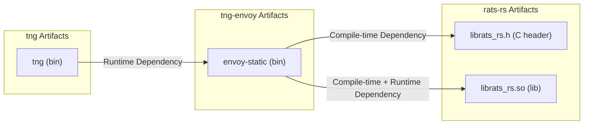

# Developer Guide

This guide will introduce the composition of this project and how to set up a source code development environment for TNG from scratch.

## Project Composition

The TNG source code consists of three parts: this repository, and two other components, [tng-envoy](https://github.com/inclavare-containers/tng-envoy) and [rats-rs](https://github.com/inclavare-containers/rats-rs).

To better track the version dependencies between each TNG version and the other two components, we use [git submodule](https://git-scm.com/book/en/v2/Git-Tools-Submodules) to manage dependencies, making [tng-envoy](https://github.com/inclavare-containers/tng-envoy) and [rats-rs](https://github.com/inclavare-containers/rats-rs) submodules of this project repository, as shown in the following diagram:

You can view the git commit IDs of the submodules corresponding to the current commit of this repository with the following command:

```sh
git submodule
```

Example output:
```txt
[root@0180caefdbb9 tng]# git submodule
 8f4e6e5f421c96b4840367085dc20c7519e5e425 deps/rats-rs (tng-1.0.5)
 be9f978e7f31bb7c6d1733dcfb65eefe5d036301 deps/tng-envoy (tng-1.0.5)
```

## Setting Up the Development Environment

## Obtaining the Source Code

Since one of TNG's components, [tng-envoy](https://github.com/inclavare-containers/tng-envoy), has a relatively complex compilation process, we recommend using the Docker environment provided by the upstream envoy project to compile tng-envoy and complete the compilation of TNG. The following steps will introduce the complete process:

1. Docker Environment Preparation

```sh
docker run -it --name tng-dev --privileged --network=host envoyproxy/envoy-build-ubuntu:26c6bcc3af3d6ad166c42b550de672d40209bc1c bash
```
The above command will create a container named tng-dev, which will serve as the development environment for TNG. We will continue with the subsequent steps inside this container.

If you accidentally exit the container, use the following commands to re-enter:
```sh
docker start tng-dev
docker exec -it tng-dev bash
```

2. Clone the Source Code

```sh
cd /
git clone https://github.com/inclavare-containers/tng.git --branch <tag-name>
cd tng
git submodule update --init
```
Now, you have the TNG repository source code in the `/tng` directory.

The directories `deps/rats-rs` and `deps/tng-envoy` contain the source code of rats-rs and tng-envoy, respectively, as submodules. You can directly modify them as if they were two ordinary git repositories.

## Compiling Components

There are dependency relationships among tng, tng-envoy, and rats-rs, so they need to be compiled in order.



### rats-rs Compilation

rats-rs is a pure Rust language project, but it exports a set of C APIs for integration with other language programs.

In TNG, rats-rs is a direct dependency of tng-envoy, providing C language header files (.h files) and dynamic libraries (.so files) for the latter. It is compiled and installed into the current environment using the following method:

1. Switch to the rats-rs directory

```sh
cd /tng/deps/rats-rs
```

2. Install Rust and the just tool

```sh
cat <<EOF >> ~/.bashrc
export RUSTUP_DIST_SERVER=https://mirrors.ustc.edu.cn/rust-static
export RUSTUP_UPDATE_ROOT=https://mirrors.ustc.edu.cn/rust-static/rustup
EOF

. ~/.bashrc

curl --proto '=https' --tlsv1.2 -sSf https://sh.rustup.rs | sh

mkdir -p ~/.cargo/
cat <<EOF > ~/.cargo/config
[source.crates-io]
replace-with = 'ustc'

[source.ustc]
registry = "git://mirrors.ustc.edu.cn/crates.io-index"
EOF

. "$HOME/.cargo/env"

ln -s -f /usr/bin/gcc /usr/bin/cc

cargo install just

apt install -y cmake g++ protobuf-compiler
```

2. Compile and Install

```sh
just install-c-api-coco
```

The above command installs the C API header files (.h files) and dynamic libraries (.so files) of rats-rs into the current environment, so that tng-envoy can reference them.

### tng-envoy Compilation

1. Prepare a New User

tng-envoy uses Bazel as the build tool, and Bazel cannot run as the root user. Therefore, we need to create a new user to run the compilation commands.

```sh
useradd -m -s /bin/bash newuser
chown -R newuser:newuser /tng/deps/tng-envoy/
```
The above command creates a new user named newuser and grants the necessary permissions.

2. Switch to the New User

```sh
su - newuser
```

Note: Switch back to the root user when compiling other components.

3. Switch to the tng-envoy directory

```sh
cd /tng/deps/tng-envoy
```

4. Configure Bazel

> This process only needs to be done once. Re-compilation does not require re-configuration.

```sh
bazel/setup_clang.sh /opt/llvm/
echo "build --config=clang" >> user.bazelrc
```

5. Compile and Install to System

```sh
bazel build -c opt envoy
cp /tng/deps/tng-envoy/bazel-bin/source/exe/envoy-static /usr/local/bin/envoy-static
```

> Note: Unless you have modified the C API interfaces in rats-rs or the code in tng-envoy, you can compile rats-rs separately after modifying its code without needing to recompile and reinstall tng-envoy.

### tng Compilation

1. Switch to the tng directory

```sh
cd /tng
```

2. Compile and Install tng

```sh
cargo install --locked --path . --root /usr/local/
```

Now, you can directly use the `tng` command to start a TNG instance.

> Note: If you have only modified the code of the other two components and not the Rust code of tng, you do not need to recompile and reinstall tng.

## Packaging RPM from the Development Environment

Generally, we recommend using the automated build process triggered by git, as described in [build-rpm.yml](/.github/workflows/build-rpm.yml), to package. If you have temporary packaging needs during development, you can use the following process.

1. Install Packaging Dependencies

```sh
apt install chrpath
```

2. Build the RPM Package

```sh
cat <<EOF > /tmp/trusted-network-gateway.spec
%global debug_package %{nil}

Name: trusted-network-gateway
Version: 1.0.0
Release: 1
Summary: Trusted Network Gateway
Group: Applications/System
License: ASL 2.0
URL: www.alibaba.com

Requires: curl iptables openssl

ExclusiveArch: x86_64

%description
A tool for establishing secure communication tunnels in confidential computing.

%install
# Install rats-rs
mkdir -p %{buildroot}/usr/lib64/tng/
install -p -m 644 /usr/local/lib/rats-rs/librats_rs.so %{buildroot}/usr/lib64/tng/
# Install tng
mkdir -p %{buildroot}/usr/bin/
install -p -m 755 /usr/local/bin/tng %{buildroot}/usr/bin/tng
# Install tng-envoy
install -p -m 755 /usr/local/bin/envoy-static %{buildroot}/usr/lib64/tng/envoy-static
chrpath --replace '\$ORIGIN' %{buildroot}/usr/lib64/tng/envoy-static

%define __requires_exclude librats_rs.so

%files
/usr/bin/tng
/usr/lib64/tng/envoy-static
/usr/lib64/tng/librats_rs.so
EOF

rpmbuild -ba /tmp/trusted-network-gateway.spec
```

The build artifacts will be located in the `~/rpmbuild/RPMS/x86_64/` directory. Please copy them to the target environment.

2. On the target environment, install the RPM package

First, uninstall the old version of TNG

```sh
yum remove trusted-network-gateway -y
```

Then, install the new version

```sh
yum install -y <path-to-rpm-package-on-target-environment>
```

Now, you can directly use the `tng` command to start a TNG instance.

## Running Tests

Some tests depend on attestation-agent and attestation-service instances. The following steps will introduce how to set them up.

### Compile and Run attestation-agent

1. Clone the Code

```sh
cd /
git clone https://github.com/inclavare-containers/guest-components.git
```

2. Compile

```sh
cd guest-components/attestation-agent
make ATTESTER=none ttrpc=true
```

Here, we will build an attestation-agent that can generate fake evidence materials, which is convenient for testing in a development environment without TEE hardware.

3. Install

```sh
make install
```

4. Run

```sh
RUST_LOG=debug attestation-agent --attestation_sock unix:///run/confidential-containers/attestation-agent/attestation-agent.sock
```

This will run an attestation-agent instance and create a ttrpc listener at `/run/confidential-containers/attestation-agent/attestation-agent.sock`.

### Compile and Run attestation-service

1. Install Dependencies

```sh
# Update apt sources
KUBIC_REPO_URL="https://download.opensuse.org/repositories/devel:kubic:libcontainers:stable/xUbuntu_20.04"
echo "deb ${KUBIC_REPO_URL} /" \
    | tee /etc/apt/sources.list.d/devel:kubic:libcontainers:stable.list
curl -fsSL "${KUBIC_REPO_URL}/Release.key" \
    | gpg --dearmor \
    | tee /etc/apt/trusted.gpg.d/devel_kubic_libcontainers_stable.gpg \
            > /dev/null

# Install dependencies
apt update && apt install -y gcc perl wget make gnupg openssl curl protobuf-compiler git clang libtss2-dev libudev-dev pkg-config && \
    curl -L https://download.01.org/intel-sgx/sgx_repo/ubuntu/intel-sgx-deb.key | tee intel-sgx-deb.key | apt-key add - && \
    echo 'deb [arch=amd64] https://download.01.org/intel-sgx/sgx_repo/ubuntu focal main' | tee /etc/apt/sources.list.d/intel-sgx.list && \
    apt-get update && apt-get install -y libsgx-dcap-default-qpl libsgx-dcap-quote-verify libsgx-dcap-quote-verify-dev
```

2. Clone the Code

```sh
cd /
git clone https://github.com/openanolis/trustee.git
```

3. Compile and Install

```sh
cd trustee/attestation-service
cargo install --path . --bin restful-as --features restful-bin --locked
```

4. Prepare Certificates

```sh
openssl req -x509 -sha256 -nodes -days 365 -newkey rsa:2048 -keyout /tmp/as-ca.key -out /tmp/as-ca.pem -nodes -subj "/O=Trustee CA" \
      -addext keyUsage=critical,cRLSign,keyCertSign,digitalSignature
openssl genrsa -out /tmp/as.key 2048
openssl req -new -key /tmp/as.key -out /tmp/as.csr -subj "/CN=Trustee/O=Trustee CA"
openssl x509 -req -in /tmp/as.csr -CA /tmp/as-ca.pem -CAkey /tmp/as-ca.key -CAcreateserial -out /tmp/as.pem -days 365 -extensions v3_req -extfile <(echo -e "[v3_req]\nsubjectKeyIdentifier = hash") -sha256

cat config.json | jq '.attestation_token_config.signer.cert_path="/tmp/as.pem" | .attestation_token_config.signer.key_path="/tmp/as.key"' > config_with_cert.json
```

4. Run

```sh
RUST_LOG=debug restful-as --socket 127.0.0.1:8080 --config-file /trustee/attestation-service/config_with_cert.json
```

This will run an attestation-service instance and create an HTTP RESTful listener at `127.0.0.1:8080`.

### Run TNG Tests

1. Install Dependencies

```sh
apt-get update && apt-get install -y curl iptables && update-alternatives --set iptables /usr/sbin/iptables-nft
```

2. Run Tests

```sh
make run-test
```
