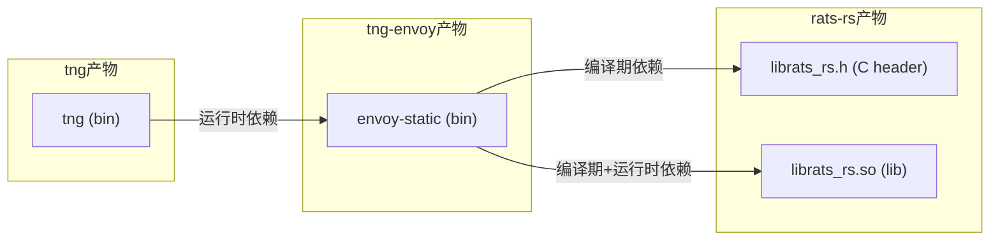

# 开发者指南

本指南将介绍本项目的组成，并介绍如何从头搭建一个TNG的源码开发环境

## 项目组成

TNG源码由三部分组成，除了本仓库，另外还有[tng-envoy](https://github.com/inclavare-containers/tng-envoy)和[rats-rs](https://github.com/inclavare-containers/rats-rs)两个组件。

为了更好地跟踪每一个TNG版本与其余两个组件的版本依赖关系，我们使用[git submodule](https://git-scm.com/book/zh/v2/Git-%e5%b7%a5%e5%85%b7-%e5%ad%90%e6%a8%a1%e5%9d%97) 来管理依赖项，将[tng-envoy](https://github.com/inclavare-containers/tng-envoy)和[rats-rs](https://github.com/inclavare-containers/rats-rs)作为了本项目仓库的子模块，如下图所示：

您可以通过以下命令来查看本仓库当前提交对应的子模块中的git commit id：

```sh
git submodule
```

输出例如：
```txt
[root@0180caefdbb9 tng]# git submodule
 8f4e6e5f421c96b4840367085dc20c7519e5e425 deps/rats-rs (tng-1.0.5)
 be9f978e7f31bb7c6d1733dcfb65eefe5d036301 deps/tng-envoy (tng-1.0.5)
```

## 开发环境搭建

## 获取源码

由于TNG的组件之一[tng-envoy](https://github.com/inclavare-containers/tng-envoy)的编译过程较为复杂，我们推荐使用上游envoy项目提供的Docker环境来编译tng-envoy，并且在里面完成TNG的编译。下面的步骤将介绍完整过程：

1. Docker环境准备

```sh
docker run -it --name tng-dev --privileged --network=host envoyproxy/envoy-build-ubuntu:26c6bcc3af3d6ad166c42b550de672d40209bc1c bash
```
上述命令将创建一个名为tng-dev的容器，该容器将作为TNG的开发环境。我们将在该容器中继续后面的步骤。

如果您不慎退出了该容器，使用如下命令重新进入
```sh
docker start tng-dev
docker exec -it tng-dev bash
```

2. 拉取源码

```sh
cd /
git clone https://github.com/inclavare-containers/tng.git --branch <tag名称>
cd tng
git submodule update --init
```
现在，你已经在`/tng`目录中拥有了tng仓库源码。

在目录`deps/rats-rs`和`deps/tng-envoy`则是rats-rs和tng-envoy这两个git submodule的源码，也已经一并clone下来，您可以直接在其中进行修改，就像它们是两个普通的git仓库一样。

## 编译组件

tng、tng-envoy和rats-rs三个组件之间存在依赖关系，因此，需要按顺序编译它们。




### rats-rs 编译

rats-rs是一个纯Rust语言项目，但是它导出了一组C API，方便与其他语言的程序集成。

在tng中，rats-rs是tng-envoy的一个直接依赖，它为后者提供C语言的头文件（.h文件），以及动态链接库（.so文件），使用如下方式编译并安装到当前环境中：

1. 切换到rats-rs目录下

```sh
cd /tng/deps/rats-rs
```

2. 安装Rust，和just工具

```sh
cat <<EOF >> ~/.bashrc
export RUSTUP_DIST_SERVER=https://mirrors.ustc.edu.cn/rust-static
export RUSTUP_UPDATE_ROOT=https://mirrors.ustc.edu.cn/rust-static/rustup
EOF

. ~/.bashrc

curl --proto '=https' --tlsv1.2 -sSf https://sh.rustup.rs | sh

mkdir -p ~/.cargo/
cat <<EOF > ~/.cargo/config
[source.crates-io]
replace-with = 'ustc'

[source.ustc]
registry = "git://mirrors.ustc.edu.cn/crates.io-index"
EOF

. "$HOME/.cargo/env"

ln -s -f /usr/bin/gcc /usr/bin/cc

cargo install just

apt install -y cmake g++ protobuf-compiler
```

2. 编译并安装 

```sh
just install-c-api-coco
```

上述命令将rats-rs的C API头文件（.h文件）和动态链接库（.so文件）安装到当前环境中，以便tng-envoy可以引用。

### tng-envoy 编译

1. 准备新用户

tng-envoy使用Bazel作为构建工具，Bazel无法使用root用户运行，因此，我们需要创建一个新用户来运行编译命令。

```sh
useradd -m -s /bin/bash newuser
chown -R newuser:newuser /tng/deps/tng-envoy/
```
上述创建了一个名为newuser的新用户，并授予了所需的权限。

2. 切换到新用户

```sh
su - newuser
```

注意，编译其他组件时，请切换回root用户。

3. 切换到tng-envoy目录下

```sh
cd /tng/deps/tng-envoy
```

4. 配置Bazel

> 该过程仅需做一次，重新编译时不需要再次配置

```sh
bazel/setup_clang.sh /opt/llvm/
echo "build --config=clang" >> user.bazelrc
```

5. 编译并安装到系统
```sh
bazel build -c opt envoy
cp /tng/deps/tng-envoy/bazel-bin/source/exe/envoy-static /usr/local/bin/envoy-static
```

> 提示：除非您对rats-rs中的C API接口做了改动，或者修改了tng-envoy的代码，否则，您在修改rats-rs的代码之后可以单独编译rats-rs，而不需要重新编译安装一遍tng-envoy。

### tng 编译

1. 切换到tng目录

```sh
cd /tng
```

2. 编译并安装tng
```sh
cargo install --locked --path . --root /usr/local/
```

现在，您可以直接使用tng命令来启动一个TNG实例了。

> 提示：如果您只是修改了其他两组件的代码，而并未修改tng的rust代码，您不需要重新编译和安装tng。


## 从开发环境打包rpm

一般来说，我们建议通过由git触发的[自动化的构建流程](/.github/workflows/build-rpm.yml)来打包，如果您在开发过程中有临时打包需求，可以使用如下流程。

1. 安装打包依赖

```
apt install chrpath
```

2. 构建rpm包

```sh
cat <<EOF > /tmp/trusted-network-gateway.spec
%global debug_package %{nil}

Name: trusted-network-gateway
Version: 1.0.0
Release: 1
Summary: Trusted Network Gateway
Group: Applications/System
License: ASL 2.0
URL: www.alibaba.com

Requires: curl iptables openssl

ExclusiveArch: x86_64

%description
A tool for establishing secure communication tunnels in confidential computing.

%install
# Install rats-rs
mkdir -p %{buildroot}/usr/lib64/tng/
install -p -m 644 /usr/local/lib/rats-rs/librats_rs.so %{buildroot}/usr/lib64/tng/
# Install tng
mkdir -p %{buildroot}/usr/bin/
install -p -m 755 /usr/local/bin/tng %{buildroot}/usr/bin/tng
# Install tng-envoy
install -p -m 755 /usr/local/bin/envoy-static %{buildroot}/usr/lib64/tng/envoy-static
chrpath --replace '\$ORIGIN' %{buildroot}/usr/lib64/tng/envoy-static

%define __requires_exclude librats_rs.so

%files
/usr/bin/tng
/usr/lib64/tng/envoy-static
/usr/lib64/tng/librats_rs.so
EOF

rpmbuild -ba /tmp/trusted-network-gateway.spec
```

产物将存放在`~/rpmbuild/RPMS/x86_64/`目录中，请将其拷贝到目标环境

2. 在目标环境上，安装rpm包

首先卸载旧版本tng

```sh
yum remove trusted-network-gateway -y
```
安装新版本
```sh
yum install -y <rpm包在目标环境中的路径>
```

现在，您可以直接使用tng命令来启动一个TNG实例了。


## 运行测试

部分测试需要依赖于attestation-agent和attestation-service实例，接下来步骤将介绍这部分的搭建。

### 编译并运行attestation-agent

1. 拉取代码

```sh
cd /
git clone https://github.com/inclavare-containers/guest-components.git
```

2. 编译

```sh
cd guest-components/attestation-agent
make ATTESTER=none ttrpc=true
```

这里我们将构建一个能够产生虚假evidence材料的attestation-agent，方便在没有TEE硬件的开发环境上进行测试。

3. 安装

```sh
make install
```

4. 运行

```sh
RUST_LOG=debug attestation-agent --attestation_sock unix:///run/confidential-containers/attestation-agent/attestation-agent.sock
```

这将运行一个attestation-agent实例，并在`/run/confidential-containers/attestation-agent/attestation-agent.sock`上创建ttrpc监听

### 编译并运行attestation-service

1. 安装依赖

```sh
# 更新apt源
KUBIC_REPO_URL="https://download.opensuse.org/repositories/devel:kubic:libcontainers:stable/xUbuntu_20.04"
echo "deb ${KUBIC_REPO_URL} /" \
    | tee /etc/apt/sources.list.d/devel:kubic:libcontainers:stable.list
curl -fsSL "${KUBIC_REPO_URL}/Release.key" \
    | gpg --dearmor \
    | tee /etc/apt/trusted.gpg.d/devel_kubic_libcontainers_stable.gpg \
            > /dev/null

# 安装依赖
apt update && apt install -y gcc perl wget make gnupg openssl curl protobuf-compiler git clang libtss2-dev libudev-dev pkg-config && \
    curl -L https://download.01.org/intel-sgx/sgx_repo/ubuntu/intel-sgx-deb.key | tee intel-sgx-deb.key | apt-key add - && \
    echo 'deb [arch=amd64] https://download.01.org/intel-sgx/sgx_repo/ubuntu focal main' | tee /etc/apt/sources.list.d/intel-sgx.list && \
    apt-get update && apt-get install -y libsgx-dcap-default-qpl libsgx-dcap-quote-verify libsgx-dcap-quote-verify-dev
```

2. 拉取代码

```sh
cd /
git clone https://github.com/openanolis/trustee.git
```

3. 编译和安装

```sh
cd trustee/attestation-service
cargo install --path . --bin restful-as --features restful-bin --locked
```

4. 准备证书

```sh
openssl req -x509 -sha256 -nodes -days 365 -newkey rsa:2048 -keyout /tmp/as-ca.key -out /tmp/as-ca.pem -nodes -subj "/O=Trustee CA" \
      -addext keyUsage=critical,cRLSign,keyCertSign,digitalSignature
openssl genrsa -out /tmp/as.key 2048
openssl req -new -key /tmp/as.key -out /tmp/as.csr -subj "/CN=Trustee/O=Trustee CA"
openssl x509 -req -in /tmp/as.csr -CA /tmp/as-ca.pem -CAkey /tmp/as-ca.key -CAcreateserial -out /tmp/as.pem -days 365 -extensions v3_req -extfile <(echo -e "[v3_req]\nsubjectKeyIdentifier = hash") -sha256

cat config.json | jq '.attestation_token_config.signer.cert_path="/tmp/as.pem" | .attestation_token_config.signer.key_path="/tmp/as.key"' > config_with_cert.json
```

4. 运行

```sh
RUST_LOG=debug restful-as --socket 127.0.0.1:8080 --config-file /trustee/attestation-service/config_with_cert.json
```

这将运行一个attestation-service实例，并在`127.0.0.1:8080`上创建HTTP restful监听

### 运行tng测试

1. 安装依赖

```sh
apt-get update && apt-get install -y curl iptables && update-alternatives --set iptables /usr/sbin/iptables-nft
```

2. 运行测试

```sh
make run-test
```
