# Peer Shared Key Sharing Protocol

This document describes the complete design of the `peer_shared` feature in TNG: how to decentralizedly share OHTTP private keys across a cluster of TNG instances, so that any node can decrypt traffic encrypted by another node's public key.

- Source code: `tng/src/tunnel/egress/protocol/ohttp/security/key_manager/peer_shared/`

## Design Goals

In stateless service deployments (e.g., multiple TNG Pods behind an HTTP LoadBalancer), each client request may reach any node. If every node uses a different OHTTP key pair, traffic encrypted with node A's public key cannot be decrypted when it arrives at node B. The `peer_shared` mode solves this problem through:

- **Shared cluster private key**: All nodes in the cluster use the same private key at any given time, rather than generating independent keys.
- **Decentralized synchronization**: Key broadcasting and synchronization between nodes is based on Serf (Gossip protocol), eliminating the need for a centralized key management service.
- **Smooth three-key rotation**: A Pending / Active / Stale three-state mechanism ensures uninterrupted service during key rotation.
- **Bidirectional remote attestation**: Nodes establish trusted communication channels through bidirectional remote attestation, ensuring only verified trusted nodes can participate in key sharing.

## Why Not Use Strong Consistency Protocols (e.g., Raft)?

- **Complex member management**: Raft-like protocols require additional orchestration for member management during cluster initialization, scaling, etc., to maintain leader node availability.
- **Availability trade-offs**: Strong consistency protocols sacrifice availability to achieve consensus. For example: (a) only the leader can provide the latest private key, which is unacceptable if every encryption request must hit the leader; (b) the cluster cannot independently serve traffic after a network partition.

## Architecture Overview

Each TNG instance runs a Serf client at startup, forming a decentralized cluster with other nodes via the Gossip protocol. Nodes establish encrypted channels through bidirectional remote attestation, broadcasting and synchronizing OHTTP key information over these channels.


### Configuration Examples

> The `peers` list requires only one known peer address (IP or domain + port). The new instance joins the cluster through this address and subsequently connects to all other nodes.

For detailed configuration options, refer to [configuration.md — peer_shared Mode](./configuration.md#ohttp-key-configuration-peer_shared-mode).

#### TNG Server Configuration

```json
{
    "add_egress": [
        {
            "netfilter": {
                "capture_dst": [
                    { "port": 8080 }
                ]
            },
            "ohttp": {
                "key": {
                    "source": "peer_shared",
                    "rotation_interval": 300,
                    "host": "0.0.0.0",
                    "port": 8301,
                    "peers": [
                        "10.0.0.1:8301"
                    ],
                    "attest": {
                        "aa_addr": "unix:///run/confidential-containers/attestation-agent/attestation-agent.sock"
                    },
                    "verify": {
                        "as_addr": "http://as.example.com:8080/",
                        "policy_ids": ["default"]
                    }
                }
            },
            "attest": {
                "aa_addr": "unix:///run/confidential-containers/attestation-agent/attestation-agent.sock"
            }
        }
    ]
}
```

#### TNG Client Configuration

The client side uses standard `add_ingress` configuration to send encrypted traffic to the server via OHTTP. No `peer_shared` fields are needed — the client automatically fetches the currently Active public key from the server.

```json
{
    "add_ingress": [
        {
            "mapping": {
                "in": {
                    "host": "127.0.0.1",
                    "port": 8080
                },
                "out": {
                    "host": "10.0.0.10",
                    "port": 8080
                }
            },
            "ohttp": {},
            "verify": {
                "as_addr": "http://as.example.com:8080/",
                "policy_ids": ["default"]
            }
        }
    ]
}
```

> **Note**: The examples above use external Attestation Agent and Attestation Service addresses for `attest` and `verify`. TNG also supports a **builtin** remote attestation mode that does not require deploying external services. In builtin mode, TNG verifies TEE evidence (e.g., TDX quotes) locally, which is suitable for single-machine deployments or simplified architectures. For details, see [configuration.md — Builtin AS Configuration](./configuration.md#builtin-as-configuration).

## Key Definitions

### KeyInfo

Each key is represented by a `KeyInfo` struct, containing the key configuration and its status.

| Field | Type | Description |
| --- | --- | --- |
| `key_config` | `ohttp::KeyConfig` | OHTTP key configuration (contains the private key) |
| `status` | `KeyStatus` | Current key status (see table below) |
| `actived_at` | `SystemTime` | Time when the key becomes active |
| `stale_at` | `SystemTime` | Time when the key transitions to Stale |
| `expire_at` | `SystemTime` | Time when the key expires |

The `KeyStatus` enum defines three key states:

| Status | Description | Used for decryption? | Public key exposed to clients? | Shared within the cluster? |
| --- | --- | --- | --- | --- |
| `Pending` | Waiting to be activated; already distributed but not yet effective | ✅ | ❌ | ✅ |
| `Active` | Active; can be provided to new clients | ✅ | ✅ | ✅ |
| `Stale` | Expired; only used to decrypt existing connections, not assigned to new clients | ✅ | ❌ | ✅ |

Key rotation behavior (single node view):


In a multi-node scenario, each node independently performs key status transitions locally, but new Pending keys are created and broadcast exclusively by the primary node.

[Source definition](https://github.com/alibaba/tng.better-serf/blob/main/tng/src/tunnel/egress/protocol/ohttp/security/key_manager/mod.rs)

### ClusterKeySet

Each TNG instance maintains a `ClusterKeySet`, using a `HashMap<PublicKeyData, KeyInfo>` as the single source of truth, with `KeyStatus` differentiating key states.

| Field | Type | Description |
| --- | --- | --- |
| `keys` | `HashMap<PublicKeyData, KeyInfo>` | All keys, indexed by public key |
| `rotation_interval` | `u64` | Rotation interval in seconds, default 300 |
| `notify` | `Option<Arc<tokio::sync::Notify>>` | Notifies the key watcher to check immediately |

[Source definition](https://github.com/alibaba/tng.better-serf/blob/main/tng/src/tunnel/egress/protocol/ohttp/security/key_manager/peer_shared/cluster_key_set.rs)

## TNG Instance Startup Process

### Flowchart

```mermaid
flowchart LR
    classDef startEnd fill:#f9f,stroke:#333,stroke-width:2px,rx:5,ry:5;
    classDef process fill:#e1f5fe,stroke:#0277bd,stroke-width:2px,rx:5,ry:5;
    classDef decision fill:#fff9c4,stroke:#fbc02d,stroke-width:2px,rx:5,ry:5;
    classDef subProcess fill:#e8f5e9,stroke:#2e7d32,stroke-width:2px,stroke-dasharray: 5 5;
    classDef event fill:#f3e5f5,stroke:#7b1fa2,stroke-width:2px;
    classDef error fill:#ffebee,stroke:#c62828,stroke-width:2px;
    classDef parallel fill:#fff3e0,stroke:#ef6c00,stroke-width:2px,stroke-dasharray: 2 2;

    subgraph Phase1_Init ["Phase 1: Initialization & Consensus (Preboot & Boot)"]
        Start((New Instance Created)):::startEnd --> JoinAll["Iterate peer list\nCall SerfJoin for each"]:::process
        JoinAll --> StartWatcher1["Start background: peer_list_watcher"]:::parallel
        StartWatcher1 --> PreBootCheck{"Other nodes\nin cluster?"}:::decision

        PreBootCheck -- No --> BootProc["Execute Boot"]:::subProcess
        PreBootCheck -- Yes --> QueryEvent["Send SerfQuery\n(QUERY_CLUSTER_KEY_SET)"]:::event
        QueryEvent --> CollectResp["Collect responses\nfrom all nodes"]:::process
        CollectResp --> HasSet{"Received valid\nClusterKeySet?"}:::decision

        HasSet -- Yes --> MergeKeys["Merge received ClusterKeySets\nas own"]:::process
        HasSet -- No --> CheckMinID{"Own node ID\nis smallest?"}:::decision

        CheckMinID -- Yes --> BootProc
        CheckMinID -- No --> RetryPreboot["Restart Preboot\n(wait for others)"]:::process
        RetryPreboot --> PreBootCheck

        BootProc --> GenKeys["Generate ClusterKeySet\n(one Pending + one Active)"]:::process
        GenKeys --> BroadcastEvent["Broadcast SerfUserEvent\n(BROADCAST_CLUSTER_KEY_SET)\nwith own ClusterKeySet"]:::event
        BroadcastEvent --> EnterWork
        MergeKeys --> EnterWork
    end

    subgraph Phase2_Work ["Phase 2: Work (parallel background tasks)"]
        EnterWork((Enter Work State)):::startEnd

        EnterWork --> StartWatcher2["Start background: key_watcher"]:::parallel
        EnterWork --> StartWatcher3["Start background: serf_watcher"]:::parallel
        EnterWork --> StartHandler["Start background: handle_client"]:::parallel

        subgraph SW_Key ["key_watcher (time-driven)"]
            WaitKeyChange(("Watch for key expiry\nin ClusterKeySet")):::event --> CheckStatus{Key type?}:::decision

            CheckStatus -- "Stale" --> CheckExpire{"expire_at\nexpired?"}:::decision
            CheckExpire -- Yes --> RemoveKey["Remove and discard"]:::process
            CheckExpire -- No --> WaitKeyChange

            CheckStatus -- "Active" --> CheckStale{"stale_at\nexpired?"}:::decision
            CheckStale -- Yes --> CountActive{"Other\nActive keys?"}:::decision
            CountActive -- Yes --> ToStale["Transition to Stale"]:::process
            CountActive -- No --> KeepActive["Keep unchanged\n(enforce at least one)"]:::process
            CheckStale -- No --> WaitKeyChange

            CheckStatus -- "Pending" --> CheckActiveTime{"actived_at\nexpired?"}:::decision
            CheckActiveTime -- Yes --> ToActive["Transition to Active"]:::process
            ToActive --> CheckLegacy{"Old Active keys kept\nbecause 'no other Active'?"}:::decision
            CheckLegacy -- Yes --> ForceStale["Force old Active\nto Stale"]:::process
            ForceStale --> TriggerRotCall["Trigger check_and_key_rotation"]:::event
            CheckLegacy -- No --> TriggerRotCall
            CheckActiveTime -- No --> WaitKeyChange
        end

        subgraph SW_Serf ["serf_watcher (event-driven)"]
            WaitSerf(("Watch Serf events")):::event --> SerfType{Event type?}:::decision

            SerfType -- "SerfMemberJoin" --> IgnoreJoin["No action"]:::process
            SerfType -- "SerfMemberLeave" --> TriggerRotCall2["Trigger check_and_key_rotation"]:::event
            SerfType -- "SerfUserEvent(BROADCAST_CLUSTER_KEY_SET)" --> MergeRemote["Merge remote ClusterKeySet"]:::process
            SerfType -- "SerfQuery(QUERY_CLUSTER_KEY_SET)" --> ReturnLocalSet["Return own ClusterKeySet"]:::process
            SerfType -- "SerfQuery(QUERY_KEY)" --> CheckHasKey{"Local has\nrequested key ID?"}:::decision

            CheckHasKey -- Yes --> ReturnKey["Return KeyInfo"]:::process
            CheckHasKey -- No --> ReturnNull["Return empty"]:::process

            IgnoreJoin -.-> WaitSerf
            MergeRemote -.-> WaitSerf
            ReturnLocalSet -.-> WaitSerf
            ReturnKey -.-> WaitSerf
            ReturnNull -.-> WaitSerf
        end

        subgraph Logic_Rot ["check_and_key_rotation logic"]
            TriggerRotCall & TriggerRotCall2 --> RotCheck{"Pending key\nexists?"}:::decision
            RotCheck -- No --> IsMaster{"Own node ID\nis smallest?"}:::decision
            IsMaster -- Yes --> CreatePending["Create new Pending key"]:::process
            CreatePending --> BroadcastEvent2["Broadcast SerfUserEvent\n(BROADCAST_CLUSTER_KEY_SET)\nwith own ClusterKeySet"]:::event
            IsMaster -- No --> WaitOthers["Wait for others"]:::process
            RotCheck -- Yes --> RotEnd[Done]:::startEnd
            BroadcastEvent2 --> RotEnd
            WaitOthers --> RotEnd
        end

        subgraph SW_Client ["handle_client (request-driven)"]
            WaitReq(("Watch for client\nrequests")):::event --> ReqType{Request type?}:::decision

            ReqType -- "Get public key" --> CountPub{"Active key count?"}:::decision
            CountPub -- "=1" --> RetSingle["Return directly"]:::process
            CountPub -- ">1" --> SelectBest["Return Active key with\nlatest stale_at + smallest ID"]:::process
            SelectBest --> RetSingle

            ReqType -- "Encrypted prompt" --> FindLocal{"ClusterKeySet\nhas this key?"}:::decision
            FindLocal -- Yes --> DecryptSvc["Process directly"]:::process
            FindLocal -- No --> QueryCluster["Fallback: send SerfQuery(QUERY_KEY)"]:::event
            QueryCluster --> FoundCluster{"Another node\nhas the key?"}:::decision
            FoundCluster -- Yes --> DecryptSvc
            FoundCluster -- No --> ErrNotFound["Return 'key not found' to client"]:::error

            RetSingle -.-> WaitReq
            DecryptSvc -.-> WaitReq
            ErrNotFound -.-> WaitReq
        end
    end

    subgraph Phase3_PeerWatch ["peer_list_watcher"]
        WatchPeer(("Watch peer list\nchanges")):::event --> NewPeer{"New node in\npeer list?"}:::decision
        NewPeer -- Yes --> JoinNewNode["Call SerfJoin to add it"]:::process
        NewPeer -- No --> WatchPeer
        JoinNewNode --> WatchPeer
    end

    StartWatcher1 -.-> Phase3_PeerWatch
    StartWatcher2 -.-> SW_Key
    StartWatcher3 -.-> SW_Serf
    StartHandler -.-> SW_Client

    linkStyle default stroke:#333,stroke-width:1.5px;
```



## Runtime Scenarios

### Cluster Scale-Out

**How a new instance joins the cluster**: The new instance initializes its Serf node with a random node ID and calls SerfJoin for all entries in the peer list. The peer list is provided as a file, and the background `peer_list_watcher` monitors it for changes, automatically joining new nodes when they appear. Therefore, the peer list must be kept up to date — ideally, at least one known peer should be present before the TNG instance starts.

**How the new instance obtains private keys**: During the Preboot phase, the new instance sends `SerfQuery(QUERY_CLUSTER_KEY_SET)` to all nodes in the cluster, merges all received ClusterKeySets into its own initial key set, then enters the Work state.

**How keys created by a new node are synced to others**: If the new instance fails to join the cluster immediately (e.g., network delay), it creates its own private key (when Preboot receives no valid ClusterKeySet and its own node ID is smallest, it executes Boot, generating a Pending + Active key and broadcasting it). After joining the cluster, other nodes receive the `SerfUserEvent(BROADCAST_CLUSTER_KEY_SET)` and obtain the key via Merge. The fallback path is `SerfQuery(QUERY_KEY)`.

**Two instances start simultaneously but cannot see each other**: Each believes it is the primary node (smallest node ID) and completes Boot independently, generating different key sets. Once they eventually connect through Serf, they exchange their ClusterKeySets via `SerfUserEvent(BROADCAST_CLUSTER_KEY_SET)` and merge them locally. At this point, multiple Active keys coexist in the cluster, but the system continues to work normally:
   - Any node can decrypt requests encrypted with any Active key (since it holds all keys locally).
   - When clients request a public key, the server always returns the Active key with the latest `stale_at` and smallest ID, ensuring consistency.
   - On the next key rotation, each node checks its own node ID: the node with a larger ID finds a smaller one exists and stops creating new keys. The smallest-ID node creates and broadcasts the new Pending key. Old keys gradually transition to Stale and are removed upon expiry, naturally converging to a single key.

### Cluster Scale-In

**When a node leaves**: Upon receiving a `SerfMemberLeave` event (which may indicate the primary node left), `check_and_key_rotation` is triggered immediately. This flow checks for an existing Pending key; if none exists, the node with the smallest ID among the remaining nodes creates a new Pending key and broadcasts it, ensuring key rotation does not stall due to node departure.

**Normal scale-in does not affect service**: Since key information is stored in each node's local ClusterKeySet, scale-in only reduces node count — no keys are lost. As long as at least one node remains, the cluster continues serving traffic.

### Key Rotation

**Primary node election**: The node with the smallest node ID acts as the primary node, responsible for creating new Pending keys and broadcasting. When the primary node leaves (detected via `SerfMemberLeave`), remaining nodes trigger `check_and_key_rotation`, and the new smallest-ID node automatically takes over.

**Pending key creation and broadcast**: When `check_and_key_rotation` fires and no Pending key exists, the primary node creates a new KeyInfo{Pending} with the following timestamps:
- `actived_at = max(stale_at of all Active keys)`
- `stale_at = actived_at + rotation_interval`
- `expire_at = stale_at + rotation_interval`

After creation, it is broadcast to the cluster via `SerfUserEvent(BROADCAST_CLUSTER_KEY_SET)`.

**Automatic key status transitions** (driven by `key_watcher`):
- Pending → Active: When `actived_at` arrives. After transition, any old Active keys that were kept because "no other Active" existed are force-converted to Stale.
- Active → Stale: When `stale_at` arrives. If other Active keys exist, the transition proceeds; otherwise the key is left unchanged (at least one Active key must remain available).
- Stale → Removed: When `expire_at` arrives, the key is directly removed and discarded.

**Why Pending keys are needed**: They are generated and broadcast ahead of `rotation_interval` (controlled by `ohttp.key.rotation_interval`, default 300 seconds / 5 minutes, which is far greater than Serf convergence time), and uniformly switch to Active upon expiry. This avoids service disruption caused by delayed key synchronization after rotation.

**Why Stale keys are needed**: After an Active key expires, it transitions to Stale and remains usable for `rotation_interval` duration. This handles cases where some clients have not yet received the new Active key.

### Fallback Query for Unknown Keys

When a node receives a request encrypted with an unknown public key (the key ID is not found in its local ClusterKeySet), it sends a `SerfQuery(QUERY_KEY)` to the cluster. This query is broadcast to all nodes via Serf's Query mechanism, and each node checks whether its ClusterKeySet contains the requested key ID:

- **If a node has the key**: It returns the KeyInfo as a Query response to the requesting node. The requesting node inserts the key into its local ClusterKeySet via `insert_key_from_peer` and then processes the client request normally. This allows keys to propagate dynamically within the cluster — even if some nodes temporarily missed the latest key broadcast, they can still obtain it through the fallback query.

- **If no node has the key**: The query times out and the client receives a "key not found" error.

This mechanism serves as a fallback for `BROADCAST_CLUSTER_KEY_SET`. Under normal conditions, keys are synchronized to all nodes via broadcast. However, network partitions, Serf message delays, or newly joined nodes that have not yet received the full key set may cause local key gaps. `SerfQuery(QUERY_KEY)` ensures service continuity in these scenarios rather than rejecting requests outright.

### Client Behavior

**Obtaining a public key**: When a client requests a public key, the server selects an Active key from its ClusterKeySet. If only one Active key exists, it is returned directly. If multiple Active keys exist, the one with the latest `stale_at` and smallest ID is returned (ensuring consistent results across multiple calls, which aids client-side caching).

**Client-side public key caching policy**: When a client requests a public key from a TNG instance, success replaces the existing cache; failure reports an error but preserves the current cache. When a client sends an encrypted inference prompt, success leaves the cache unchanged; failure due to `ShouldRequestNewKeyConfigFromServerError` clears the cache and reports an error (the next request will retry fetching the public key); other failure reasons report an error without clearing the cache.
