# Peer Shared 密钥共享协议

本文档介绍 TNG 中 `peer_shared` 特性的完整设计：在多个 TNG 实例组成的集群中，如何去中心化地共享 OHTTP 私钥，使任意节点都能解密由其他节点公钥加密的流量。

- 源码：`tng/src/tunnel/egress/protocol/ohttp/security/key_manager/peer_shared/`

## 设计目标

在无状态服务部署场景下（例如多个 TNG Pod 前方挂载 HTTP 负载均衡器），客户端每次请求可能到达任意节点。如果每个节点使用不同的 OHTTP 密钥对，客户端用 A 节点公钥加密的流量到达 B 节点时无法解密。`peer_shared` 模式通过以下方式解决此问题：

- **集群公用私钥**：集群内所有节点在同一时间使用同一把私钥，而非各自独立生成。
- **去中心化同步**：基于 Serf（Gossip 协议）实现节点间的密钥广播和同步，无需中心化的密钥管理服务。
- **三密钥平滑轮换**：采用 Pending / Active / Stale 三状态机制，确保密钥轮换期间服务不中断。
- **双向远程证明**：节点间通过双向远程证明建立可信通信信道，只有经过验证的可信节点才能参与密钥共享。

## 为什么不使用强一致性协议（如 Raft）？

- **成员管理复杂**：Raft 类协议在集群初始化、扩缩容等场景下需要额外的管控来维护主节点可用性。
- **可用性问题**：强一致性协议为达成一致将放弃部分可用性。例如：(a) 只有主节点能提供最新私钥，每次请求都访问主节点不可接受；(b) 集群分裂后无法独立提供服务。

## 架构概述

每个 TNG 实例启动时运行一个 Serf 客户端，通过 Gossip 协议与其他节点建立去中心化的集群。节点间通过双向远程证明建立加密通道，在此通道上广播和同步 OHTTP 密钥信息。


### 配置示例

> `peers` 列表中填写的是任意一个已知对等节点的地址（IP 或域名 + 端口），只需保证至少填写一个可达的地址即可。新实例会通过该地址加入集群，进而与所有其他节点建立连接。

`peer_shared` 模式的详细配置方式请参考 [configuration.md — peer_shared Mode](./configuration.md#ohttp-key-configuration-peer_shared-mode)。

#### TNG 服务端配置

```json
{
    "add_egress": [
        {
            "netfilter": {
                "capture_dst": [
                    { "port": 8080 }
                ]
            },
            "ohttp": {
                "key": {
                    "source": "peer_shared",
                    "rotation_interval": 300,
                    "host": "0.0.0.0",
                    "port": 8301,
                    "peers": [
                        "10.0.0.1:8301"
                    ],
                    "attest": {
                        "aa_addr": "unix:///run/confidential-containers/attestation-agent/attestation-agent.sock"
                    },
                    "verify": {
                        "as_addr": "http://as.example.com:8080/",
                        "policy_ids": ["default"]
                    }
                }
            },
            "attest": {
                "aa_addr": "unix:///run/confidential-containers/attestation-agent/attestation-agent.sock"
            }
        }
    ]
}
```

#### TNG 客户端配置

客户端侧使用标准的 `add_ingress` 配置，通过 OHTTP 协议将加密流量发送至服务端。无需额外指定 `peer_shared` 相关字段，客户端会自动从服务端获取当前 Active 的公钥。

```json
{
    "add_ingress": [
        {
            "mapping": {
                "in": {
                    "host": "127.0.0.1",
                    "port": 8080
                },
                "out": {
                    "host": "10.0.0.10",
                    "port": 8080
                }
            },
            "ohttp": {},
            "verify": {
                "as_addr": "http://as.example.com:8080/",
                "policy_ids": ["default"]
            }
        }
    ]
}
```

> **注意**：上述示例中 `attest` 和 `verify` 使用了外部 Attestation Agent 和 Attestation Service 的地址。实际上，TNG 支持内置（builtin）的远程证明验证功能，无需单独部署外部服务。内置模式下，TNG 在本地直接验证 TEE 证据（如 TDX Quote），适合单机部署或简化部署的场景。详细配置方式请参考 [configuration.md — Builtin AS Configuration](./configuration.md#builtin-as-configuration)。

## 私钥定义

### KeyInfo

每个密钥由一个 `KeyInfo` 结构体表示，包含密钥配置和状态信息。

| 字段 | 类型 | 说明 |
| --- | --- | --- |
| `key_config` | `ohttp::KeyConfig` | OHTTP 密钥配置（包含私钥） |
| `status` | `KeyStatus` | 密钥当前状态（见下表） |
| `actived_at` | `SystemTime` | 密钥激活时间 |
| `stale_at` | `SystemTime` | 密钥进入 Stale 状态的时间 |
| `expire_at` | `SystemTime` | 密钥过期时间 |

`KeyStatus` 枚举定义三种密钥状态：

| 状态 | 说明 | 用于解密请求？ | 公钥可公开给客户端？ | 可在集群内共享？ |
| --- | --- | --- | --- | --- |
| `Pending` | 等待激活，已分发到集群但尚未生效 | ✅ | ❌ | ✅ |
| `Active` | 活跃状态，可提供给新客户端使用 | ✅ | ✅ | ✅ |
| `Stale` | 已过期，仅用于解密现有连接，不再分配给新客户端 | ✅ | ❌ | ✅ |

密钥轮换行为（以单节点为例）：


多节点场景下，所有节点各自在本地进行密钥状态转换，但新密钥（Pending）的产生由主节点创建并广播。

[源码定义](https://github.com/alibaba/tng.better-serf/blob/main/tng/src/tunnel/egress/protocol/ohttp/security/key_manager/mod.rs)

### ClusterKeySet

每个 TNG 实例维护一个 `ClusterKeySet`，使用 `HashMap<PublicKeyData, KeyInfo>` 作为唯一数据源，通过 `KeyStatus` 区分密钥状态。

| 字段 | 类型 | 说明 |
| --- | --- | --- |
| `keys` | `HashMap<PublicKeyData, KeyInfo>` | 所有密钥，以公钥为索引 |
| `rotation_interval` | `u64` | 轮换间隔（单位：秒），默认 300 |
| `notify` | `Option<Arc<tokio::sync::Notify>>` | 用于通知密钥 watcher 立即检查 |

[源码定义](https://github.com/alibaba/tng.better-serf/blob/main/tng/src/tunnel/egress/protocol/ohttp/security/key_manager/peer_shared/cluster_key_set.rs)

## TNG 实例启动流程

### 流程图

```mermaid
flowchart LR
    classDef startEnd fill:#f9f,stroke:#333,stroke-width:2px,rx:5,ry:5;
    classDef process fill:#e1f5fe,stroke:#0277bd,stroke-width:2px,rx:5,ry:5;
    classDef decision fill:#fff9c4,stroke:#fbc02d,stroke-width:2px,rx:5,ry:5;
    classDef subProcess fill:#e8f5e9,stroke:#2e7d32,stroke-width:2px,stroke-dasharray: 5 5;
    classDef event fill:#f3e5f5,stroke:#7b1fa2,stroke-width:2px;
    classDef error fill:#ffebee,stroke:#c62828,stroke-width:2px;
    classDef parallel fill:#fff3e0,stroke:#ef6c00,stroke-width:2px,stroke-dasharray: 2 2;

    subgraph Phase1_Init ["阶段一：初始化与共识（Preboot & Boot）"]
        Start((新实例创建)):::startEnd --> JoinAll["遍历 Peer 列表\n对每个节点调用 SerfJoin"]:::process
        JoinAll --> StartWatcher1["启动后台：peer_list_watcher"]:::parallel
        StartWatcher1 --> PreBootCheck{"集群中有\n其他节点？"}:::decision

        PreBootCheck -- 否 --> BootProc["执行 Boot 流程"]:::subProcess
        PreBootCheck -- 是 --> QueryEvent["发起 SerfQuery\n(QUERY_CLUSTER_KEY_SET)"]:::event
        QueryEvent --> CollectResp["收集所有节点响应"]:::process
        CollectResp --> HasSet{"收到有效\nClusterKeySet？"}:::decision

        HasSet -- 是 --> MergeKeys["将所有收到的 ClusterKeySet\n合并作为自己的"]:::process
        HasSet -- 否 --> CheckMinID{"自身节点 ID\n是最小的吗？"}:::decision

        CheckMinID -- 是 --> BootProc
        CheckMinID -- 否 --> RetryPreboot["重新开始 Preboot\n（等待其他节点 Boot）"]:::process
        RetryPreboot --> PreBootCheck

        BootProc --> GenKeys["生成 ClusterKeySet\n（一个 Pending + 一个 Active）"]:::process
        GenKeys --> BroadcastEvent["广播 SerfUserEvent\n(BROADCAST_CLUSTER_KEY_SET)\n携带自己的 ClusterKeySet"]:::event
        BroadcastEvent --> EnterWork
        MergeKeys --> EnterWork
    end

    subgraph Phase2_Work ["阶段二：Work 流程（并行后台任务）"]
        EnterWork((进入 Work 状态)):::startEnd

        EnterWork --> StartWatcher2["启动后台：key_watcher"]:::parallel
        EnterWork --> StartWatcher3["启动后台：serf_watcher"]:::parallel
        EnterWork --> StartHandler["启动后台：handle_client"]:::parallel

        subgraph SW_Key ["key_watcher（时间驱动）"]
            WaitKeyChange(("监听 ClusterKeySet 中密钥到期")):::event --> CheckStatus{密钥类型？}:::decision

            CheckStatus -- "Stale" --> CheckExpire{"expire_at\n到期？"}:::decision
            CheckExpire -- 是 --> RemoveKey["移除并丢弃"]:::process
            CheckExpire -- 否 --> WaitKeyChange

            CheckStatus -- "Active" --> CheckStale{"stale_at\n到期？"}:::decision
            CheckStale -- 是 --> CountActive{"存在其他\nActive 密钥？"}:::decision
            CountActive -- 是 --> ToStale["变更为 Stale"]:::process
            CountActive -- 否 --> KeepActive["保留不动\n（强制至少保留一个）"]:::process
            CheckStale -- 否 --> WaitKeyChange

            CheckStatus -- "Pending" --> CheckActiveTime{"actived_at\n到期？"}:::decision
            CheckActiveTime -- 是 --> ToActive["变更为 Active"]:::process
            ToActive --> CheckLegacy{"存在因'无其他 Active'\n而保留的旧 Active 密钥？"}:::decision
            CheckLegacy -- 是 --> ForceStale["将旧 Active 密钥\n强制转为 Stale"]:::process
            ForceStale --> TriggerRotCall["触发 check_and_key_rotation"]:::event
            CheckLegacy -- 否 --> TriggerRotCall
            CheckActiveTime -- 否 --> WaitKeyChange
        end

        subgraph SW_Serf ["serf_watcher（事件驱动）"]
            WaitSerf(("监听 Serf 事件")):::event --> SerfType{事件类型？}:::decision

            SerfType -- "SerfMemberJoin" --> IgnoreJoin["不处理"]:::process
            SerfType -- "SerfMemberLeave" --> TriggerRotCall2["触发 check_and_key_rotation"]:::event
            SerfType -- "SerfUserEvent(BROADCAST_CLUSTER_KEY_SET)" --> MergeRemote["合并远程 ClusterKeySet"]:::process
            SerfType -- "SerfQuery(QUERY_CLUSTER_KEY_SET)" --> ReturnLocalSet["返回自己的 ClusterKeySet"]:::process
            SerfType -- "SerfQuery(QUERY_KEY)" --> CheckHasKey{"本地包含\n要求的密钥 ID？"}:::decision

            CheckHasKey -- 是 --> ReturnKey["返回 KeyInfo"]:::process
            CheckHasKey -- 否 --> ReturnNull["返回空"]:::process

            IgnoreJoin -.-> WaitSerf
            MergeRemote -.-> WaitSerf
            ReturnLocalSet -.-> WaitSerf
            ReturnKey -.-> WaitSerf
            ReturnNull -.-> WaitSerf
        end

        subgraph Logic_Rot ["check_and_key_rotation 逻辑"]
            TriggerRotCall & TriggerRotCall2 --> RotCheck{"存在\nPending 密钥？"}:::decision
            RotCheck -- 否 --> IsMaster{"自身是\n最小节点 ID？"}:::decision
            IsMaster -- 是 --> CreatePending["创建新的 Pending 密钥"]:::process
            CreatePending --> BroadcastEvent2["广播 SerfUserEvent\n(BROADCAST_CLUSTER_KEY_SET)\n携带自己的 ClusterKeySet"]:::event
            IsMaster -- 否 --> WaitOthers["等待其他节点操作"]:::process
            RotCheck -- 是 --> RotEnd[结束]:::startEnd
            BroadcastEvent2 --> RotEnd
            WaitOthers --> RotEnd
        end

        subgraph SW_Client ["handle_client（请求驱动）"]
            WaitReq(("监听客户端请求")):::event --> ReqType{请求类型？}:::decision

            ReqType -- "获取公钥" --> CountPub{"Active 密钥数量？"}:::decision
            CountPub -- "=1" --> RetSingle["直接返回"]:::process
            CountPub -- ">1" --> SelectBest["返回 Active 密钥中\n过期最晚且 ID 最小的"]:::process
            SelectBest --> RetSingle

            ReqType -- "携带加密提示词" --> FindLocal{"ClusterKeySet\n找到该密钥？"}:::decision
            FindLocal -- 是 --> DecryptSvc["直接处理"]:::process
            FindLocal -- 否 --> QueryCluster["兜底：发起 SerfQuery(QUERY_KEY)"]:::event
            QueryCluster --> FoundCluster{"集群其他节点\n有该密钥？"}:::decision
            FoundCluster -- 是 --> DecryptSvc
            FoundCluster -- 否 --> ErrNotFound["向客户端报错：密钥不存在"]:::error

            RetSingle -.-> WaitReq
            DecryptSvc -.-> WaitReq
            ErrNotFound -.-> WaitReq
        end
    end

    subgraph Phase3_PeerWatch ["peer_list_watcher"]
        WatchPeer(("监听 Peer 列表变化")):::event --> NewPeer{"有新节点\n出现在列表中？"}:::decision
        NewPeer -- 是 --> JoinNewNode["调用 SerfJoin 加入该节点"]:::process
        NewPeer -- 否 --> WatchPeer
        JoinNewNode --> WatchPeer
    end

    StartWatcher1 -.-> Phase3_PeerWatch
    StartWatcher2 -.-> SW_Key
    StartWatcher3 -.-> SW_Serf
    StartHandler -.-> SW_Client

    linkStyle default stroke:#333,stroke-width:1.5px;
```



## 运行场景说明

### 集群扩容

**新实例如何加入集群**：新实例使用随机节点 ID 初始化 Serf 节点，对 Peer 列表中所有节点调用 SerfJoin。Peer 列表以文件形式提供，后台 `peer_list_watcher` 会监控文件变更，当有新节点地址写入时自动调用 SerfJoin 加入。因此 Peer 列表需及时更新，最好在 TNG 实例启动前就已知集群中至少一个 Peer 节点。

**新实例如何获得私钥**：新实例进入 Preboot 流程后，会发起 `SerfQuery(QUERY_CLUSTER_KEY_SET)` 向集群中所有节点查询密钥集，将收到的所有 ClusterKeySet 合并作为自己的初始密钥集，然后进入 Work 状态。

**新节点创建的私钥如何同步给其他节点**：如果新实例未能立即加入集群（如网络延迟），会先自行创建私钥（Preboot 中未收到任何有效 ClusterKeySet 且自身节点 ID 最小时执行 Boot 流程，生成一个 Pending + 一个 Active 密钥并广播），随后加入集群。其他节点收到 `SerfUserEvent(BROADCAST_CLUSTER_KEY_SET)` 后通过 Merge 获得该私钥。兜底路径可通过 `SerfQuery(QUERY_KEY)` 查询。

**两个实例同时启动但互不可见**：双方各自认为自己是主节点（节点 ID 最小），各自完成 Boot 并生成不同的密钥集。当它们最终通过 Serf 连接上之后，通过 `SerfUserEvent(BROADCAST_CLUSTER_KEY_SET)` 交换各自的 ClusterKeySet 并 Merge 到本地。此时集群内存在多把 Active 密钥，但系统仍可正常工作：
   - 任意节点收到用任意 Active 密钥加密的请求都能解密（本地已包含所有密钥）。
   - 客户端获取公钥时，始终返回 `stale_at` 最晚且 ID 最小的 Active 密钥，保持一致。
   - 下一次触发密钥轮换时，每个节点检查自身节点 ID：ID 较大的节点发现存在比自己更小的节点，自动不再创建新密钥，由最小 ID 的节点负责创建 Pending 密钥并广播。旧密钥随时间依次转为 Stale 并过期移除，自然收敛为一把密钥。

### 集群缩容

**节点离开时的处理**：收到 `SerfMemberLeave` 事件时，可能是主节点离开，因此立即触发 `check_and_key_rotation` 流程。该流程会检查当前是否存在 Pending 密钥，若不存在则由剩余节点中节点 ID 最小的节点创建新的 Pending 密钥并广播，确保密钥轮换不会因节点离开而停滞。

**正常缩容不影响服务**：由于密钥信息存储在集群所有节点的本地 ClusterKeySet 中，缩容仅减少节点数量，不会导致密钥丢失。只要集群中至少保留一个节点，即可继续提供服务。

### 密钥轮换

**主节点选举**：集群中节点 ID 最小的节点担任主节点角色，负责创建新的 Pending 密钥并广播。当主节点离开时（通过 `SerfMemberLeave` 检测到），其余节点会触发 `check_and_key_rotation`，新的最小 ID 节点自动接管主节点职责。

**Pending 密钥的创建和广播**：当 `check_and_key_rotation` 触发且当前不存在 Pending 密钥时，主节点创建新的 KeyInfo{Pending}，其时间参数计算如下：
- `actived_at = max(所有 Active 密钥的 stale_at)`
- `stale_at = actived_at + rotation_interval`
- `expire_at = stale_at + rotation_interval`

创建完成后通过 `SerfUserEvent(BROADCAST_CLUSTER_KEY_SET)` 广播给全集群。

**密钥状态自动流转**（`key_watcher` 驱动）：
- Pending → Active：`actived_at` 到期时自动切换。切换后若存在因"无其他 Active"而保留的旧 Active 密钥，则将其强制转为 Stale。
- Active → Stale：`stale_at` 到期时，若存在其他 Active 密钥则切换；否则保留不动（强制至少保留一个 Active 密钥可用）。
- Stale → 移除：`expire_at` 到期后直接移除丢弃。

**为什么需要 Pending 密钥**：在 `rotation_interval`（由 `ohttp.key.rotation_interval` 字段控制，默认 300 秒即 5 分钟，远大于 Serf 收敛时间）之前提前生成并广播，到期后统一切换为 Active，避免轮换后短时间内密钥同步不到位导致的服务中断。

**为什么需要 Stale 密钥**：Active 密钥过期后转为 Stale，持续 `rotation_interval` 时间，期间仍可用于解密。这处理了部分客户端未及时获得新 Active 密钥的情况。


### 未知密钥兜底查询

当某个节点收到客户端使用未知公钥加密的请求时（本地 ClusterKeySet 中找不到对应的密钥 ID），会向集群发起 `SerfQuery(QUERY_KEY)` 查询。该查询通过 Serf 的 Query 机制广播到集群所有节点，每个节点检查自己的 ClusterKeySet 是否包含该密钥 ID：

- **如果某个节点包含该密钥**：将该密钥的 KeyInfo 作为 Query 响应返回给发起查询的节点。发起节点收到响应后，通过 `insert_key_from_peer` 将该密钥插入本地 ClusterKeySet，随后即可正常处理客户端请求。这种方式使得密钥可以在集群内动态传播，即使某些节点暂时未收到最新的密钥广播，也能通过兜底查询临时获得该密钥。

- **如果所有节点都不包含该密钥**：查询超时后向客户端报密钥不存在错误。

该机制是 `BROADCAST_CLUSTER_KEY_SET` 广播的兜底路径。正常情况下，密钥通过广播同步到所有节点，但网络分区、Serf 消息延迟或新节点刚加入尚未收到完整密钥集等场景下，本地可能缺失某些密钥。此时通过 `SerfQuery(QUERY_KEY)` 确保服务不中断，而非直接拒绝请求。


### 客户端行为

**获取公钥**：当客户端请求获取公钥时，服务端从 ClusterKeySet 中选择 Active 密钥返回。仅一个 Active 密钥时直接返回；多个 Active 密钥时返回 `stale_at` 最晚且 ID 最小的（确保多次返回结果一致，利于客户端缓存）。

**TNG 客户端侧的公钥缓存策略**：当客户端请求 TNG 实例获取公钥时，如果成功则替换现有缓存，如果失败则报告错误但保留现有缓存。当客户端携带加密推理提示词发起请求时，如果成功则不清除缓存；如果失败且原因为 `ShouldRequestNewKeyConfigFromServerError`，则清除缓存并报告错误，下次请求将重新尝试获取公钥；如果失败为其他原因，则仅报告错误，不清除缓存。
