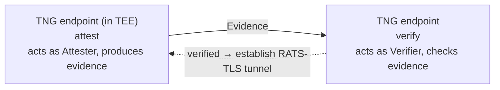
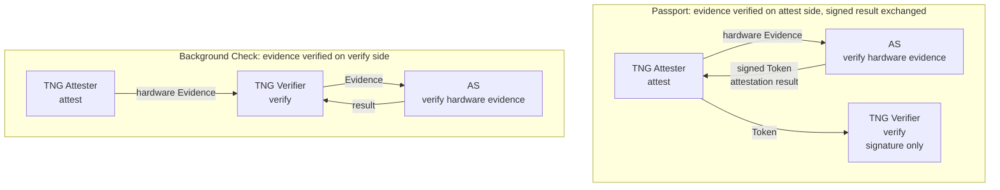

# Remote Attestation

## Overview

### Remote Attestation Introduction

Remote attestation is a core security mechanism in trusted computing, used to verify the runtime integrity and trustworthiness of remote systems. Through cryptographic means, a system (**Attester**) generates "evidence" describing its hardware and software configuration, and another system (**Verifier**) verifies this evidence to ensure it comes from a legitimate, untampered Trusted Execution Environment (TEE).

TNG controls remote attestation roles on each Ingress/Egress endpoint through three fields:

- **`attest`**: the local endpoint acts as the Attester, collecting local platform trust state and generating cryptographic evidence (Evidence) for the peer to verify.
- **`verify`**: the local endpoint acts as the Verifier, receiving and verifying the peer's evidence; the peer is considered trusted only when the evidence satisfies preset trust policies.
- **`no_ra`**: disable remote attestation; the endpoint establishes a plain TLS session (for non-TEE environments or debugging).

The topology of the two roles in a single attestation is:



`attest` turns the local TEE state into evidence via an **Attestation Agent (AA)**; `verify` decides whether the evidence is trustworthy via an **Attestation Service (AS)**. AA and AS are the concrete implementations of these two roles. Below is a typical unidirectional Background Check configuration: the server runs in a TEE and configures `attest`, while the client configures `verify` to verify the server's evidence.

Server (in a TEE; configures `attest`; `aa_addr` points to the AA inside the TEE):

```json
"attest": {
    "aa_type": "uds",
    "aa_addr": "unix:///run/confidential-containers/attestation-agent/attestation-agent.sock"
}
```

Client (configures `verify`; `as_addr` points to the AS):

```json
"verify": {
    "as_addr": "http://127.0.0.1:8080/",
    "policy_ids": ["default"]
}
```

Deployment topology: the server's `aa_addr` points to an Attestation Agent running inside the TEE (collects evidence; must be deployed beforehand); the client's `as_addr` points to an Attestation Service (verifies evidence; must be deployed beforehand). If you do not want to deploy a separate AS, use the built-in AS on the `verify` side (`as_type` = `"builtin"`; `as_type` accepts `restful`/`grpc`/`builtin`, see below): TNG verifies evidence locally with no AS deployment, but the `attest` side still needs an AA (`aa_type` = `"uds"`) or an ASR proxy to collect evidence.

By combining `no_ra`, `attest`, and `verify`, you can cover different scenarios such as unidirectional, bidirectional, reverse-unidirectional, and no-TEE debugging:

| Scenario | Client Configuration | Server Configuration | Description |
|---|---|---|---|
| Unidirectional | `verify` | `attest` | Most common; server is in TEE |
| Bidirectional | `attest` + `verify` | `attest` + `verify` | Both ends are in different TEEs |
| Reverse Unidirectional | `attest` | `verify` | Client is in TEE; server does not do RA, uses a fixed certificate |
| No TEE (debugging) | `no_ra` | `no_ra` | Non-TEE environment; establishes normal TLS session |

### Provider Introduction and Selection

The provider determines which interface TNG uses to talk to the attestation components, and which verification service the verify side depends on. **`aa_provider`** selects the Attestation Agent stack (which AA interface evidence collection uses); **`as_provider`** selects the Attestation Service stack (which AS interface and verification-service backend verification uses). Both default to **`"coco"`** (the Confidential Containers reference implementation) when omitted. When unsure, keep the default `"coco"`; use `"ita"` only when verification goes through the Intel Trust Authority (ITA).

| Provider | Usage | Description |
|---|---|---|
| `"coco"` | `aa_provider` / `as_provider` | Default. Interfaces with CoCo AA and CoCo AS |
| `"ita"` | `aa_provider` / `as_provider` | Interfaces with CoCo AA for evidence collection, and with the Intel Trust Authority (Intel's online remote attestation service) for verification |

`coco_asr` and `ita_asr` are transport variants of `coco` and `ita` respectively, used only for `aa_provider` (the evidence-collection side). They do not change the underlying provider; they only switch the evidence-collection connection from the AA's Unix socket to the [API Server Rest](https://github.com/confidential-containers/guest-components/tree/main/api-server-rest) (ASR) HTTP proxy. When TNG cannot reach the AA Unix socket directly (e.g. running inside a container), change the provider to `coco_asr` / `ita_asr` and use `asr_addr` instead of `aa_addr`. The `as_provider` (verification side) does not use these variants.

> Field prefixes: `aa_`-prefixed fields belong to the attest side (interface with the Attestation Agent, governs evidence collection); `as_`-prefixed fields belong to the verify side (interface with the Attestation Service, governs verification). `*_type` selects the connection method; `*_provider` selects the implementation stack.

### Attestation Model Overview (Background Check and Passport)

TNG supports two remote attestation models conforming to [RATS RFC 9334](https://datatracker.ietf.org/doc/html/rfc9334):

- **Background Check model**: TNG's default model. The proving party obtains evidence through the Attestation Agent, and the verifying party verifies it directly. Omitting the `model` field enables it. See [Background Check Mode](#background-check-mode).
- **Passport model**: The proving party first submits evidence to the Attestation Service to obtain a Token (the "passport"); the verifying party only needs to verify the Token's validity, without directly interacting with the Attestation Service. Suitable for scenarios with network isolation or high performance requirements. See [Passport Mode](#passport-mode).

The core difference is **where the hardware-evidence verification logic runs**:



Background Check leaves the raw evidence to be verified on the verify side (the Verifier contacts the AS; the built-in AS does it in-process on the Verifier). Passport verifies the evidence on the attest side up front and exchanges a signed attestation-result Token; the Verifier only checks the Token signature and never touches the raw evidence.

For the specific field configuration of each model, see [Configuration](#configuration) below.

### Glossary

- **Attestation Agent (AA)**: a proxy running inside the TEE that collects hardware trust measurements and formats them into evidence (Evidence).
- **Attestation Service (AS)**: the backend service that verifies evidence; either TNG's built-in AS or an externally deployed one (e.g. Trustee).
- **Trustee**: the Attestation Service reference implementation maintained by OpenAnolis; can be deployed as an external AS.
- **CoCo**: Confidential Containers; the AA/AS reference implementation TNG targets by default.
- **ITA**: Intel Trust Authority, Intel's online remote attestation service.
- **Rekor**: sigstore's transparency-log service; v1 is used for the transparency_log policy anchor, v2 for signer_transparency certificate binding. They are two independent mechanisms.
- **OPA / rego**: Open Policy Agent and its policy language rego; the built-in AS uses it to express custom verification policies.
- **SLSA**: a software supply-chain provenance standard; `reference_values` can obtain reference values from SLSA provenance.
- **DSSE**: a signed-payload envelope format; the transparency_log policy can verify an entry's DSSE publisher signature.
- **PCCS**: Provisioning Certificate Caching Service, the SGX/TDX certificate caching service; verifying TDX evidence requires fetching collateral from it.
- **RATS-TLS**: a protocol that carries remote-attestation evidence inside the TLS 1.3 handshake; TNG's default communication protocol.

## Adoption Guide

Adopt remote attestation progressively, from the simplest link to a production-grade configuration.

**1. Bring up the link with `no_ra` first.** Set `"no_ra": true` on both ends to establish a plain TLS tunnel only, ruling out remote attestation as a variable and confirming the network and tunnel themselves work. See the "No TEE" row in [Remote Attestation Introduction](#remote-attestation-introduction).

```json
"no_ra": true
```

**2. Once the link is up, add RA from the simplest real configuration.** `attest` uses `aa_type: "uds"` + `aa_addr` pointing to the AA inside the TEE; `verify` uses `as_type: "builtin"` with the default `hardware_only` policy written explicitly. This still requires deploying an AA on the attest side, but the verify side uses the built-in AS so no AS deployment is needed. It is the lightest real remote attestation. See [Background Check Mode / CoCo / Built-in AS](#background-check-mode).

```json
"attest": {
    "aa_type": "uds",
    "aa_addr": "unix:///run/confidential-containers/attestation-agent/attestation-agent.sock"
}
```

```json
"verify": {
    "as_type": "builtin",
    "attestation_policy": {
        "type": "hardware_only"
    }
}
```

**3. Tighten verification strength as needed.** Move to `hardware_only_strict` (stricter platform checks) first; then add a custom policy (`inline`/`path` rego) and reference values (`sample`/`slsa`/`release_manifest`) for measurement comparison; for advanced cases use `transparency_log` to anchor to a Rekor transparency log. See Scenarios 1 to 4 under the built-in AS in [Background Check Mode](#background-check-mode).

**4. Use an external AS for large-scale / centralized cases.** If you have a high volume of remote-attestation verifications and need centralized verification and configuration management, switch to an externally deployed Attestation Service ([Trustee](https://github.com/openanolis/trustee)) and set the verify side to `as_type: "restful"`/`"grpc"` + `as_addr`. See the External AS section under [Background Check Mode](#background-check-mode).

## Configuration

### Background Check Mode

[Background Check](https://datatracker.ietf.org/doc/html/rfc9334#name-background-check-model) is TNG's default remote attestation mode. The proving party obtains evidence through the Attestation Agent, and the verifying party verifies it directly.

> [!NOTE]
> When the `"model"` field is not specified, TNG automatically uses Background Check mode (`model` may be omitted on both the attest and verify sides).

#### CoCo Provider

##### Attest (attest)

The **Attester** is the party being verified, responsible for collecting local platform trust state information and generating cryptographic evidence (Evidence). The fields below apply to the default CoCo provider (`aa_provider` = `"coco"` or omitted):

| Field | Type | Default | Description |
|---|---|---|---|
| `model` | string | — | Set to `"background_check"` to explicitly enable |
| `aa_type` | string | `"uds"` | Agent type; currently only `"uds"` is supported (connects to an external AA over a Unix socket) |
| `aa_addr` | string | — | Required for `"uds"` type; AA Unix socket address |
| `asr_addr` | string | — | Only for the `coco_asr` variant; ASR HTTP proxy address, replaces `aa_addr` |
| `refresh_interval` | int | `600` | Evidence cache time in seconds; `0` means fetch latest each time |

> Evidence generation accesses TEE hardware and is relatively expensive, so `refresh_interval` caches for 600 seconds by default; set it to `0` to fetch fresh evidence every time.

<details>
<summary>Example: uds direct</summary>

```json
"attest": {
    "aa_type": "uds",
    "aa_addr": "unix:///run/confidential-containers/attestation-agent/attestation-agent.sock"
}
```

```json
"attest": {
    "model": "background_check",
    "aa_type": "uds",
    "aa_addr": "unix:///run/confidential-containers/attestation-agent/attestation-agent.sock",
    "refresh_interval": 3600
}
```
</details>

<details>
<summary>Example: ASR proxy</summary>

Change `aa_provider` to `"coco_asr"` and use `asr_addr` instead of `aa_addr`:

```json
"attest": {
    "aa_provider": "coco_asr",
    "asr_addr": "http://127.0.0.1:8006"
}
```
</details>

##### Verify (verify)

The **Verifier** receives and verifies Evidence from the Attester, only recognizing the peer as trusted if the evidence complies with preset trust policies. The fields below apply to the default CoCo provider (`as_provider` = `"coco"` or omitted). Choose a verification path by `as_type`: verify locally with the built-in AS, or connect to an external AS.

###### Built-in AS (`as_type` = `"builtin"`)

When `as_type` = `"builtin"`, TNG uses the built-in AS to verify Evidence locally without connecting to an external AS; verification policies and reference values are configured on the local side. Suitable for network-isolated, latency-sensitive, or simplified deployment scenarios.

**Field reference**

| Field | Type | Default | Description |
|---|---|---|---|
| `model` | string | — | Set to `"background_check"` to enable explicitly (omitting it defaults to this mode) |
| `as_type` | string | `"builtin"` | Set to `"builtin"` to enable the built-in AS |
| `attestation_policy` | object | `{"type": "hardware_only"}` | Built-in AS verification policy. Defaults to `{"type": "hardware_only"}` if omitted (the alias `{"type": "default"}` resolves to the same). `type` values are shown in the scenarios and the cheat-sheet at the end |
| `reference_values` | array | — | Built-in AS reference value (trusted baseline) configuration list; only used when the policy requires reference values |

**PCCS configuration**

> [!NOTE]
> To verify TDX Evidence, TNG fetches TDX/SGX collateral directly over HTTPS from a PCCS (Provisioning Certificate Caching Service). Set the `PCCS_URL` environment variable to your cloud provider's PCCS; if unset, it defaults to the Alibaba Cloud PCCS (`https://sgx-dcap-server.cn-beijing.aliyuncs.com`). Both bare-host (`https://sgx-dcap-server.cn-hangzhou.aliyuncs.com`) and path-suffixed (`https://sgx-dcap-server.cn-hangzhou.aliyuncs.com/sgx/certification/v4/`) forms are accepted; the backend normalizes the path. Common Alibaba Cloud endpoints:
>
> | Endpoint | `PCCS_URL` |
> |---|---|
> | Public (region-specific) | `https://sgx-dcap-server.<region>.aliyuncs.com` |
> | VPC internal | `https://sgx-dcap-server-vpc.<region>.aliyuncs.com` |

**Verification strategies**

Compare the four strategies below, then pick one matching your goal; the `type` value of `attestation_policy` varies by scenario.

| Strategy (`type`) | Hardware TEE check | Compare measurements | Requires user input | Use case |
|---|---|---|---|---|
| `hardware_only` / `hardware_only_strict` | ✅ | ❌ | ❌ | Only confirm the peer is a genuine TEE |
| `hardware_with_reference_values` / `hardware_strict_with_reference_values` | ✅ | ✅ trusted baseline | ✅ `reference_values` | Compare against a trusted baseline to detect tampering |
| `inline` / `path` | ✅ | depends on policy | ✅ rego policy | Custom decision logic |
| `transparency_log` | ✅ | ✅ Rekor-anchored | ✅ log entry | Supply-chain transparency anchoring |

> `trust_all` is debug-only (affirms every dimension); see the cheat-sheet at the end.

**Scenario 1: Platform attestation only**

Goal: only confirm the peer is a genuine TEE, without comparing measurements. No policy or reference values are needed: omit `attestation_policy` and `reference_values` and the default `{"type": "hardware_only"}` applies: it only verifies hardware TEE recognition and ignores reference values; it is the simplest starting configuration, suited to general-purpose deployments.

<details>
<summary>Example: default configuration</summary>

```json
"verify": {
    "as_type": "builtin"
}
```
</details>

> If you also need TDX to be non-debug and include an event log, use `{"type": "hardware_only_strict"}`; for debug/test use `{"type": "trust_all"}` (affirms every dimension). Both are listed in the cheat-sheet at the end.

**Scenario 2: Custom verification policy (OPA/rego)**

Goal: verify evidence with your own rules. Set `attestation_policy.type` to `"inline"` (inline base64 rego) or `"path"` (rego file path).

| `attestation_policy.type` | Description |
|---|---|
| `"inline"` | Inline policy; requires `content` (Base64-encoded OPA policy content) |
| `"path"` | File path policy; requires `path` (OPA policy file path) |

<details>
<summary>Example: inline OPA policy</summary>

```json
"verify": {
    "as_type": "builtin",
    "attestation_policy": {
        "type": "inline",
        "content": "cGFja2FnZSBwb2xpY3kKZGVmYXVsdCBhbGxvdyA9IHRydWU="
    }
}
```
</details>

> [!TIP]
> OPA/rego is an advanced feature. Most deployments are fine with `hardware_only` from Scenario 1; write rego only when you need custom decision logic. You can also combine custom rego with reference values: set `attestation_policy.type` to `"inline"` / `"path"` and also provide `reference_values`; the policy can then read the reference values to make decisions.

**Scenario 3: Compare against reference values**

Goal: compare the peer's actual measurements against a "trusted baseline" (reference values) to confirm the runtime environment has not been tampered with. Set `attestation_policy.type` to `"hardware_with_reference_values"` (trustee comprehensive appraisal against reference values) or `"hardware_strict_with_reference_values"` (same, but additionally requires TDX to be non-debug and include an event log); the trusted baseline is provided via `reference_values`.

Each `reference_values[]` entry has two `type` fields: the outer one selects the reference-value **source**, the inner `payload.type` selects the **loading method**.

| `reference_values[].type` (source) | Description | payload shape |
|---|---|---|
| `"sample"` | Directly provides reference value payload | `Provenance` (measurement name → hash), e.g. `{"measurement.uki.SHA-384": ["..."]}` or TDX's `{"tdx":{"quote":{"body":{"mr_td":"..."}}}}`; pick by your TEE type |
| `"slsa"` | Fetches SLSA provenance from Rekor transparency log (historical compatibility) | `ReferenceValueListPayload` (`rv_list`) |
| `"release_manifest"` | **Recommended**: fetches reference values from an RV release manifest bundle | `ReferenceValueListPayload` (`rv_list`) |

`payload.type` loading method: `"inline"` (inline content) or `"path"` (load from file).

Structure of `ReferenceValueListPayload` (`release_manifest` / `slsa`):

```json
{
    "rv_list": [
        {
            "id": "cvm_container_proxy",
            "version": "1.0.0",
            "type": "container",
            "provenance_info": {
                "type": "rv-release-manifest",
                "rekor_url": "https://log2025-1.rekor.sigstore.dev",
                "rekor_api_version": 2
            },
            "provenance_source": {
                "protocol": "oci",
                "uri": "oci://registry/repo:tag",
                "artifact": "bundle"
            },
            "operation_type": "refresh"
        }
    ]
}
```

Nested field meanings: `provenance_info.type` is `rv-release-manifest` or `slsa-intoto-statements`, identifying the provenance format; `rekor_api_version` (default `2`) is the Rekor log API version; `provenance_source` describes the reference-value source (`protocol` e.g. `oci`, `uri`, `artifact`); `operation_type` is `refresh` or `add`.

<details>
<summary>Example 3a: sample source</summary>

```json
{
    "verify": {
        "as_type": "builtin",
        "attestation_policy": {
            "type": "hardware_with_reference_values"
        },
        "reference_values": [
            {
                "type": "sample",
                "payload": {
                    "type": "path",
                    "path": "/etc/tng/tdx-reference-values.json"
                }
            }
        ]
    }
}
```

`/etc/tng/tdx-reference-values.json`:

```json
{
    "tdx": {
        "quote": {
            "body": {
                "mr_td": "000000000000000000000000000000000000000000000000000000000000000000000000000000000000000000000000"
            }
        }
    }
}
```

> Structural illustration only; the all-zero `mr_td` is a placeholder. The real value must come from a trusted TEE's measured state. Do not copy it as a real value.
</details>

<details>
<summary>Example 3b: slsa source</summary>

```json
{
    "verify": {
        "as_type": "builtin",
        "attestation_policy": {
            "type": "hardware_with_reference_values"
        },
        "reference_values": [
            {
                "type": "slsa",
                "payload": {
                    "type": "inline",
                    "content": {
                        "rv_list": [
                            {
                                "id": "my-artifact",
                                "version": "1.0.0",
                                "type": "binary",
                                "provenance_info": {
                                    "type": "slsa-intoto-statements",
                                    "rekor_url": "https://log2025-1.rekor.sigstore.dev"
                                },
                                "operation_type": "add"
                            }
                        ]
                    }
                }
            }
        ]
    }
}
```
</details>

<details>
<summary>Example 3c: release_manifest source</summary>

```json
{
    "verify": {
        "as_type": "builtin",
        "attestation_policy": {
            "type": "hardware_with_reference_values"
        },
        "reference_values": [
            {
                "type": "release_manifest",
                "payload": {
                    "type": "inline",
                    "content": {
                        "rv_list": [
                            {
                                "id": "cvm_container_proxy",
                                "version": "1.0.0",
                                "type": "container",
                                "provenance_info": {
                                    "type": "rv-release-manifest",
                                    "rekor_url": "https://log2025-1.rekor.sigstore.dev",
                                    "rekor_api_version": 2
                                },
                                "provenance_source": {
                                    "protocol": "oci",
                                    "uri": "oci://registry/trustee/provenance:cvm_container_proxy-1.0.0",
                                    "artifact": "bundle"
                                },
                                "operation_type": "refresh"
                            }
                        ]
                    }
                }
            }
        ]
    }
}
```
</details>

**Scenario 4: transparency_log anchoring (advanced)**

Goal: anchor the trusted measurement set to an authenticated Rekor v1 transparency-log entry, and at appraisal compare the actual measurements against the recorded reference. Set `attestation_policy.type` to `"transparency_log"`. Requires `schemaVersion` and one `rekor-v1` service; `publishedMeasurements` is optional (absent → skip the measurement check).

<details>
<summary>Example: transparency_log policy</summary>

```json
{
    "verify": {
        "as_type": "builtin",
        "attestation_policy": {
            "type": "transparency_log",
            "publishedMeasurements": ["tdx.td-shim", "container.image.cmaas-runtime"],
            "schemaVersion": "1.0.0",
            "services": [
                {
                    "type": "rekor-v1",
                    "logUrl": "https://rekor.sigstore.dev",
                    "logIndex": 2279770888,
                    "publisherPublicKeyPem": "-----BEGIN PUBLIC KEY-----\n...\n-----END PUBLIC KEY-----"
                }
            ]
        }
    }
}
```
</details>

**transparency_log policy: field reference**

<details>
<summary>What the <code>transparency_log</code> policy verifies</summary>

The `transparency_log` policy anchors the trusted measurement set to an authenticated Rekor v1 transparency-log entry, then checks the running TDX hardware's actual measurements against that recorded reference.

**At init (policy load):**

- Fetch the Rekor v1 entry by `logIndex` from the configured `logUrl`.
- Authenticate the entry: verify the signed checkpoint, the Merkle inclusion proof, and the Signed Entry Timestamp (SET). If `rekorPublicKeyPem` is omitted, the well-known public key for `rekor.sigstore.dev` / `rekor.openanolis.cn` is used; other logs must supply their key.
- Record the trusted reference (the entry's `payloadHash` and, when a publisher key is configured, the DSSE publisher signature) for use at appraisal.

**At appraisal (evidence verification):**

- Extract the actual measurement values from the TDX quote (e.g. `mr_td` for `tdx.td-shim`) and the UEFI event log (e.g. the image digest from an AAEL `kangaroo/pull-image` event for a `container.image.*` measurement).
- Reconstruct the release manifest from those actual values, in the order given by `publishedMeasurements`, and compare its hash to the recorded `payloadHash`. A mismatch (wrong type, wrong order, wrong value, or wrong `schemaVersion`) rejects.
- Enforce the TDX platform checks (non-debug, event log present, canonical Intel quoting-enclave vendor) regardless of the measurement check.

**Optional DSSE publisher verification:** When `publisherPublicKeyPem` is configured, the entry's DSSE publisher signature is also verified at appraisal, binding the entry to a trusted publisher (defense against a substituted `logIndex`). Without it, trust is anchored in the configured `logIndex` alone. Configuring it on an entry that carries no DSSE signature is a config/entry mismatch and errors at init.

**When `publishedMeasurements` is absent:** the measurement reconstruction and hash comparison are skipped entirely; only the TDX platform checks run, and the executables trust dimension stays affirming. An explicit empty array (`[]`) is *not* the same: it still runs the check, which always rejects against a real logged reference. Use absence to opt out of measurement binding (e.g. when only platform attestation matters).

</details>

<details>
<summary>transparency_log field table</summary>

| Field | Default | Description |
|---|---|---|
| `publishedMeasurements` | absent (`None`) | Measurement type list, must mirror the manifest's `measurements` array in order and set; absent skips the measurement check, explicit `[]` is not the same (see above) |
| `schemaVersion` | `"1.0.0"` | Must equal the logged manifest's `schemaVersion` |
| `services[].type` | — | Must be `"rekor-v1"`; exactly one service is supported |
| `services[].logUrl` | — | Rekor v1 log base URL (e.g. `https://rekor.sigstore.dev`, `https://rekor.openanolis.cn`) |
| `services[].logIndex` | — | The Rekor v1 entry index to fetch and authenticate |
| `services[].rekorPublicKeyPem` | built-in | Optional PEM of the log's public key (verifies checkpoint/SET); omit to use the well-known key for `rekor.sigstore.dev` / `rekor.openanolis.cn`, required for other logs |
| `services[].publisherPublicKeyPem` | — | Optional trusted publisher public key PEM; when set, the DSSE publisher signature is verified at appraisal, binding the entry to this publisher |

</details>

###### External AS (`as_type` = `"restful"` / `"grpc"`)

Connect to an external Attestation Service (restful HTTP or gRPC). Verification policies are predefined on the AS side; the local side references them via `policy_ids`.

**Field reference**

| Field | Type | Default | Description |
|---|---|---|---|
| `model` | string | — | Set to `"background_check"` to enable explicitly (omitting it defaults to this mode) |
| `as_type` | string | `"restful"` | AS type: `"restful"` / `"grpc"` |
| `as_addr` | string | — | AS address (required; trailing slash optional) |
| `as_headers` | object | `{}` | Custom headers sent to AS (e.g., Authorization) |
| `policy_ids` | array [string] | — | Policy ID list, references policies predefined on the AS side (required; policies must be created on the AS side first, `default` is an example name only) |
| `trusted_certs_paths` | array [string] | `[]` | Root CA certificate paths for verifying Attestation Token signatures |
| `verify_signer_transparency` | boolean | `false` | Verify the `signer_transparency` claim in JWT tokens issued by Trustee AS (see the folded note) |
| `skip_as_token_cert_verify` | boolean | `false` | **DANGER:** Skip AS token certificate verification. When `true`, neither `trusted_certs_paths` nor `as_addr` can be set. Only use this when you fully trust the token source. |

<details>
<summary><code>verify_signer_transparency</code> background</summary>

When Trustee runs inside a TEE hosted by an untrusted provider, its JWT signing certificate lacks inherent trust mechanisms. The `signer_transparency` feature solves this by binding the signing certificate to TEE evidence and recording it in a Rekor **v2** transparency log (a separate mechanism from the Rekor **v1** transparency_log policy in Scenario 4). Verification includes certificate DER SHA-256 match, report_data binding, Rekor checkpoint signature verification, etc. See the [Trustee AS signer transparency document](https://github.com/openanolis/trustee/blob/main/attestation-service/docs/as_signer_transparency.md) for the full specification.
</details>

**Examples**

Basic example (Restful):

```json
"verify": {
    "as_addr": "http://127.0.0.1:8080/",
    "as_headers": {
        "Authorization": "Bearer your-token-here"
    },
    "policy_ids": ["default"]
}
```

<details>
<summary>Variant: gRPC AS</summary>

```json
"verify": {
    "as_type": "grpc",
    "as_addr": "http://127.0.0.1:5000/",
    "policy_ids": ["default"]
}
```
</details>

<details>
<summary>Variant: specify root certificate paths</summary>

```json
"verify": {
    "as_addr": "http://127.0.0.1:8080/",
    "policy_ids": ["default"],
    "trusted_certs_paths": ["/tmp/as-ca.pem"]
}
```
</details>

###### `attestation_policy.type` cheat-sheet

| `type` | One-liner | See |
|---|---|---|
| `hardware_only` (alias `default`) | Only verifies hardware TEE recognition, ignores reference values (default) | Scenario 1 |
| `hardware_only_strict` | Same, but TDX must be non-debug and include an event log | Scenario 1 note |
| `hardware_with_reference_values` | Trustee comprehensive appraisal against reference values | Scenario 3 |
| `hardware_strict_with_reference_values` | Same, additionally requires TDX non-debug and event log | Scenario 3 |
| `trust_all` | Affirms every dimension unconditionally (debug/test only) | — |
| `inline` | Inline base64 rego | Scenario 2 |
| `path` | rego file path | Scenario 2 |
| `transparency_log` | Anchor to a Rekor v1 transparency log | Scenario 4 |

#### ITA Provider

##### Attest (attest)

When `aa_provider` = `"ita"`, the Attest configuration uses the following fields:

| Field | Type | Default | Description |
|---|---|---|---|
| `aa_provider` | string | — | Set to `"ita"` (required) |
| `aa_addr` | string | — | AA Unix socket address (required) |
| `asr_addr` | string | — | Only for the `ita_asr` variant; ASR HTTP proxy address, replaces `aa_addr` |
| `refresh_interval` | int | `600` | Evidence cache time in seconds; `0` means fetch latest each time |

When the AA Unix socket is not directly reachable, change `aa_provider` to `"ita_asr"` and use `asr_addr` instead of `aa_addr` (same shape as the CoCo ASR example).

<details>
<summary>Example: basic configuration</summary>

```json
"attest": {
    "aa_provider": "ita",
    "aa_addr": "unix:///run/confidential-containers/attestation-agent/attestation-agent.sock"
}
```
</details>

##### Verify (verify)

When `as_provider` = `"ita"`, the Verify configuration uses the following fields:

| Field | Type | Default | Description |
|---|---|---|---|
| `as_provider` | string | — | Set to `"ita"` (required) |
| `as_addr` | string | `https://api.trustauthority.intel.com` | ITA API base URL |
| `api_key` | string | — | ITA API key (can also be set via the `ITA_API_KEY` environment variable) |
| `ita_jwks_addr` | string | `https://portal.trustauthority.intel.com` | ITA portal URL for fetching JWKS signing keys for Token verification |
| `policy_ids` | array [string] | `[]` | ITA policy ID list (policies must be created in the ITA console first) |

> It is recommended to set the API key via the `ITA_API_KEY` environment variable rather than writing it in the configuration file.

<details>
<summary>Example: basic configuration</summary>

```json
"verify": {
    "as_provider": "ita",
    "api_key": "your-ita-api-key",
    "policy_ids": ["my-policy"]
}
```

> Replace `policy_ids` with the policy ID you created in the ITA console.
</details>

### Passport Mode

In addition to Background Check mode, TNG also supports remote attestation that conforms to the [Passport model](https://datatracker.ietf.org/doc/html/rfc9334#name-passport-model) defined in the [RATS RFC 9334 document](https://datatracker.ietf.org/doc/html/rfc9334). In the Passport model, the Attester obtains evidence through the Attestation Agent and submits it to the Attestation Service to obtain a Token (i.e., Passport). The Verifier only needs to verify the validity of this Token without directly interacting with the Attestation Service.

> [!NOTE]
> `model` must be set to `"passport"` on both the attest and verify sides (each endpoint is configured independently, and the two must match).

#### CoCo Provider

##### Attest (attest)

In the Passport model, the Attest configuration should include the following fields. The fields below apply to the default CoCo provider (`aa_provider` = `"coco"` or omitted, `as_provider` = `"coco"` or omitted):

| Field | Type | Default | Description |
|---|---|---|---|
| `model` | string | — | Set to `"passport"` to enable the Passport model |
| `aa_type` | string | `"uds"` | Agent type; currently only `"uds"` is supported (connects to an external AA over a Unix socket) |
| `aa_addr` | string | — | Required for `"uds"` type; AA Unix socket address |
| `asr_addr` | string | — | Only for the `coco_asr` variant; ASR HTTP proxy address, replaces `aa_addr` |
| `refresh_interval` | int | `600` | Evidence cache time in seconds; `0` means fetch latest each time |
| `as_type` | string | `"restful"` | AS type: `"restful"` / `"grpc"` |
| `as_addr` | string | — | Attestation Service address |
| `as_headers` | object | `{}` | Custom headers sent to AS (e.g., Authorization) |
| `policy_ids` | array [string] | — | Policy ID list |

When the AA Unix socket is not directly reachable, change `aa_provider` to `"coco_asr"` and use `asr_addr` instead of `aa_addr` (same shape as in Background Check mode).

<details>
<summary>Example: basic configuration</summary>

```json
"attest": {
    "model": "passport",
    "aa_type": "uds",
    "aa_addr": "unix:///run/confidential-containers/attestation-agent/attestation-agent.sock",
    "refresh_interval": 3600,
    "as_type": "restful",
    "as_addr": "http://127.0.0.1:8080/",
    "as_headers": {
        "Authorization": "Bearer your-token-here",
        "X-Custom-Header": "custom-value"
    },
    "policy_ids": [
        "default"
    ]
}
```
</details>

##### Verify (verify)

In the Passport model, the Verify configuration should include the following fields. The fields below apply to the default CoCo provider (`as_provider` = `"coco"` or omitted):

| Field | Type | Default | Description |
|---|---|---|---|
| `model` | string | — | Set to `"passport"` to enable the Passport model |
| `as_type` | string | `"restful"` | AS type: `"restful"` / `"grpc"` |
| `as_addr` | string | — | Attestation Service address (optional, but at least one of `as_addr` or `trusted_certs_paths` must be specified) |
| `as_headers` | object | `{}` | Custom headers sent to AS (e.g., Authorization) |
| `policy_ids` | array [string] | — | Policy ID list |
| `trusted_certs_paths` | array [string] | `[]` | Root CA certificate paths for verifying Attestation Token signatures |
| `verify_signer_transparency` | boolean | `false` | Verify `signer_transparency` claim in JWT tokens issued by Trustee AS |
| `skip_as_token_cert_verify` | boolean | `false` | **DANGER:** Skip AS token certificate verification. When `true`, neither `trusted_certs_paths` nor `as_addr` can be set. Only use this when you fully trust the token source. |

<details>
<summary>Example: basic configuration</summary>

```json
"verify": {
    "model": "passport",
    "as_addr": "http://127.0.0.1:8080/",
    "policy_ids": [
        "default"
    ],
    "trusted_certs_paths": [
        "/tmp/as-ca.pem"
    ]
}
```
</details>

<details>
<summary>Example: skip certificate verification</summary>

```json
"verify": {
    "model": "passport",
    "policy_ids": [
        "default"
    ],
    "skip_as_token_cert_verify": true
}
```

> [!WARNING]
> This example skips token certificate verification entirely. Only use this when you fully trust the token source (e.g., the token comes from a trusted trustee in a controlled environment).
</details>

#### ITA Provider

##### Attest (attest)

When `aa_provider` and `as_provider` are set to `"ita"`, the Attest configuration uses the following fields:

| Field | Type | Default | Description |
|---|---|---|---|
| `model` | string | — | Set to `"passport"` (required) |
| `aa_provider` | string | — | Set to `"ita"` (required) |
| `aa_addr` | string | — | AA Unix socket address (required) |
| `asr_addr` | string | — | Only for the `ita_asr` variant; ASR HTTP proxy address, replaces `aa_addr` |
| `as_provider` | string | — | Set to `"ita"` (required) |
| `as_addr` | string | `https://api.trustauthority.intel.com` | ITA API base URL |
| `api_key` | string | — | ITA API key (can also be set via the `ITA_API_KEY` environment variable) |
| `refresh_interval` | int | `600` | Evidence cache time in seconds; `0` means fetch latest each time |
| `policy_ids` | array [string] | `[]` | ITA policy ID list; attestation must match these policies to succeed |

When the AA Unix socket is not directly reachable, change `aa_provider` to `"ita_asr"` and use `asr_addr` instead of `aa_addr` (same shape as in Background Check mode).

<details>
<summary>Example: basic configuration</summary>

```json
"attest": {
    "model": "passport",
    "aa_provider": "ita",
    "aa_addr": "unix:///run/confidential-containers/attestation-agent/attestation-agent.sock",
    "as_provider": "ita",
    "api_key": "your-ita-api-key",
    "policy_ids": ["my-policy"]
}
```
</details>

##### Verify (verify)

When `as_provider` is set to `"ita"`, the Verify configuration uses the following fields:

| Field | Type | Default | Description |
|---|---|---|---|
| `model` | string | — | Set to `"passport"` |
| `as_provider` | string | — | Set to `"ita"` (required) |
| `ita_jwks_addr` | string | `https://portal.trustauthority.intel.com` | ITA portal URL for fetching JWKS signing keys for Token verification |
| `policy_ids` | array [string] | `[]` | ITA policy ID list |

<details>
<summary>Example: basic configuration</summary>

```json
"verify": {
    "model": "passport",
    "as_provider": "ita",
    "policy_ids": ["my-policy"]
}
```
</details>
