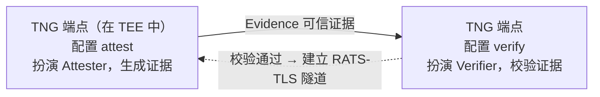
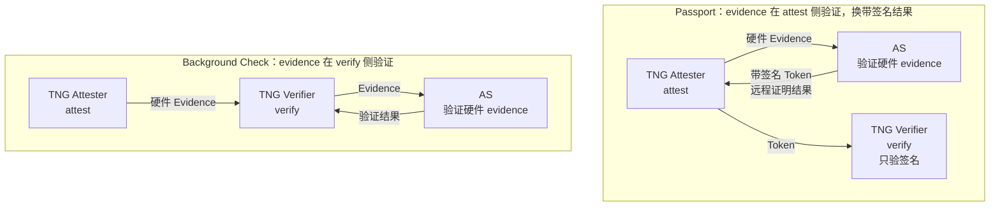

# 远程证明（Remote Attestation）

## 概述

### 远程证明介绍

远程证明是可信计算的核心安全机制，用于验证远程系统的运行时完整性与可信状态。通过密码学手段，一个系统（**Attester**）可以生成描述其软硬件配置的"证据"（Evidence），另一个系统（**Verifier**）则可对该证据进行验证，确保其来自合法、未被篡改的可信执行环境（TEE）。

TNG 在每个 Ingress/Egress 端点上通过三类字段控制远程证明角色：

- **`attest`**：本端扮演 Attester，收集本地平台的可信状态信息并生成加密证据（Evidence），供对端校验。
- **`verify`**：本端扮演 Verifier，接收并校验对端发来的证据，只有证据符合预设信任策略时才认定对端可信。
- **`no_ra`**：关闭远程证明，端点只建立普通 TLS 会话（用于非 TEE 环境或调试）。

两个角色在一次远程证明里的拓扑如下：



`attest` 把本地 TEE 状态变成证据，靠的是 **Attestation Agent（AA）**；`verify` 判定证据是否可信，靠的是 **Attestation Service（AS）**。AA 和 AS 就是这两个角色的具体实现。下面是一个典型的单向 Background Check 配置：服务端运行在 TEE 中并配置 `attest`，客户端配置 `verify` 校验服务端证据。

服务端（位于 TEE 中，配置 `attest`，`aa_addr` 指向 TEE 内的 AA）：

```json
"attest": {
    "aa_type": "uds",
    "aa_addr": "unix:///run/confidential-containers/attestation-agent/attestation-agent.sock"
}
```

客户端（配置 `verify`，`as_addr` 指向 AS）：

```json
"verify": {
    "as_addr": "http://127.0.0.1:8080/",
    "policy_ids": ["default"]
}
```

部署拓扑：服务端的 `aa_addr` 指向运行在 TEE 内的 Attestation Agent（收集证据，需提前部署）；客户端的 `as_addr` 指向 Attestation Service（验证证据，需提前部署）。如果不想单独部署 AS，可在 `verify` 侧改用内置 AS（`as_type` = `"builtin"`，`as_type` 可选 `restful`/`grpc`/`builtin`，见下文），TNG 在本地直接验证证据、免去 AS 部署，但 `attest` 侧仍需一个 AA（`aa_type` = `"uds"`）或 ASR 代理来收集证据。

通过组合 `no_ra`、`attest`、`verify`，可以覆盖单向、双向、逆单向以及无 TEE 调试等不同场景：

| 场景 | 客户端配置 | 服务端配置 | 说明 |
|---|---|---|---|
| 单向 | `verify` | `attest` | 最常见，服务端在 TEE 中 |
| 双向 | `attest` + `verify` | `attest` + `verify` | 两端都在不同 TEE 中 |
| 逆单向 | `attest` | `verify` | 客户端在 TEE 中，服务端不做 RA、用固定证书 |
| 无 TEE（调试） | `no_ra` | `no_ra` | 非 TEE 环境，建立普通 TLS 会话 |

### Provider 介绍与选择

Provider 决定 TNG 用哪套接口对接远程证明组件、验证侧依赖哪个验证服务。`aa_provider` 选 Attestation Agent 栈（决定证据收集走哪套 AA 接口），`as_provider` 选 Attestation Service 栈（决定验证走哪个 AS 接口与验证服务后端）。省略时均默认为 **`"coco"`**（Confidential Containers 参考实现）。不确定时保持默认 `"coco"` 即可；仅当验证要走 Intel Trust Authority（ITA）时才用 `"ita"`。

| Provider | 用途 | 说明 |
|---|---|---|
| `"coco"` | `aa_provider` / `as_provider` | 默认。与 CoCo AA 和 CoCo AS 对接 |
| `"ita"` | `aa_provider` / `as_provider` | 与 CoCo AA 对接收集证据，与 Intel Trust Authority（Intel 提供的在线远程证明服务）对接验证 |

`coco_asr` 与 `ita_asr` 分别是 `coco` 与 `ita` 的传输变体，仅用于 `aa_provider`（证据收集侧）。它们不改变底层 provider，只把证据收集的连接方式从 AA 的 Unix socket 换成 [API Server Rest](https://github.com/confidential-containers/guest-components/tree/main/api-server-rest) (ASR) HTTP 代理。当 TNG 无法直连 AA 的 Unix socket（如运行在容器内）时，把对应 provider 换成 `coco_asr` / `ita_asr`，并用 `asr_addr` 代替 `aa_addr`。`as_provider`（验证侧）不使用此变体。

> 字段前缀：`aa_` 开头的字段属 attest 侧（对接 Attestation Agent，管证据收集）；`as_` 开头的字段属 verify 侧（对接 Attestation Service，管验证）。`*_type` 选连接方式，`*_provider` 选实现栈。

### 证明模式概览（背景检查与护照模型）

TNG 支持两种符合 [RATS RFC 9334](https://datatracker.ietf.org/doc/html/rfc9334) 的远程证明模式：

- **Background Check（背景检查）模式**：TNG 默认模式。证明方通过 Attestation Agent 获取证据，验证方直接验证。省略 `model` 字段即启用。详见 [Background Check 模式](#background-check-模式)。
- **Passport（护照）模式**：证明方先向 Attestation Service 提交证据换取 Token（即"护照"），验证方只需验证该 Token 的有效性，无需直接与 Attestation Service 交互。适用于网络隔离或性能要求较高的场景。详见 [Passport 模式](#passport-模式)。

两种模式的核心差异在于**硬件 evidence 的验证逻辑放在哪一侧**：



Background Check 把原始 evidence 留到 verify 侧验证（Verifier 联系 AS，内置 AS 即在 Verifier 进程内完成）；Passport 则在 attest 侧提前验证 evidence 并换得带签名的远程证明结果 Token，Verifier 只验 Token 签名、不再接触原始 evidence。

两种模式的具体字段配置见下方 [配置说明](#配置说明)。

### 术语速查

- **Attestation Agent（AA）**：运行在 TEE 内的代理，收集硬件可信度量并格式化为证据（Evidence）。
- **Attestation Service（AS）**：验证证据的后端服务；可用 TNG 内置 AS，或外部部署（如 Trustee）。
- **Trustee**：OpenAnolis 维护的 Attestation Service 参考实现，可作为外部 AS 部署。
- **CoCo**：Confidential Containers，TNG 默认对接的 AA/AS 参考实现。
- **ITA**：Intel Trust Authority，Intel 提供的在线远程证明服务。
- **Rekor**：sigstore 的透明日志服务；文档中 v1 用于 transparency_log 策略锚定，v2 用于 signer_transparency 证书绑定，是两套独立机制。
- **OPA / rego**：Open Policy Agent 及其策略语言 rego，内置 AS 用它表达自定义验证策略。
- **SLSA**：软件供应链溯源标准，`reference_values` 可从 SLSA provenance 获取参考值。
- **DSSE**：签名载荷封装格式，transparency_log 策略可校验条目的 DSSE 发布者签名。
- **PCCS**：Provisioning Certificate Caching Service，SGX/TDX 证书缓存服务；验证 TDX 证据时需从中拉取 collateral。
- **RATS-TLS**：在 TLS 1.3 握手内传递远程证明证据的协议，TNG 默认通信协议。

## 接入建议

接入远程证明建议按以下递进顺序进行，从最简链路逐步收紧到生产级配置。

**1. 先用 `no_ra` 打通链路。** 两端先设 `"no_ra": true`，只建立普通 TLS 隧道，排除远程证明干扰，确认网络与隧道本身通。角色组合见 [远程证明介绍](#远程证明介绍) 的"无 TEE"行。

```json
"no_ra": true
```

**2. 链路通了再加 RA，从最简真实配置起步。** `attest` 用 `aa_type: "uds"` + `aa_addr` 指向 TEE 内的 AA；`verify` 用 `as_type: "builtin"`，策略显式写默认的 `hardware_only`。此组合 attest 侧仍需部署一个 AA，verify 侧用内置 AS 免部署 AS，是最轻量的真实远程证明。详见 [Background Check 模式 / CoCo / 内置 AS](#background-check-模式)。

```json
"attest": {
    "aa_type": "uds",
    "aa_addr": "unix:///run/confidential-containers/attestation-agent/attestation-agent.sock"
}
```

```json
"verify": {
    "as_type": "builtin",
    "attestation_policy": {
        "type": "hardware_only"
    }
}
```

**3. 按需收紧验证强度。** 先过渡到 `hardware_only_strict`（更严的平台校验）；再视需要自定义策略（`inline`/`path` rego）与参考值（`sample`/`slsa`/`release_manifest`）做度量比对；高级场景可用 `transparency_log` 锚定到 Rekor 透明日志。详见 [Background Check 模式](#background-check-模式) 下内置 AS 的场景 1 至 4。

**4. 大规模 / 中心化场景再上外部 AS。** 若有大量远程证明验证需求、需要中心化的验证与配置管理，改用外部部署的 Attestation Service（[Trustee](https://github.com/openanolis/trustee)），verify 侧切到 `as_type: "restful"`/`"grpc"` + `as_addr`。详见 [Background Check 模式](#background-check-模式) 下的外部 AS 小节。

## 配置说明

### Background Check 模式

[Background Check](https://datatracker.ietf.org/doc/html/rfc9334#name-background-check-model) 是 TNG 默认的远程证明模式。证明方通过 Attestation Agent 获取证据，验证方直接验证。

> [!NOTE]
> 未指定 `"model"` 字段时，TNG 自动使用 Background Check 模式（attest 与 verify 两侧均可省略 `model`）。

#### CoCo Provider

##### Attest（attest）

**Attester** 是被验证的一方，负责收集本地平台的可信状态信息并生成加密证据（Evidence）。以下字段适用于默认 CoCo Provider（`aa_provider` = `"coco"` 或省略）：

| 字段 | 类型 | 默认 | 说明 |
|---|---|---|---|
| `model` | string | — | 设为 `"background_check"` 显式启用 |
| `aa_type` | string | `"uds"` | Agent 类型，当前仅支持 `"uds"`（通过 Unix socket 连接外部 AA） |
| `aa_addr` | string | — | `"uds"` 类型必填，AA 的 Unix socket 地址 |
| `asr_addr` | string | — | 仅 `coco_asr` 变体使用，ASR HTTP 代理地址，替代 `aa_addr` |
| `refresh_interval` | int | `600` | Evidence 缓存时间（秒），`0` 表示每次获取最新 |

> 证据生成需访问 TEE 硬件、开销较大，故 `refresh_interval` 默认缓存 600 秒；设为 `0` 则每次获取最新证据。

<details>
<summary>示例：uds 直连</summary>

```json
"attest": {
    "aa_type": "uds",
    "aa_addr": "unix:///run/confidential-containers/attestation-agent/attestation-agent.sock"
}
```

```json
"attest": {
    "model": "background_check",
    "aa_type": "uds",
    "aa_addr": "unix:///run/confidential-containers/attestation-agent/attestation-agent.sock",
    "refresh_interval": 3600
}
```
</details>

<details>
<summary>示例：ASR 代理</summary>

把 `aa_provider` 改为 `"coco_asr"`，用 `asr_addr` 代替 `aa_addr`：

```json
"attest": {
    "aa_provider": "coco_asr",
    "asr_addr": "http://127.0.0.1:8006"
}
```
</details>

##### Verify（verify）

**Verifier** 负责接收并验证来自 Attester 的 Evidence，只有证据符合预设信任策略时才认定对端可信。以下字段适用于默认 CoCo Provider（`as_provider` = `"coco"` 或省略）。按 `as_type` 选择验证路径：使用内置 AS 本地验证，或连接外部 AS。

###### 内置 AS（`as_type` = `"builtin"`）

`as_type` = `"builtin"` 时，TNG 使用内置 AS 在本地直接验证 Evidence，无需连接外部 AS，验证策略与参考值在本端就地配置。适用于网络隔离、延迟敏感或简化部署的场景。

**字段说明**

| 字段 | 类型 | 默认 | 说明 |
|---|---|---|---|
| `model` | string | — | 设为 `"background_check"` 显式启用（省略即默认该模式） |
| `as_type` | string | `"builtin"` | 设为 `"builtin"` 启用内置 AS |
| `attestation_policy` | object | `{"type": "hardware_only"}` | 内置 AS 的验证策略。省略时默认 `{"type": "hardware_only"}`（别名 `{"type": "default"}` 同样解析为该策略）。`type` 取值见下方场景与末尾速查表 |
| `reference_values` | array | — | 内置 AS 的参考值（可信基线）配置列表，仅在策略需要参考值时使用 |

**PCCS 配置**

> [!NOTE]
> 当验证 TDX Evidence 时，TNG 会通过 HTTPS 直接从 PCCS（Provisioning Certificate Caching Service）拉取 TDX/SGX collateral。将 `PCCS_URL` 环境变量设为你的云服务商 PCCS；未设置时默认为阿里云 PCCS（`https://sgx-dcap-server.cn-beijing.aliyuncs.com`）。纯主机形式（`https://sgx-dcap-server.cn-hangzhou.aliyuncs.com`）和带路径后缀形式（`https://sgx-dcap-server.cn-hangzhou.aliyuncs.com/sgx/certification/v4/`）都接受，后端会规范化路径。阿里云常用端点：
>
> | 端点类型 | `PCCS_URL` |
> |---|---|
> | 公网（按地域） | `https://sgx-dcap-server.<region>.aliyuncs.com` |
> | VPC 内网 | `https://sgx-dcap-server-vpc.<region>.aliyuncs.com` |

**验证策略**

先按下表对比四种验证策略，按你的目标选一个；`attestation_policy` 的 `type` 取值随场景不同。

| 策略（`type`） | 校验硬件 TEE | 比对度量值 | 需用户提供 | 适用 |
|---|---|---|---|---|
| `hardware_only` / `hardware_only_strict` | ✅ | ❌ | ❌ | 只确认对端是真 TEE |
| `hardware_with_reference_values` / `hardware_strict_with_reference_values` | ✅ | ✅ 可信基线 | ✅ `reference_values` | 比对可信基线，确认未被篡改 |
| `inline` / `path` | ✅ | 视策略而定 | ✅ rego 策略 | 自定义判定逻辑 |
| `transparency_log` | ✅ | ✅ Rekor 锚定 | ✅ 日志条目 | 供应链透明度锚定 |

> `trust_all` 仅调试用（全部维度恒通过），见末尾速查表。

**场景 1：仅做平台证明**

目标：只确认对端是真实 TEE，不比对度量值。无需任何策略与参考值，省略 `attestation_policy` 与 `reference_values` 即可，默认 `{"type": "hardware_only"}`：仅校验硬件 TEE 可识别、忽略参考值，是最简的起步配置，适用于通用部署。

<details>
<summary>示例：默认配置</summary>

```json
"verify": {
    "as_type": "builtin"
}
```
</details>

> 若还需要求 TDX 非 debug 且包含 eventlog，用 `{"type": "hardware_only_strict"}`；调试/测试可用 `{"type": "trust_all"}`（全部维度恒通过）。这两个取值见末尾速查表。

**场景 2：自定义验证策略（OPA/rego）**

目标：用你自己的规则校验证据。设 `attestation_policy.type` 为 `"inline"`（内联 base64 rego）或 `"path"`（rego 文件路径）。

| `attestation_policy.type` | 说明 |
|---|---|
| `"inline"` | 内联策略，需提供 `content`（Base64 编码的 OPA 策略内容） |
| `"path"` | 文件路径策略，需提供 `path`（OPA 策略文件路径） |

<details>
<summary>示例：内联 OPA 策略</summary>

```json
"verify": {
    "as_type": "builtin",
    "attestation_policy": {
        "type": "inline",
        "content": "cGFja2FnZSBwb2xpY3kKZGVmYXVsdCBhbGxvdyA9IHRydWU="
    }
}
```
</details>

> [!TIP]
> OPA/rego 是进阶用法。多数部署用场景 1 的 `hardware_only` 即可，仅在需要自定义判定逻辑时才写 rego。也可把自定义 rego 与参考值组合：将 `attestation_policy.type` 设为 `"inline"` / `"path"`，同时提供 `reference_values`，策略里即可读取参考值做判定。

**场景 3：与参考值做度量比对**

目标：把对端的实际度量值与"可信基线"（参考值）比对，确认运行环境未被篡改。设 `attestation_policy.type` 为 `"hardware_with_reference_values"`（基于 trustee 的完整参考值度量）或 `"hardware_strict_with_reference_values"`（同前，但额外要求 TDX 非 debug 且包含 eventlog）；可信基线通过 `reference_values` 提供。

每个 `reference_values[]` 条目有两个 `type`：外层选参考值**来源**，内层 `payload.type` 选**加载方式**。

| `reference_values[].type`（来源） | 说明 | payload 形状 |
|---|---|---|
| `"sample"` | 直接提供参考值 payload | `Provenance`（度量名 → 哈希），如 `{"measurement.uki.SHA-384": ["..."]}` 或 TDX 的 `{"tdx":{"quote":{"body":{"mr_td":"..."}}}}`，按你的 TEE 类型选 |
| `"slsa"` | 从 Rekor 透明日志获取 SLSA provenance（历史兼容） | `ReferenceValueListPayload`（`rv_list`） |
| `"release_manifest"` | **推荐**：从 RV release manifest bundle 获取参考值 | `ReferenceValueListPayload`（`rv_list`） |

`payload.type` 加载方式：`"inline"`（内联 content）或 `"path"`（从文件加载）。

`ReferenceValueListPayload`（`release_manifest` / `slsa`）的结构：

```json
{
    "rv_list": [
        {
            "id": "cvm_container_proxy",
            "version": "1.0.0",
            "type": "container",
            "provenance_info": {
                "type": "rv-release-manifest",
                "rekor_url": "https://log2025-1.rekor.sigstore.dev",
                "rekor_api_version": 2
            },
            "provenance_source": {
                "protocol": "oci",
                "uri": "oci://registry/repo:tag",
                "artifact": "bundle"
            },
            "operation_type": "refresh"
        }
    ]
}
```

嵌套字段含义：`provenance_info.type` 为 `rv-release-manifest` 或 `slsa-intoto-statements`，标识 provenance 格式；`rekor_api_version`（默认 `2`）是 Rekor 日志 API 版本；`provenance_source` 描述参考值来源（`protocol` 如 `oci`、`uri`、`artifact`）；`operation_type` 为 `refresh` 或 `add`。

<details>
<summary>示例 3a：sample 来源</summary>

```json
{
    "verify": {
        "as_type": "builtin",
        "attestation_policy": {
            "type": "hardware_with_reference_values"
        },
        "reference_values": [
            {
                "type": "sample",
                "payload": {
                    "type": "path",
                    "path": "/etc/tng/tdx-reference-values.json"
                }
            }
        ]
    }
}
```

`/etc/tng/tdx-reference-values.json`：

```json
{
    "tdx": {
        "quote": {
            "body": {
                "mr_td": "000000000000000000000000000000000000000000000000000000000000000000000000000000000000000000000000"
            }
        }
    }
}
```

> 仅为结构示意，`mr_td` 全零是占位值；实际值需取自你信任的 TEE 实测度量，勿当真值复制。
</details>

<details>
<summary>示例 3b：slsa 来源</summary>

```json
{
    "verify": {
        "as_type": "builtin",
        "attestation_policy": {
            "type": "hardware_with_reference_values"
        },
        "reference_values": [
            {
                "type": "slsa",
                "payload": {
                    "type": "inline",
                    "content": {
                        "rv_list": [
                            {
                                "id": "my-artifact",
                                "version": "1.0.0",
                                "type": "binary",
                                "provenance_info": {
                                    "type": "slsa-intoto-statements",
                                    "rekor_url": "https://log2025-1.rekor.sigstore.dev"
                                },
                                "operation_type": "add"
                            }
                        ]
                    }
                }
            }
        ]
    }
}
```
</details>

<details>
<summary>示例 3c：release_manifest 来源</summary>

```json
{
    "verify": {
        "as_type": "builtin",
        "attestation_policy": {
            "type": "hardware_with_reference_values"
        },
        "reference_values": [
            {
                "type": "release_manifest",
                "payload": {
                    "type": "inline",
                    "content": {
                        "rv_list": [
                            {
                                "id": "cvm_container_proxy",
                                "version": "1.0.0",
                                "type": "container",
                                "provenance_info": {
                                    "type": "rv-release-manifest",
                                    "rekor_url": "https://log2025-1.rekor.sigstore.dev",
                                    "rekor_api_version": 2
                                },
                                "provenance_source": {
                                    "protocol": "oci",
                                    "uri": "oci://registry/trustee/provenance:cvm_container_proxy-1.0.0",
                                    "artifact": "bundle"
                                },
                                "operation_type": "refresh"
                            }
                        ]
                    }
                }
            }
        ]
    }
}
```
</details>

**场景 4：transparency_log 锚定（高级）**

目标：把可信度量集锚定到一个经过认证的 Rekor v1 透明日志条目，appraisal 时将实际度量值与记录的参考比对。设 `attestation_policy.type` 为 `"transparency_log"`。需要 `schemaVersion` 与一个 `rekor-v1` service；`publishedMeasurements` 可选（缺省则跳过度量检查）。

<details>
<summary>示例：transparency_log 策略</summary>

```json
{
    "verify": {
        "as_type": "builtin",
        "attestation_policy": {
            "type": "transparency_log",
            "publishedMeasurements": ["tdx.td-shim", "container.image.cmaas-runtime"],
            "schemaVersion": "1.0.0",
            "services": [
                {
                    "type": "rekor-v1",
                    "logUrl": "https://rekor.sigstore.dev",
                    "logIndex": 2279770888,
                    "publisherPublicKeyPem": "-----BEGIN PUBLIC KEY-----\n...\n-----END PUBLIC KEY-----"
                }
            ]
        }
    }
}
```
</details>

**transparency_log 策略：字段参考**

<details>
<summary><code>transparency_log</code> 策略校验什么</summary>

`transparency_log` 策略将可信度量集锚定到一个经过认证的 Rekor v1 透明日志条目，然后在 appraisal 时将运行中 TDX 硬件的实际度量值与记录的参考进行比对。

**初始化（策略加载）时：**

- 按配置的 `logUrl` 与 `logIndex` 拉取 Rekor v1 条目。
- 认证条目：校验签名 checkpoint、Merkle 包含证明与 Signed Entry Timestamp（SET）。若省略 `rekorPublicKeyPem`，则使用 `rekor.sigstore.dev` / `rekor.openanolis.cn` 的知名公钥；其他日志必须提供自己的公钥。
- 记录可信参考（条目的 `payloadHash`，以及当配置了 publisher 公钥时记录 DSSE 发布者签名），供 appraisal 时使用。

**appraisal（证据校验）时：**

- 从 TDX quote（如 `tdx.td-shim` 对应的 `mr_td`）与 UEFI 事件日志（如 `container.image.*` 度量对应 AAEL `kangaroo/pull-image` 事件中的镜像摘要）中提取实际度量值。
- 按 `publishedMeasurements` 给定的顺序，用这些实际值重建 release manifest，并将其哈希与记录的 `payloadHash` 比对。类型、顺序、值或 `schemaVersion` 不匹配即拒绝。
- 无论度量检查结果如何，都强制执行 TDX 平台检查（非 debug、存在事件日志、Intel 规范 quoting-enclave vendor）。

**可选的 DSSE 发布者校验：** 当配置了 `publisherPublicKeyPem` 时，appraisal 时还会校验条目的 DSSE 发布者签名，将条目绑定到可信 publisher（抵御 `logIndex` 被替换）。省略时信任仅锚定在配置的 `logIndex` 上。对不含 DSSE 签名的条目设置此项属于配置/条目不匹配，初始化即报错。

**`publishedMeasurements` 缺省时：** 度量重建与哈希比对被整体跳过，仅执行 TDX 平台检查，executables 信任维度保持 affirming。显式空数组（`[]`）**并不等同**于缺省：它仍会执行检查，而对真实日志参考必然拒绝。当仅需平台证明、不需要度量绑定时，用缺省来跳过度量检查。

</details>

<details>
<summary>transparency_log 字段表</summary>

| 字段 | 默认值 | 说明 |
|---|---|---|
| `publishedMeasurements` | 缺省（`None`） | 度量类型列表，须与 manifest 的 `measurements` 数组同序同集合；缺省跳过度量检查，显式 `[]` 不等同缺省（详见上） |
| `schemaVersion` | `"1.0.0"` | 必须等于日志 manifest 的 `schemaVersion` |
| `services[].type` | — | 必须为 `"rekor-v1"`；仅支持恰好一个 service |
| `services[].logUrl` | — | Rekor v1 日志基地址（如 `https://rekor.sigstore.dev`、`https://rekor.openanolis.cn`） |
| `services[].logIndex` | — | 要拉取并认证的 Rekor v1 条目索引 |
| `services[].rekorPublicKeyPem` | 内建 | 可选的日志公钥 PEM（校验 checkpoint/SET）；省略时使用 `rekor.sigstore.dev` / `rekor.openanolis.cn` 的知名公钥，其他日志必须提供 |
| `services[].publisherPublicKeyPem` | — | 可选的可信 publisher 公钥 PEM；设置后 appraisal 时校验 DSSE 发布者签名，将条目绑定到此 publisher |

</details>

###### 外部 AS（`as_type` = `"restful"` / `"grpc"`）

连接外部 Attestation Service（restful HTTP 或 gRPC），验证策略在 AS 端预定义，本端通过 `policy_ids` 引用。

**字段说明**

| 字段 | 类型 | 默认 | 说明 |
|---|---|---|---|
| `model` | string | — | 设为 `"background_check"` 显式启用（省略即默认该模式） |
| `as_type` | string | `"restful"` | AS 类型：`"restful"` / `"grpc"` |
| `as_addr` | string | — | AS 地址（必填，结尾斜杠可选） |
| `as_headers` | object | `{}` | 发送到 AS 的自定义头部（如 Authorization） |
| `policy_ids` | array [string] | — | 策略 ID 列表，引用 AS 端已定义的策略（必填；策略需先在 AS 端创建，`default` 仅为示例名） |
| `trusted_certs_paths` | array [string] | `[]` | 验证 Attestation Token 签名的根 CA 证书路径 |
| `verify_signer_transparency` | boolean | `false` | 验证 Trustee AS 签发 JWT 中的 `signer_transparency` 声明（详见折叠） |
| `skip_as_token_cert_verify` | boolean | `false` | **危险：** 跳过 AS token 证书验证。开启时 `trusted_certs_paths` 与 `as_addr` 均不可设置。仅在完全信任 token 来源时使用。 |

<details>
<summary><code>verify_signer_transparency</code> 背景</summary>

当 Trustee 运行在不可信服务商托管的 TEE 内时，其 JWT 签名证书缺乏内生可信机制。`signer_transparency` 功能通过将签名证书与 TEE 证据绑定并记录到 Rekor **v2** 透明度日志中来解决此问题（与场景 4 的 Rekor **v1** transparency_log 策略是两套独立机制）。验证内容包括证书 DER SHA-256 匹配、report_data 绑定、Rekor 检查点签名验证等。完整规范见 [Trustee AS signer transparency 文档](https://github.com/openanolis/trustee/blob/main/attestation-service/docs/as_signer_transparency.md)。
</details>

**示例**

基本示例（Restful）：

```json
"verify": {
    "as_addr": "http://127.0.0.1:8080/",
    "as_headers": {
        "Authorization": "Bearer your-token-here"
    },
    "policy_ids": ["default"]
}
```

<details>
<summary>变体：gRPC AS</summary>

```json
"verify": {
    "as_type": "grpc",
    "as_addr": "http://127.0.0.1:5000/",
    "policy_ids": ["default"]
}
```
</details>

<details>
<summary>变体：指定根证书路径</summary>

```json
"verify": {
    "as_addr": "http://127.0.0.1:8080/",
    "policy_ids": ["default"],
    "trusted_certs_paths": ["/tmp/as-ca.pem"]
}
```
</details>

###### `attestation_policy.type` 取值速查

| `type` | 一句话 | 详见 |
|---|---|---|
| `hardware_only`（别名 `default`） | 仅校验硬件 TEE 识别、忽略参考值（默认） | 场景 1 |
| `hardware_only_strict` | 同上，但要求 TDX 非 debug 且包含 eventlog | 场景 1 注 |
| `hardware_with_reference_values` | 基于 trustee 的完整参考值度量 | 场景 3 |
| `hardware_strict_with_reference_values` | 同上，额外要求 TDX 非 debug 且包含 eventlog | 场景 3 |
| `trust_all` | 全部维度恒通过（仅调试/测试） | — |
| `inline` | 内联 base64 rego | 场景 2 |
| `path` | rego 文件路径 | 场景 2 |
| `transparency_log` | 锚定到 Rekor v1 透明日志 | 场景 4 |

#### ITA Provider

##### Attest（attest）

当 `aa_provider` = `"ita"` 时，Attest 配置使用以下字段：

| 字段 | 类型 | 默认 | 说明 |
|---|---|---|---|
| `aa_provider` | string | — | 设为 `"ita"`（必填） |
| `aa_addr` | string | — | AA Unix socket 地址（必填） |
| `asr_addr` | string | — | 仅 `ita_asr` 变体使用，ASR HTTP 代理地址，替代 `aa_addr` |
| `refresh_interval` | int | `600` | Evidence 缓存时间（秒），`0` 表示每次获取最新 |

无法直连 AA Unix socket 时，把 `aa_provider` 改为 `"ita_asr"`，用 `asr_addr` 代替 `aa_addr`（写法同 CoCo 的 ASR 示例）。

<details>
<summary>示例：基础配置</summary>

```json
"attest": {
    "aa_provider": "ita",
    "aa_addr": "unix:///run/confidential-containers/attestation-agent/attestation-agent.sock"
}
```
</details>

##### Verify（verify）

当 `as_provider` = `"ita"` 时，Verify 配置使用以下字段：

| 字段 | 类型 | 默认 | 说明 |
|---|---|---|---|
| `as_provider` | string | — | 设为 `"ita"`（必填） |
| `as_addr` | string | `https://api.trustauthority.intel.com` | ITA API 基础 URL |
| `api_key` | string | — | ITA API 密钥（也可通过 `ITA_API_KEY` 环境变量设置） |
| `ita_jwks_addr` | string | `https://portal.trustauthority.intel.com` | ITA 门户 URL，用于获取 JWKS 签名密钥以进行 Token 验证 |
| `policy_ids` | array [string] | `[]` | ITA 策略 ID 列表（策略需先在 ITA 控制台创建后填入） |

> 推荐通过 `ITA_API_KEY` 环境变量设置 API 密钥，而非写入配置文件。

<details>
<summary>示例：基础配置</summary>

```json
"verify": {
    "as_provider": "ita",
    "api_key": "your-ita-api-key",
    "policy_ids": ["my-policy"]
}
```

> `policy_ids` 需替换为你在 ITA 控制台创建的策略 ID。
</details>

### Passport 模式

除了 Background Check 模式外，TNG 还支持符合 [RATS RFC 9334 文档](https://datatracker.ietf.org/doc/html/rfc9334) 中定义的 [Passport 模式](https://datatracker.ietf.org/doc/html/rfc9334#name-passport-model) 的远程证明。在 Passport 模式中，证明方（Attester）通过 Attestation Agent 获取证明，并将其提交给 Attestation Service 获取 Token（即 Passport）。验证方（Verifier）只需验证该 Token 的有效性，而无需直接与 Attestation Service 交互。

> [!NOTE]
> 在许多场景中，Passport 模式也称为"护照模型"。`model` 需在 attest 与 verify 两侧同时设为 `"passport"`（两端各自配置，必须一致）。

#### CoCo Provider

##### Attest（attest）

在 Passport 模式下，Attest 配置需要包含以下字段。以下字段适用于默认 CoCo Provider（`aa_provider` = `"coco"` 或省略，`as_provider` = `"coco"` 或省略）：

| 字段 | 类型 | 默认 | 说明 |
|---|---|---|---|
| `model` | string | — | 设为 `"passport"` 以启用 Passport 模式 |
| `aa_type` | string | `"uds"` | Agent 类型，当前仅支持 `"uds"`（通过 Unix socket 连接外部 AA） |
| `aa_addr` | string | — | `"uds"` 类型必填，AA 的 Unix socket 地址 |
| `asr_addr` | string | — | 仅 `coco_asr` 变体使用，ASR HTTP 代理地址，替代 `aa_addr` |
| `refresh_interval` | int | `600` | Evidence 缓存时间（秒），`0` 表示每次获取最新 |
| `as_type` | string | `"restful"` | AS 类型：`"restful"` / `"grpc"` |
| `as_addr` | string | — | Attestation Service 地址 |
| `as_headers` | object | `{}` | 发送到 AS 的自定义头部（如 Authorization） |
| `policy_ids` | array [string] | — | 策略 ID 列表 |

无法直连 AA Unix socket 时，把 `aa_provider` 改为 `"coco_asr"`，用 `asr_addr` 代替 `aa_addr`（写法同 Background Check 模式）。

<details>
<summary>示例：基础配置</summary>

```json
"attest": {
    "model": "passport",
    "aa_type": "uds",
    "aa_addr": "unix:///run/confidential-containers/attestation-agent/attestation-agent.sock",
    "refresh_interval": 3600,
    "as_type": "restful",
    "as_addr": "http://127.0.0.1:8080/",
    "as_headers": {
        "Authorization": "Bearer your-token-here",
        "X-Custom-Header": "custom-value"
    },
    "policy_ids": [
        "default"
    ]
}
```
</details>

##### Verify（verify）

在 Passport 模式下，Verify 配置需要包含以下字段。以下字段适用于默认 CoCo Provider（`as_provider` = `"coco"` 或省略）：

| 字段 | 类型 | 默认 | 说明 |
|---|---|---|---|
| `model` | string | — | 设为 `"passport"` 以启用 Passport 模式 |
| `as_type` | string | `"restful"` | AS 类型：`"restful"` / `"grpc"` |
| `as_addr` | string | — | Attestation Service 地址（可选，但 `as_addr` 或 `trusted_certs_paths` 至少需指定一个） |
| `as_headers` | object | `{}` | 发送到 AS 的自定义头部（如 Authorization） |
| `policy_ids` | array [string] | — | 策略 ID 列表 |
| `trusted_certs_paths` | array [string] | `[]` | 验证 Attestation Token 签名的根 CA 证书路径 |
| `verify_signer_transparency` | boolean | `false` | 验证 Trustee AS 签发的 JWT token 中的 `signer_transparency` 声明 |
| `skip_as_token_cert_verify` | boolean | `false` | **危险：** 跳过 AS token 证书验证。开启时 `trusted_certs_paths` 与 `as_addr` 均不可设置。仅在完全信任 token 来源时使用。 |

<details>
<summary>示例：基础配置</summary>

```json
"verify": {
    "model": "passport",
    "as_addr": "http://127.0.0.1:8080/",
    "policy_ids": [
        "default"
    ],
    "trusted_certs_paths": [
        "/tmp/as-ca.pem"
    ]
}
```
</details>

<details>
<summary>示例：跳过证书验证</summary>

```json
"verify": {
    "model": "passport",
    "policy_ids": [
        "default"
    ],
    "skip_as_token_cert_verify": true
}
```

> [!WARNING]
> 此示例完全跳过了 token 证书验证。仅在完全信任 token 来源（例如 token 来自受控环境中的可信 trustee）时使用。
</details>

#### ITA Provider

##### Attest（attest）

当 `aa_provider` 和 `as_provider` 设置为 `"ita"` 时，Attest 配置使用以下字段：

| 字段 | 类型 | 默认 | 说明 |
|---|---|---|---|
| `model` | string | — | 设为 `"passport"`（必填） |
| `aa_provider` | string | — | 设为 `"ita"`（必填） |
| `aa_addr` | string | — | AA Unix socket 地址（必填） |
| `asr_addr` | string | — | 仅 `ita_asr` 变体使用，ASR HTTP 代理地址，替代 `aa_addr` |
| `as_provider` | string | — | 设为 `"ita"`（必填） |
| `as_addr` | string | `https://api.trustauthority.intel.com` | ITA API 基础 URL |
| `api_key` | string | — | ITA API 密钥（也可通过 `ITA_API_KEY` 环境变量设置） |
| `refresh_interval` | int | `600` | Evidence 缓存时间（秒），`0` 表示每次获取最新 |
| `policy_ids` | array [string] | `[]` | ITA 策略 ID 列表，attestation 成功必须匹配这些策略 |

无法直连 AA Unix socket 时，把 `aa_provider` 改为 `"ita_asr"`，用 `asr_addr` 代替 `aa_addr`（写法同 Background Check 模式）。

<details>
<summary>示例：基础配置</summary>

```json
"attest": {
    "model": "passport",
    "aa_provider": "ita",
    "aa_addr": "unix:///run/confidential-containers/attestation-agent/attestation-agent.sock",
    "as_provider": "ita",
    "api_key": "your-ita-api-key",
    "policy_ids": ["my-policy"]
}
```
</details>

##### Verify（verify）

当 `as_provider` 设置为 `"ita"` 时，Verify 配置使用以下字段：

| 字段 | 类型 | 默认 | 说明 |
|---|---|---|---|
| `model` | string | — | 设为 `"passport"` |
| `as_provider` | string | — | 设为 `"ita"`（必填） |
| `ita_jwks_addr` | string | `https://portal.trustauthority.intel.com` | ITA 门户 URL，用于获取 JWKS 签名密钥以进行 Token 验证 |
| `policy_ids` | array [string] | `[]` | ITA 策略 ID 列表 |

<details>
<summary>示例：基础配置</summary>

```json
"verify": {
    "model": "passport",
    "as_provider": "ita",
    "policy_ids": ["my-policy"]
}
```
</details>
