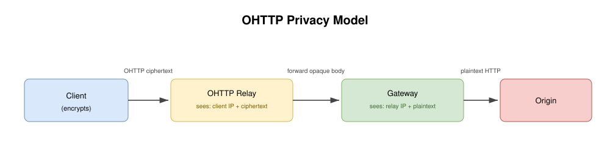
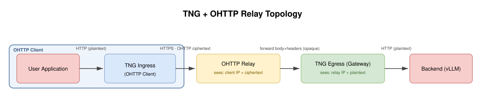

## Use Case 8: OHTTP Relay for Extra Privacy

[中文文档](README_zh.md)

### Scenario Overview

- **Goal**: Insert a public OHTTP relay between the TNG client and the TNG server so that the server (the OHTTP gateway) cannot see the client's IP address, on top of the OHTTP content encryption TNG already provides.
- **Approach**:
  - The TNG Ingress acts as the OHTTP client: it fetches the gateway key config, encrypts the request, and POSTs the OHTTP ciphertext to a public relay over HTTPS.
  - The relay is a blind forwarder: it terminates TLS, then forwards the opaque ciphertext and headers unchanged to the TNG Egress (the OHTTP gateway) configured as its target.
  - The TNG Egress decrypts the ciphertext and sends the plaintext to the local backend (for example, a vLLM inference service).
- **Effect**:
  - The relay knows the client IP but only sees ciphertext; the gateway sees plaintext but only the relay's IP. Neither party alone can link a client identity to the request content.
  - Without the relay, the gateway would hold both the plaintext and the client IP after decryption, letting it correlate a user's requests over time. The relay closes that gap.
  - The application only points at the relay domain; the backend runs unmodified.

### OHTTP Privacy Principle

Oblivious HTTP (RFC 9458) separates the client's identity from the request content by splitting the path across two non-colluding parties: a relay and a gateway. The client encrypts the request with the gateway's HPKE public key and POSTs the ciphertext to the relay. The relay forwards the opaque body to the gateway without ever decrypting it. The gateway decrypts and forwards the plaintext to the origin.

The privacy comes from that split:



| Party | Sees the client IP? | Sees the request content? |
|---|---|---|
| OHTTP relay | ✅ | ❌ (ciphertext only) |
| OHTTP gateway | ❌ (only the relay IP) | ✅ (plaintext after decrypt) |

The relay knows the source but only sees ciphertext; the gateway sees the plaintext but only the relay's address. To link a request to a client, an adversary would need to compromise both parties at once.

### TNG with an OHTTP Relay

TNG maps directly onto the OHTTP roles above. The TNG Ingress is the OHTTP client: it fetches the gateway key config, encrypts the request, and POSTs the ciphertext to a public relay over HTTPS. The relay is a blind forwarder that terminates TLS and forwards the opaque body to the TNG Egress. The TNG Egress is the OHTTP gateway: it decrypts and sends the plaintext to the local backend, such as a vLLM inference service.



In this scenario's demo the relay is an Aliyun Function Compute function (Node.js) and the egress runs on an Aliyun ECS (TDX-capable, Alibaba Cloud Linux 3). nginx on the ECS terminates TLS on the relay-to-egress leg (`:8443`) and proxies plain HTTP to the egress listener (`localhost:9000`); it is a TLS terminator for that hop, not the relay. TNG's OHTTP already encrypts the request end to end, so any on-path node between the client and the gateway sees only ciphertext, which protects content. On its own that does not protect the client's identity: when the client reaches the gateway directly, the gateway holds the plaintext and the client IP together and can group a user's requests over time. Inserting the relay closes that gap by giving the gateway only the relay's IP. Remote attestation (built-in AS) still verifies the egress is a trusted confidential backend before the tunnel is established; it is not drawn as a separate node because this scenario uses the built-in AS.

### Relay Options

Public managed OHTTP relays exist as products:

- Cloudflare Privacy Gateway: https://www.cloudflare.com/privacy-platform/
- Fastly OHTTP Relay: https://www.fastly.com/blog/enabling-privacy-on-the-internet-with-oblivious-http
- Oblivious HTTP, RFC 9458: https://www.rfc-editor.org/info/rfc9458

The current demo provides an FC-based relay (see below).

### Server-side TNG (Egress) Configuration Example

The egress is the OHTTP gateway. It owns the HPKE key, decrypts the ciphertext the relay forwards in, and sends the plaintext to the local backend. The demo uses `mapping` mode: an explicit OHTTP listener (`:9000`) forwards decrypted plaintext to the backend (`:8080`). This is required when an in-path TLS proxy (nginx) fronts the egress, because netfilter cannot capture loopback traffic from that proxy.

```json
{
    "add_egress": [
        {
            "mapping": {
                "in": { "host": "127.0.0.1", "port": 9000 },
                "out": { "host": "127.0.0.1", "port": 8080 }
            },
            "ohttp": {
                "key": {
                    "source": "self_generated",
                    "rotation_interval": 300
                }
            },
            "no_ra": true
        }
    ]
}
```

- **Key Points**:
  - **`mapping`**: `in` is the OHTTP listener the relay (via nginx) forwards to; `out` is the local backend. Use `netfilter.capture_dst` instead when the relay forwards to a dedicated port on the egress node and there is no in-path TLS proxy (netfilter is Linux-only). See [scenario 05](../05-vllm-ohttp-cluster/README.md) for a cluster using `peer_shared` keys.
  - **`ohttp.key.source: "self_generated"`**: the egress generates and rotates its own HPKE key pair. This is the right choice for a single gateway node. For a cluster of gateways behind one relay, use `"peer_shared"` so any node can decrypt.
  - **`forward_client_ip`** (default on): the egress injects `X-Real-IP` and `X-Forwarded-For` carrying the direct client IP it sees (its direct TCP peer). When nginx fronts the egress (as in the demo) that peer is the local proxy, so no real client IP reaches the backend through these headers. The demo's anonymity table confirms the gateway saw no client IP there.
  - **`no_ra: true`**: the demo runs remote attestation off so it needs no AA/AS services. The ECS is TDX-capable; flip RA on later with an `attest` block and the built-in attester (see [remote_attestation.md](../../remote_attestation.md)).

### Client-side TNG (Ingress) Configuration Example

The ingress is the OHTTP client. The application sends ordinary HTTP to the relay domain through this local proxy. TNG fetches the key config from the relay (which proxies it to the egress), encrypts the request, and POSTs the ciphertext to the relay over HTTPS.

```json
{
    "add_ingress": [
        {
            "http_proxy": {
                "proxy_listen": {
                    "host": "0.0.0.0",
                    "port": 41000
                },
                "dst_filters": {
                    "domain": "relay.example.com",
                    "port": 443
                }
            },
            "ohttp": {
                "tls": true,
                "path_default": "original"
            },
            "no_ra": true
        }
    ]
}
```

- **Key Points**:
  - **`dst_filters`**: only requests to the relay domain on port 443 enter the TNG OHTTP tunnel; other traffic is forwarded as a plain HTTP proxy. TNG builds the OHTTP base URL from this destination, so both the key-config fetch and the tunnel POST go to the relay.
  - **`ohttp.tls: true`**: wraps the outer OHTTP POST in HTTPS, since the relay is a public service reached over TLS. The relay terminates this TLS.
  - **`ohttp.path_default: "original"`**: keeps the request path on the outer OHTTP POST so it matches the relay's HTTP trigger path. Without this the ingress rewrites the path and the relay rejects it.
  - **Remote attestation is omitted** from this runnable config (`no_ra: true`). When RA is needed, add a `verify` block with `as_type: "builtin"`:

    ```json
    "verify": {
        "model": "background_check",
        "as_type": "builtin",
        "attestation_policy": { "type": "inline", "content": "<base64-encoded-policy>" },
        "reference_values": []
    }
    ```

    See [remote_attestation.md](../../remote_attestation.md) for policy and reference-value setup.

### Demo: Aliyun Deployment

The [`demo/`](demo/) directory is a reproducible, fully scripted bring-up of this scenario on Aliyun, run by [`demo/run-demo.sh`](demo/run-demo.sh). It provisions, runs one request end to end, prints an anonymity verification table, and tears down.

**What it provisions** ([`demo/terraform/`](demo/terraform)):

- An Aliyun ECS (Alibaba Cloud Linux 3, `g8i` TDX-capable) running the TNG egress (mapping mode, `no_ra`), an echo backend on `:8080`, and nginx on `:8443` as the relay-to-egress TLS terminator. cloud-init ([`demo/terraform/user-data.sh`](demo/terraform/user-data.sh)) installs all three and issues a Let's Encrypt short-lived IP certificate for the ECS public IP (best-effort, with a self-signed fallback at boot so `:8443` always listens). IP certificates are for demo/eval only; production uses a domain certificate.
- An Aliyun Function Compute 3.0 function ([`demo/fc-relay/index.js`](demo/fc-relay/index.js), built-in `nodejs20`) as the OHTTP relay. It is a blind forwarder: it forwards the OHTTP ciphertext and the `x-tng-ohttp-api` header to the egress URL and never decrypts.
- A VPC with a NAT gateway + EIP + SNAT so the FC relay has a fixed public egress IP. The ECS SG `:8443` is narrowed to that EIP's `/32`, and `:22` to the demo runner's own `/32`.
- An SSH keypair generated in-place by Terraform (written to a gitignored local file) so `run-demo.sh` can run a one-shot capture on the ECS.

**Prerequisites**: run as root (raw-socket capture); `tng`, `tshark`, `terraform`, `git`, `go` on PATH; `ALICLOUD_ACCESS_KEY`, `ALICLOUD_SECRET_KEY`, `ALICLOUD_REGION` in the environment.

**Run**:

```bash
export ALICLOUD_ACCESS_KEY=...  ALICLOUD_SECRET_KEY=...  ALICLOUD_REGION=cn-beijing
bash demo/run-demo.sh             # bring up, send a request, print the anonymity table
bash demo/run-demo.sh --destroy   # tear everything down
```

`setup-provider.sh` clones and builds the inclavare-containers `terraform-provider-alicloud` fork (the `security_options` block for TDX) into a sibling gitignored dir and points Terraform at it via `dev_overrides`; it is idempotent.

### Anonymity Verification

`run-demo.sh` does not just claim the relay anonymizes the client; it measures it. It captures the TLS ClientHello on both legs with `tshark` (Leg A: ingress to relay, on the runner; Leg B: relay to ECS, on the ECS over SSH), computes the JA3 fingerprint for each, and compares what the gateway saw against what the client sent across several dimensions. This is the real output from a run (the client's own IP is redacted to a documentation-reserved address):

```text
  OHTTP relay anonymity probe
  ---------------------------------------------------------------------------------------------------------------------
  dimension          client sent                                gateway saw                                verdict
  ---------------------------------------------------------------------------------------------------------------------
  TCP source IP      198.51.100.1                              127.0.0.1                                  ANONYMIZED
  X-Real-IP          <none>                                     <none>                                     ANONYMIZED
  X-Forwarded-For    <none>                                     <none>                                     ANONYMIZED
  TLS fingerprint    afa03e6b2838b4a1435904b2faebad74           6f7da855939e3f167f29efc5e1e03185           ANONYMIZED
  SNI                tng-relay-zvnktyejeb.cn-beijing.fcapp.run  <none>                                     ANONYMIZED
  ALPN               h2,http/1.1                                <none>                                     ANONYMIZED
  ---------------------------------------------------------------------------------------------------------------------
  User-Agent         tng-demo/1.0                               tng-demo/1.0                               VISIBLE (permitted)
  Accept             application/json                           application/json                           VISIBLE (permitted)
  ---------------------------------------------------------------------------------------------------------------------
  note: teardown  run-demo.sh --destroy
  note: content headers are out of OHTTP scope; hiding them needs app-layer anonymization
```

The IP-family dimensions and the TLS fingerprint/SNI/ALPN are ANONYMIZED: the relay re-originates the TLS connection, so the gateway sees the relay's stack and address, never the client's. The content headers (User-Agent, Accept) are VISIBLE because OHTTP hides the client's network identity, not the HTTP content; hiding those needs application-layer anonymization (opaque tokens, header stripping), which is out of OHTTP's scope. A `N/A` verdict means a capture missed the ClientHello, not a judgment.

### End-to-End Test

The demo's request goes through the local TNG ingress as a plain-HTTP proxy request to the relay host on 443; `ohttp.tls` wraps the outer OHTTP POST in HTTPS to the relay (an HTTP proxy cannot encapsulate HTTPS `CONNECT`, so the inner request is plain HTTP):

```bash
# run-demo.sh sends this through the local ingress (ohttp.tls makes the outer POST HTTPS).
curl -x http://127.0.0.1:41000 \
     http://relay.example.com:443/ \
     -H "accept: application/json" -H "user-agent: tng-demo/1.0"
```

- `-x` directs the request through the local TNG ingress.
- The target is the relay domain on port 443; TNG fetches the key config from the relay, encrypts the request, and POSTs the ciphertext to the relay's gateway endpoint.
- The relay forwards the opaque ciphertext to the egress, which decrypts and sends the plaintext to the local backend.
- The response follows the reverse path: the egress encrypts it, the relay forwards the ciphertext back, and the ingress decrypts it for the application.

`run-demo.sh` automates this and prints the anonymity table above. To confirm the privacy split by hand, inspect the logs: the relay sees the client IP and an encrypted OHTTP body it cannot decode; the egress sees the relay IP and the decrypted request.
