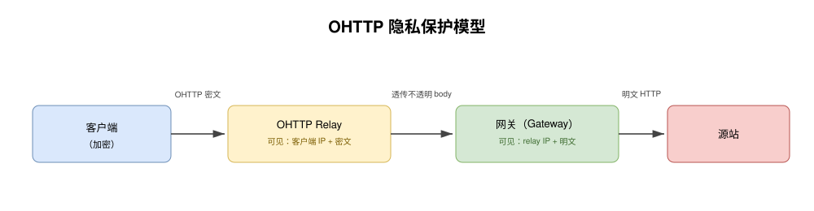
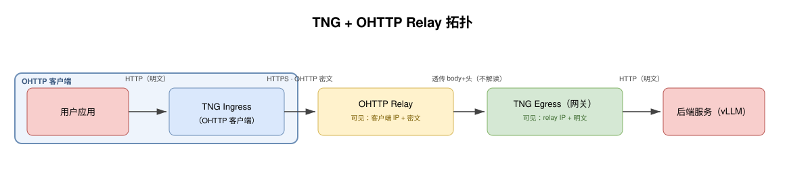

## 场景 8：OHTTP Relay 带来的额外隐私保护

[English](README.md)

### 场景概述

- **目标**：在 TNG 客户端与 TNG 服务端之间插入一个公共 OHTTP relay，使服务端（OHTTP gateway）看不到客户端 IP，在 TNG 已有的 OHTTP 内容加密之上再加一层身份隐私保护。
- **方案**：
  - TNG Ingress 充当 OHTTP 客户端：拉取 gateway 的 key 配置，加密请求，以 HTTPS 把 OHTTP 密文 POST 到一个公共 relay。
  - relay 是一个盲转发器：终结 TLS，然后把不透明的密文和头部原样转发到配置为目标地址的 TNG Egress（OHTTP gateway）。
  - TNG Egress 解密密文，把明文发给本地后端（例如 vLLM 推理服务）。
- **效果**：
  - relay 知道客户端 IP 但只见密文；gateway 见明文但只见 relay IP。单方都无法把客户端身份与请求内容关联。
  - 不经 relay 时，gateway 解密后同时持有明文和客户端 IP，可按来源聚合并关联同一用户的多次请求。relay 正是堵住这个缺口。
  - 应用只需指向 relay 域名；后端无需改动。

### OHTTP 隐私保护原理

Oblivious HTTP（RFC 9458）通过把路径拆到两个不串谋的参与方（relay 与 gateway）来把客户端身份与请求内容分离。客户端用 gateway 的 HPKE 公钥加密请求，把密文 POST 给 relay；relay 把不透明 body 转发给 gateway，全程不解密；gateway 解密后把明文发给源站。

隐私正来自这个拆分：



| 参与方 | 可见客户端 IP？ | 可见请求内容？ |
|---|---|---|
| OHTTP relay | ✅ | ❌（仅密文） |
| OHTTP gateway | ❌（仅 relay IP） | ✅（解密后明文） |

relay 知道来源但只见密文；gateway 见明文但只见 relay 地址。要把请求关联到客户端，攻击者必须同时攻破两方。

### TNG 与 OHTTP Relay

TNG 直接对应上述 OHTTP 角色。TNG Ingress 即 OHTTP 客户端：拉取 gateway 的 key 配置，加密请求，以 HTTPS 把密文 POST 给公共 relay。relay 是盲转发器，终结 TLS，把不透明 body 转发给 TNG Egress。TNG Egress 即 OHTTP gateway：解密后把明文发给本地后端，例如 vLLM 推理服务。



本场景 demo 中 relay 是一个阿里云函数计算（FC）函数（Node.js），egress 跑在一台阿里云 ECS（TDX 能力，Alibaba Cloud Linux 3）上。ECS 上的 nginx 在 relay 到 egress 这一跳上终结 TLS（`:8443`），并把明文 HTTP 代理给 egress 监听端口（`localhost:9000`）；它是这一跳的 TLS 终结器，不是 relay。TNG 的 OHTTP 已经对请求做端到端加密，客户端到 gateway 之间路径上的任何节点都只能看到密文，保护了内容。但仅此并不保护客户端身份：当客户端直连 gateway 时，gateway 同时持有明文和客户端 IP，可按来源对请求分组。插入 relay 后，gateway 只能看到 relay IP，堵住这个缺口。远程证明（内置 AS）仍会在建隧道前验证 egress 是可信的机密后端；本场景使用内置 AS，因此不单画为一个节点。

### Relay 方案

公共托管 OHTTP relay 作为产品已经存在：

- Cloudflare Privacy Gateway: https://www.cloudflare.com/privacy-platform/
- Fastly OHTTP Relay: https://www.fastly.com/blog/enabling-privacy-on-the-internet-with-oblivious-http
- Oblivious HTTP，RFC 9458: https://www.rfc-editor.org/info/rfc9458

当前 demo 提供一个基于函数计算（FC）的 relay（见下文）。

### 服务端 TNG（Egress）配置示例

egress 即 OHTTP gateway。它持有 HPKE key，解密 relay 转发进来的密文，把明文发给本地后端。demo 用 `mapping` 模式：一个显式 OHTTP 监听端口（`:9000`）把解密后的明文转发给后端（`:8080`）。当前端有 TLS 代理（nginx）时必须用 mapping，因为 netfilter 抓不到该代理的 loopback 流量。

```json
{
    "add_egress": [
        {
            "mapping": {
                "in": { "host": "127.0.0.1", "port": 9000 },
                "out": { "host": "127.0.0.1", "port": 8080 }
            },
            "ohttp": {
                "key": {
                    "source": "self_generated",
                    "rotation_interval": 300
                }
            },
            "no_ra": true
        }
    ]
}
```

- **要点**：
  - **`mapping`**：`in` 是 relay（经 nginx）转发目标的 OHTTP 监听端口；`out` 是本地后端。当 relay 直接转发到 egress 节点上的专用端口且无前端 TLS 代理时，改用 `netfilter.capture_dst`（netfilter 仅限 Linux）。集群共用一个 relay 的 `peer_shared` 密钥见 [场景 05](../05-vllm-ohttp-cluster/README_zh.md)。
  - **`ohttp.key.source: "self_generated"`**：egress 自行生成并轮换 HPKE 密钥对，适合单 gateway 节点。若 gateway 为集群且共用一个 relay，用 `"peer_shared"` 使任意节点都能解密。
  - **`forward_client_ip`**（默认开启）：egress 把它看到的直接客户 IP（即其直接 TCP 对端）注入 `X-Real-IP` 与 `X-Forwarded-For`。当 nginx 前置 egress（如 demo）时该对端是本地代理，客户端真实 IP 不会经此头部到达后端。demo 的匿名表确认 gateway 在此未看到客户端 IP。
  - **`no_ra: true`**：demo 关闭远程证明，不需要 AA/AS 服务。ECS 具备 TDX 能力；后续可加 `attest` 块并用内置 attester 打开 RA（见 [remote_attestation_zh.md](../../remote_attestation_zh.md)）。

### 客户端 TNG（Ingress）配置示例

ingress 即 OHTTP 客户端。应用通过这个本地代理以普通 HTTP 访问 relay 域名。TNG 从 relay 拉取 key 配置（relay 再代理到 egress），加密请求，以 HTTPS 把密文 POST 到 relay。

```json
{
    "add_ingress": [
        {
            "http_proxy": {
                "proxy_listen": {
                    "host": "0.0.0.0",
                    "port": 41000
                },
                "dst_filters": {
                    "domain": "relay.example.com",
                    "port": 443
                }
            },
            "ohttp": {
                "tls": true,
                "path_default": "original"
            },
            "no_ra": true
        }
    ]
}
```

- **要点**：
  - **`dst_filters`**：仅访问 relay 域名 443 端口的请求进入 TNG OHTTP 隧道，其他流量按普通 HTTP 代理转发。TNG 以此目的地构建 OHTTP base URL，因此 key 拉取和 tunnel POST 都打到 relay。
  - **`ohttp.tls: true`**：外层 OHTTP POST 走 HTTPS，因为 relay 是经 TLS 访问的公共服务，由 relay 终结 TLS。
  - **`ohttp.path_default: "original"`**：外层 OHTTP POST 保留原请求路径，以匹配 relay 的 HTTP 触发路径。否则 ingress 会改写路径，relay 拒绝。
  - **此可运行配置省略远程证明**（`no_ra: true`）。需要 RA 时加 `verify` 块并用 `as_type: "builtin"`：

    ```json
    "verify": {
        "model": "background_check",
        "as_type": "builtin",
        "attestation_policy": { "type": "inline", "content": "<base64 编码的策略>" },
        "reference_values": []
    }
    ```

    策略与参考值配置见 [remote_attestation_zh.md](../../remote_attestation_zh.md)。

### Demo：阿里云部署

[`demo/`](demo/) 目录是在阿里云上可复现、全自动搭起本场景的脚本，由 [`demo/run-demo.sh`](demo/run-demo.sh) 驱动：它开通资源、跑一个端到端请求、打印匿名验证表、再销毁。

**开通内容**（[`demo/terraform/`](demo/terraform)）：

- 一台阿里云 ECS（Alibaba Cloud Linux 3，`g8i` TDX 能力），运行 TNG egress（mapping 模式，`no_ra`）、`:8080` 上的回显后端，以及 `:8443` 上的 nginx 作为 relay 到 egress 的 TLS 终结器。cloud-init（[`demo/terraform/user-data.sh`](demo/terraform/user-data.sh)）装好三者，并为 ECS 公网 IP 申请 Let's Encrypt 短期 IP 证书（best-effort，启动时先自签兜底，保证 `:8443` 始终监听）。IP 证书仅供 demo/评估；生产用域名证书。
- 一个阿里云函数计算 3.0 函数（[`demo/fc-relay/index.js`](demo/fc-relay/index.js)，内置 `nodejs20`）充当 OHTTP relay。它是盲转发器：把 OHTTP 密文和 `x-tng-ohttp-api` 头转发到 egress URL，全程不解密。
- 一个 VPC，带 NAT 网关 + EIP + SNAT，使 FC relay 有固定公网出口 IP。ECS 安全组 `:8443` 收窄到该 EIP 的 `/32`，`:22` 收窄到 demo 运行机自身的 `/32`。
- 一个由 Terraform 现场生成的 SSH 密钥对（私钥写到本地 gitignored 文件），供 `run-demo.sh` 在 ECS 上做一次性抓包。

**前置条件**：以 root 运行（需要 raw-socket 抓包）；PATH 上有 `tng`、`tshark`、`terraform`、`git`、`go`；环境变量有 `ALICLOUD_ACCESS_KEY`、`ALICLOUD_SECRET_KEY`、`ALICLOUD_REGION`。

**运行**：

```bash
export ALICLOUD_ACCESS_KEY=...  ALICLOUD_SECRET_KEY=...  ALICLOUD_REGION=cn-beijing
bash demo/run-demo.sh             # 开通、发一个请求、打印匿名表
bash demo/run-demo.sh --destroy   # 销毁一切
```

`setup-provider.sh` 把 inclavare-containers 的 `terraform-provider-alicloud` fork（TDX 的 `security_options` 块）克隆并构建到一个相邻的 gitignored 目录，通过 `dev_overrides` 指给 Terraform；该脚本幂等。

### 匿名性验证

`run-demo.sh` 不是空口声称 relay 匿名了客户端，而是实测。它用 `tshark` 在两段抓取 TLS ClientHello（Leg A：ingress 到 relay，在运行机本地；Leg B：relay 到 ECS，经 SSH 在 ECS 上），各自算出 JA3 指纹，并在多个维度上把 gateway 所见与客户端发出做对比。下面是一次真实运行的输出（客户端自身 IP 已抹成文档保留地址）：

```text
  OHTTP relay anonymity probe
  ---------------------------------------------------------------------------------------------------------------------
  dimension          client sent                                gateway saw                                verdict
  ---------------------------------------------------------------------------------------------------------------------
  TCP source IP      198.51.100.1                              127.0.0.1                                  ANONYMIZED
  X-Real-IP          <none>                                     <none>                                     ANONYMIZED
  X-Forwarded-For    <none>                                     <none>                                     ANONYMIZED
  TLS fingerprint    afa03e6b2838b4a1435904b2faebad74           6f7da855939e3f167f29efc5e1e03185           ANONYMIZED
  SNI                tng-relay-zvnktyejeb.cn-beijing.fcapp.run  <none>                                     ANONYMIZED
  ALPN               h2,http/1.1                                <none>                                     ANONYMIZED
  ---------------------------------------------------------------------------------------------------------------------
  User-Agent         tng-demo/1.0                               tng-demo/1.0                               VISIBLE (permitted)
  Accept             application/json                           application/json                           VISIBLE (permitted)
  ---------------------------------------------------------------------------------------------------------------------
  note: teardown  run-demo.sh --destroy
  note: content headers are out of OHTTP scope; hiding them needs app-layer anonymization
```

IP 类维度和 TLS 指纹/SNI/ALPN 都是 ANONYMIZED：relay 重新发起 TLS 连接，gateway 看到的是 relay 的栈和地址，看不到客户端的。内容头（User-Agent、Accept）是 VISIBLE，因为 OHTTP 隐藏的是客户端网络身份，不是 HTTP 内容；要藏这些需应用层匿名化（不透明 token、剥离头部），不在 OHTTP 范畴内。`N/A` 表示抓包没抓到 ClientHello，不是判定。

### 端到端测试

demo 的请求经本地 TNG ingress 作为普通 HTTP 代理请求发往 relay 主机 443 端口；`ohttp.tls` 把外层 OHTTP POST 包成 HTTPS 发给 relay（HTTP 代理无法封装 HTTPS `CONNECT`，故内层请求是明文 HTTP）：

```bash
# run-demo.sh 经本地 ingress 发送（ohttp.tls 使外层 POST 为 HTTPS）。
curl -x http://127.0.0.1:41000 \
     http://relay.example.com:443/ \
     -H "accept: application/json" -H "user-agent: tng-demo/1.0"
```

- `-x` 让请求经本地 TNG ingress。
- 目标是 relay 域名 443 端口；TNG 从 relay 拉取 key 配置，加密请求，把密文 POST 到 relay 的 gateway 端点。
- relay 把不透明密文转发到 egress，egress 解密后把明文发给本地后端。
- 响应沿原路返回：egress 加密，relay 转发密文回，ingress 解密给应用。

`run-demo.sh` 自动完成上述步骤并打印上面的匿名表。想手工确认隐私拆分，可查日志：relay 看到客户端 IP 和它无法解码的加密 OHTTP body；egress 看到 relay IP 和解密后的请求。
