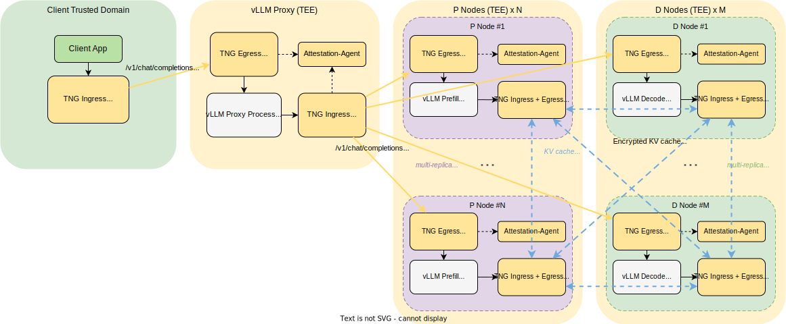

## 用例 6：vLLM P/D 分离 + NIXL/UCX KV Cache 传输加密

[English Document](scenario_vllm_pd_separation.md)

### 场景概述

- **目标**: 在 vLLM 分离式预填充/解码（P/D）架构下，P 节点和 D 节点部署在不同主机上，通过 NIXL Connector 和 UCX 进行 KV cache 传输。TNG 为三段通信链路提供端到端安全保护：
  1. **用户 → vLLM Proxy**: OHTTP 加密 + 单向远程证明（用户验证 Proxy 的 TEE 身份）
  2. **vLLM Proxy → P/D 节点**: OHTTP 加密 + 双向远程证明
  3. **P ↔ D KV Cache**: Rats-TLS（`multiplex: false`）加密 + 双向远程证明
- **方式**:
  - vLLM Proxy 运行在独立 TEE 中，接收用户推理请求并路由到 P 或 D 节点
  - P 和 D 节点使用对称的 TNG 配置——任何节点既可充当 KV cache 服务端，也可充当客户端
  - KV cache 端口范围（5000-5031）通过 `netfilter` + `port_end` 捕获，由 rats-tls 加密，每流独立 TLS 会话以保证高带宽吞吐
- **效果**:
  - 用户请求全程加密，vLLM Proxy 在可验证的 TEE 中运行
  - Proxy 到 P/D 的推理请求通过 OHTTP 加密 + 双向 RA
  - P↔D KV cache 传输使用 rats-tls 独立流加密（`multiplex: false`），避免单连接带宽瓶颈
  - vLLM NIXL/UCX 无需修改任何代码——UCX 仍连接原始 KV cache 端口，由 iptables 在 netfilter 层透明重定向

### 拓扑图



### 节点地址分配

| 节点 | 角色 | IP 地址 |
| --- | --- | --- |
| vLLM Proxy | 推理请求路由（不负责推理计算） | `10.0.0.1` |
| P 节点 | vLLM Prefill 实例（KV cache 服务端） | `10.0.0.10` |
| D 节点 | vLLM Decode 实例（KV cache 客户端） | `10.0.0.20` |

### 用户侧 TNG Client 配置

用户通过 TNG Client 发起推理请求，使用 `mapping` 模式 + OHTTP + 单向 RA（verify）：

```json
{
    "add_ingress": [
        {
            "mapping": {
                "in": { "host": "127.0.0.1", "port": 8080 },
                "out": { "host": "10.0.0.1", "port": 8080 }
            },
            "ohttp": {},
            "verify": {
                "as_addr": "<attestation-service-url>",
                "policy_ids": ["default"]
            }
        }
    ]
}
```

- **关键说明**:
  - 用户应用连接 `127.0.0.1:8080`，TNG 通过 OHTTP 加密发送到 `10.0.0.1:8080` 的 vLLM Proxy
  - **`verify`** 确保用户侧 TNG 在建立隧道前通过远程证明验证 Proxy 的 TEE 身份（单向 RA）
  - **Tip**: 如果不喜欢 mapping 模式，也可以使用 TNG 的 HTTP proxy 模式（端口 41000），在应用中配置 HTTP proxy 指向 TNG Client 即可

### vLLM Proxy 侧 TNG 配置

vLLM Proxy 部署在独立 TEE 中，需要两份配置：接收用户请求（egress 8080）和转发推理请求到 P/D 节点（ingress 8080）：

```json
{
    "add_ingress": [
        {
            "netfilter": {
                "capture_dst": [
                    { "port": 8080 }
                ]
            },
            "ohttp": {},
            "attest": {
                "aa_addr": "unix:///run/confidential-containers/attestation-agent/attestation-agent.sock"
            },
            "verify": {
                "as_addr": "<attestation-service-url>",
                "policy_ids": ["default"]
            }
        }
    ],
    "add_egress": [
        {
            "netfilter": {
                "capture_dst": [
                    { "port": 8080 }
                ]
            },
            "ohttp": {},
            "attest": {
                "aa_addr": "unix:///run/confidential-containers/attestation-agent/attestation-agent.sock"
            }
        }
    ]
}
```

- **关键说明**:
  - **egress 8080**: 接收来自用户的 OHTTP 加密请求（单向 RA——Proxy 作为 Attester，被用户验证），解密后转发给本地监听 8080 端口的 vLLM Proxy 进程
  - **ingress 8080**: vLLM Proxy 主动向 P/D 节点的 8080 端口发起推理请求，通过 OHTTP 加密 + 双向 RA（同时配置 `attest` 和 `verify`）
  - 同时配置 `attest` 和 `verify`，使 Proxy 既能证明自身的 TEE 身份，也能验证 P/D 节点的身份

### P/D 节点 TNG 配置（对称配置）

P 和 D 节点使用相同的 TNG 配置。每个节点处理两类流量：接收来自 Proxy 的推理请求（egress 8080，OHTTP）以及 P↔D 之间的双向 KV cache 传输（ingress + egress 5000-5031，rats-tls）：

```json
{
    "add_ingress": [
        {
            "netfilter": {
                "capture_dst": [
                    { "port": 5000, "port_end": 5031 }
                ]
            },
            "rats_tls": {
                "multiplex": false
            },
            "attest": {
                "aa_addr": "unix:///run/confidential-containers/attestation-agent/attestation-agent.sock"
            },
            "verify": {
                "as_addr": "<attestation-service-url>",
                "policy_ids": ["default"]
            }
        }
    ],
    "add_egress": [
        {
            "netfilter": {
                "capture_dst": [
                    { "port": 8080 }
                ]
            },
            "ohttp": {},
            "attest": {
                "aa_addr": "unix:///run/confidential-containers/attestation-agent/attestation-agent.sock"
            },
            "verify": {
                "as_addr": "<attestation-service-url>",
                "policy_ids": ["default"]
            }
        },
        {
            "netfilter": {
                "capture_dst": [
                    { "port": 5000, "port_end": 5031 }
                ]
            },
            "rats_tls": {
                "multiplex": false
            },
            "attest": {
                "aa_addr": "unix:///run/confidential-containers/attestation-agent/attestation-agent.sock"
            },
            "verify": {
                "as_addr": "<attestation-service-url>",
                "policy_ids": ["default"]
            }
        }
    ]
}
```

- **关键说明**:
  - **egress 8080（OHTTP）**: 接收来自 vLLM Proxy 的推理请求。Proxy 主动发起连接（ingress），P/D 节点被动接受连接（egress）——OHTTP 加密 + 双向 RA
  - **ingress 5000-5031（rats-tls）**: 当本节点主动向对端发起 KV cache 传输时（例如 D 从 P 拉取），主动连接对端的 KV cache 端口范围——rats-tls `multiplex: false`，每流独立 TLS 会话 + 双向 RA
  - **egress 5000-5031（rats-tls）**: 当对端主动向本节点发起 KV cache 传输时，被动接受连接——相同的 rats-tls 和 RA 配置
  - **`rats_tls.multiplex: false`**: 每个 KV cache 传输获得独立的 TLS 会话，不使用 HTTP/2 CONNECT 隧道，实现更高的单流吞吐量——推荐用于大带宽 KV cache 场景
  - **对称配置**: P 和 D 使用完全相同的配置，角色可随时互换而无需修改配置

### vLLM 与 UCX 配置

#### 前置条件

- **vLLM 版本**: v0.8.0 或更高版本（V1 引擎内置 NixlConnector 支持）
- **NIXL 库**: 由 vLLM 依赖自动安装（`nixl[cu13] >= 0.7.1, < 0.10.0`）
- **UCX**: 推荐 >= 1.18.0 以保证稳定性
- **代理依赖**: `pip install quart`（分离式代理需要）

#### 预填充节点（P）—— `10.0.0.10`

```bash
# UCX 环境变量（使用 TCP 传输）
export UCX_TLS=tcp
export UCX_NET_DEVICES=all

# NIXL 握手端口（如果 P/D 同机部署需确保端口不冲突）
export VLLM_NIXL_SIDE_CHANNEL_PORT=5600

# 启动 vLLM 预填充模式（KV 生产者）
vllm serve <model-name> \
    --host 0.0.0.0 \
    --port 8100 \
    --kv-transfer-config '{"kv_connector":"NixlConnector","kv_role":"kv_producer","kv_rank":0}'
```

#### 解码节点（D）—— `10.0.0.20`

```bash
# UCX 环境变量（使用 TCP 传输）
export UCX_TLS=tcp
export UCX_NET_DEVICES=all

# NIXL 握手端口
export VLLM_NIXL_SIDE_CHANNEL_PORT=5600

# 启动 vLLM 解码模式（KV 消费者）
vllm serve <model-name> \
    --host 0.0.0.0 \
    --port 8200 \
    --kv-transfer-config '{"kv_connector":"NixlConnector","kv_role":"kv_consumer","kv_rank":1}'
```

#### vLLM 分离式代理 —— `10.0.0.1`

代理负责在预填充和解码节点之间路由用户请求。这是 vLLM 仓库示例中提供的独立 Quart 脚本：

```bash
# 安装代理依赖
pip install quart

# 启动分离式代理
python3 examples/online_serving/disaggregated_serving/disagg_proxy_demo.py \
    --model <model-name> \
    --prefill http://10.0.0.10:8100 \
    --decode http://10.0.0.20:8200 \
    --port 8080
```

> **注意**: vLLM 没有内置的 `python -m vllm` 分离式代理入口。`disagg_proxy_demo.py` 是示例脚本。生产部署建议使用 [vLLM Production Stack](https://github.com/vllm-project/production-stack)，它包含更完善的前缀感知路由器。

#### 客户端测试命令

```bash
# 通过 TNG Client 测试 OpenAI 兼容的 Chat Completions API
curl http://127.0.0.1:8080/v1/chat/completions \
    -H "Content-Type: application/json" \
    -d '{
        "model": "<model-name>",
        "messages": [
            {"role": "user", "content": "你好，你怎么样？"}
        ],
        "max_tokens": 100,
        "temperature": 0.7
    }'
```

#### 环境变量参考

| 变量 | 说明 | 默认值 | 备注 |
|------|------|--------|------|
| `UCX_TLS` | UCX 传输层 | — | 使用 `tcp` 纯 TCP 传输（由 TNG 拦截） |
| `UCX_NET_DEVICES` | UCX 网络设备 | — | 使用 `all` 或具体设备名（如 `mlx5_0:1`）；`tcp` 不是有效的设备名 |
| `VLLM_NIXL_SIDE_CHANNEL_PORT` | NIXL 握手端口 | `5600` | P/D 同机时需确保端口唯一 |
| `VLLM_NIXL_SIDE_CHANNEL_HOST` | NIXL 握手主机 | `localhost` | 可选 |

#### `--kv-transfer-config` 参数

| 参数 | 取值 | 说明 |
|------|------|------|
| `kv_connector` | `"NixlConnector"` | 使用 NIXL 进行 KV cache 传输 |
| `kv_role` | `"kv_producer"`, `"kv_consumer"`, `"kv_both"` | KV 传输拓扑中的角色 |
| `kv_rank` | `0`, `1` 等 | 排序等级（生产者=0，消费者=1） |
| `kv_buffer_device` | `"cuda"`, `"cpu"` | KV 缓冲区设备 |

### 典型使用步骤

1. **用户侧**:
   - 启动 TNG Client，加载上述 mapping + ohttp + verify 配置
   - 配置推理客户端连接到 `127.0.0.1:8080`

2. **vLLM Proxy 侧**（`10.0.0.1`）:
   - 在 TEE（如 TDX 虚拟机）中部署 vLLM Proxy 进程
   - 启动 Attestation Agent
   - 启动 TNG，加载上述 ingress + egress 配置
   - vLLM Proxy 进程监听 8080 端口

3. **P 节点**（`10.0.0.10`）和 **D 节点**（`10.0.0.20`）:
   - 在每个节点上启动 Attestation Agent
   - 启动 TNG，加载上述对称配置
   - 配置 UCX 和 NIXL 环境变量（见 vLLM 配置部分）
   - 启动 vLLM，使用 NixlConnector（P 节点为 `kv_producer`，D 节点为 `kv_consumer`）

4. **vLLM Proxy 侧**（`10.0.0.1`）:
   - 在 TEE（如 TDX 虚拟机）中部署 vLLM Proxy 进程和分离式代理
   - 启动 Attestation Agent
   - 启动 TNG，加载上述 ingress + egress 配置
   - 启动分离式代理，监听 8080 端口（与 TNG egress 监听端口一致）

5. **验证**:
   - 从用户客户端向 `127.0.0.1:8080` 发送推理请求
   - 请求流向：Client → (OHTTP) → Proxy → (OHTTP + 双向 RA) → P 节点（预填充）
   - 预填充完成后，D 节点通过 NIXL/UCX 从 P 节点拉取 KV cache——TCP 流量被 TNG netfilter 拦截，通过 rats-tls（`multiplex: false`）+ 双向 RA 加密传输
   - D 节点收到 KV cache 后继续解码，响应沿相同链路返回
