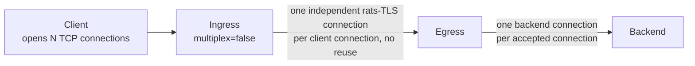
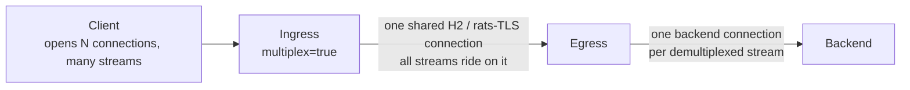
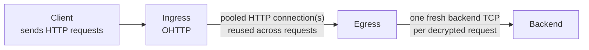
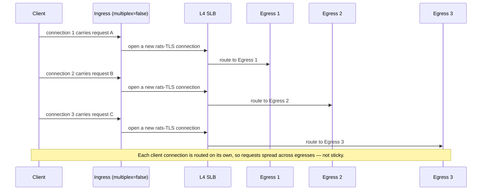
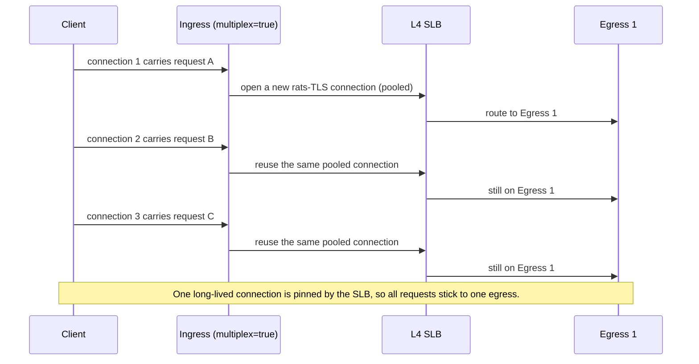
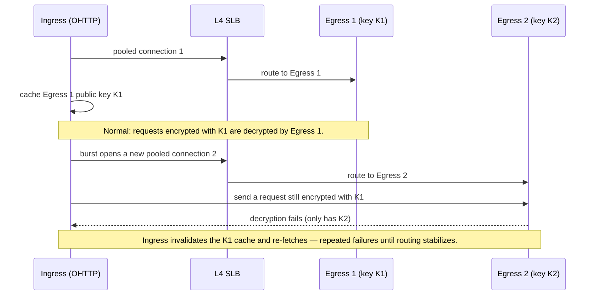
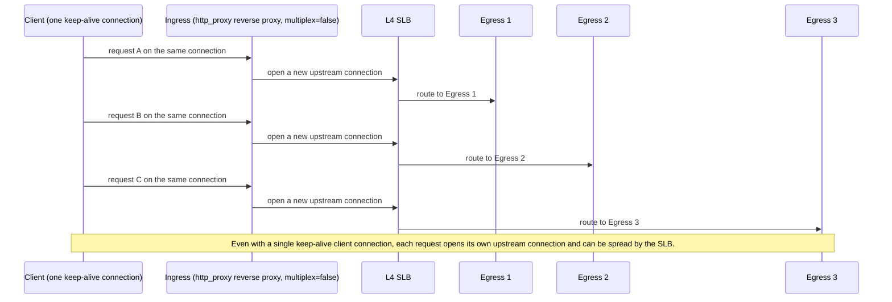

# Using TNG with a Layer-4 Load Balancer

This document explains how TNG connections behave when a Layer-4 (L4) load balancer (SLB) is placed between the ingress and the egress, and how each TNG capture mode turns client-side connections into egress-side connections. It covers the three encrypted transport modes TNG supports between ingress and egress — rats-TLS with `multiplex=false`, rats-TLS with `multiplex=true`, and OHTTP — and the TCP capture modes (UDP/QUIC is out of scope).

> **How to read this document.** "Left side" of a TNG node means the side facing the client or the upstream traffic source; "right side" means the side facing the next hop toward the backend. For ingress, left = client-facing, right = egress-facing. For egress, left = ingress-facing, right = backend-facing.

## 1. TNG request model (no load balancer)

This section assumes one ingress and one egress, with no load balancer in between. It describes how many connections each transport mode opens between ingress and egress, and how that maps to backend connections. The capture mode on the client side is assumed to be the simple `mapping` mode here; the effect of other capture modes is covered in section 3.

### 1.1 rats-TLS with `multiplex=false` (default)

Each client TCP connection accepted by the ingress becomes one dedicated, independent rats-TLS connection from ingress to egress. There is no connection pooling or reuse on this path: one client connection maps 1:1 to one ingress→egress rats-TLS connection, and the egress performs one TLS handshake per accepted connection and opens one backend connection for it.

This mode favors single-stream throughput and is recommended for high-bandwidth scenarios. The cost is one TLS handshake per client connection.

### 1.2 rats-TLS with `multiplex=true`

All client streams that target the same egress endpoint are multiplexed as HTTP/2 CONNECT tunnels over a single shared rats-TLS connection. The ingress keeps one pooled connection per destination endpoint and reuses it across many client connections, so the number of ingress→egress rats-TLS connections does not grow with the number of clients.

On the egress side, one TLS handshake is performed on the single accepted connection, then an HTTP/2 server demultiplexes each CONNECT tunnel into a separate backend connection. This mode favors many short-lived connections and reduces handshake overhead, at the cost of funneling all traffic through one TLS encryption capacity.

### 1.3 OHTTP

OHTTP does not expose a `multiplex` toggle. Instead, the ingress uses a shared HTTP client with a built-in connection pool: each client request is forwarded as an HTTP POST to the egress, and the pooled connection is reused across requests and across client connections. The egress serves the accepted connection as an HTTP server that can carry many requests over keep-alive, and opens one fresh backend TCP connection per decrypted request.

OHTTP also fetches and caches the egress's public key configuration per egress address. This caching matters for load balancing and is discussed in section 2.3.

## 2. With a load balancer between ingress and egress

When an L4 SLB sits between ingress and egress, the ingress connects to the SLB's virtual IP (VIP), and the SLB routes each connection to a backend egress. An L4 SLB routes by connection (the 5-tuple) and uses connection tracking to keep an established connection on the same backend for its lifetime. Therefore, the question of stickiness reduces to: **for a given client's requests, does the ingress reuse one upstream connection, or open a new one each time?** Reuse means the SLB keeps them on one egress; a new connection each time means the SLB can spread them.

The time-sequence diagrams below show three requests (A, B, C) from one client and trace whether each triggers a new upstream connection or reuses an existing one.

### 2.1 rats-TLS `multiplex=false` with an SLB

Each client connection causes the ingress to open a fresh upstream connection. The SLB routes each new connection independently, so the three requests land on three different egresses.

Requests are sticky only within a single keep-alive client connection (one client connection = one upstream connection that the SLB pins for its lifetime). Across multiple client connections, stickiness is not guaranteed unless the SLB is configured with source-IP persistence (so all connections from the same ingress source IP hash to the same egress). The `http_proxy` and `hook` reverse-proxy paths are an important exception to the "single keep-alive connection is sticky" rule — see section 3.3.

### 2.2 rats-TLS `multiplex=true` with an SLB

The first request opens one pooled connection, which the SLB routes to Egress 1. Subsequent requests reuse that same connection, so the SLB keeps them on Egress 1.

This is the simplest way to obtain cross-connection stickiness: a single persistent connection is naturally pinned by the SLB.

### 2.3 OHTTP with an SLB

OHTTP reuses pooled HTTP connections: when a request arrives and an idle pooled connection to the egress exists, it is reused, so the SLB keeps that traffic on whichever egress it pinned the connection to. Under burst concurrency, however, the pool may open additional simultaneous connections to the same egress address, and the SLB can route each new connection to a different egress. So OHTTP is sticky in steady state (serial or low-concurrency traffic) but not unconditionally so under bursts.

Independently of connection affinity, OHTTP has a stronger, key-based stickiness constraint. The ingress fetches and caches each egress's public key configuration, and each egress can only decrypt requests encrypted under its own key. The diagram shows what happens when the SLB routes a new pooled connection to a different egress under `self_generated` keys:

Whether the SLB needs to be sticky depends on the egress key source:

| `key.source` | Who holds the decryption key | Stickiness required behind the SLB? |
|---|---|---|
| `self_generated` | each egress holds its own unique key | Yes — the SLB must pin each ingress to one egress, otherwise requests sent to a different egress fail to decrypt |
| `file` | all egresses load the same key file | No — any egress can decrypt any request |
| `peer_shared` | egresses share a cluster-wide key ring | No — any egress can decrypt requests encrypted under any peer's key |

## 3. Connection model per capture mode (ingress left↔right, egress left↔right)

This section is about the relationship between the left side (client-facing) and the right side (egress-facing) of an ingress, and the left side (ingress-facing) and the right side (backend-facing) of an egress. It does not involve an SLB. The key variable each capture mode controls is **how many client-side connections or requests produce one accepted stream inside TNG**, because that multiplicity, combined with the transport mode from section 1, determines how many upstream connections are opened.

A central fact: **no capture mode pools upstream connections independently of `multiplex`.** The only mechanism that reuses an ingress→egress connection is the rats-TLS `multiplex=true` pool. For every capture mode, with `multiplex=false` each accepted stream opens a fresh upstream connection; with `multiplex=true` all accepted streams to the same destination endpoint reuse the single pooled connection.

### 3.1 Ingress capture modes (left → right)

| Ingress mode | How the client side maps to streams inside TNG | With `multiplex=false`, connections to egress | With `multiplex=true`, connections to egress |
|---|---|---|---|
| `mapping` | each client TCP connection produces one stream | each client connection opens its own fresh rats-TLS connection, none are reused | all streams to the same `out` endpoint share one rats-TLS connection |
| `netfilter` (TPROXY, Linux only) | each client TCP connection produces one stream, addressed to the original destination | each connection opens its own fresh connection, none reused | all streams to the same original-destination endpoint share one connection |
| `socks5` | each client CONNECT request produces one stream | each connection opens its own fresh connection, none reused | all streams to the same socks5 target endpoint share one connection |
| `http_proxy` (CONNECT tunnel) | each CONNECT request produces one stream | each CONNECT opens its own fresh connection, none reused | all streams to the same destination endpoint share one connection |
| `http_proxy` (reverse proxy) | each HTTP request produces one stream | each request opens its own fresh connection, none reused | all streams to the same destination endpoint share one connection |
| `hook` | same as `http_proxy` — one stream per CONNECT or per request | each request/CONNECT opens its own fresh connection, none reused | all streams to the same destination endpoint share one connection |

For `mapping`, `netfilter`, and `socks5`, one client TCP connection yields exactly one stream, so a single keep-alive client connection produces exactly one upstream connection under `multiplex=false` — and is therefore sticky behind an SLB.

### 3.2 Egress capture modes (left → right)

| Egress mode | How an accepted connection maps to backend connections | Notes |
|---|---|---|
| `mapping` | one TLS handshake per accepted connection, then one backend connection (or N backend connections when `multiplex=true` demultiplexes the tunnels) | always decrypts |
| `netfilter` (TPROXY, Linux only) | same as `mapping` | always decrypts |
| `hook` | decides per connection whether to decrypt or forward directly | when decryption is skipped, no TLS handshake occurs and the bytes are forwarded at the transport level |

On the egress side, one TLS handshake is always performed per accepted TCP connection. The only path that yields multiple backend connections from a single accepted connection is `multiplex=true`, where an HTTP/2 server demultiplexes the tunnels. OHTTP has its own per-request backend connection model (see section 1.3).

### 3.3 The reverse-proxy exception (why a single keep-alive client connection is not always sticky)

For `mapping`, `netfilter`, and `socks5`, one client TCP connection maps to one upstream connection, so under `multiplex=false` a single keep-alive client connection is sticky behind an SLB (section 2.1).

The `http_proxy` reverse-proxy path and the `hook` path behave differently: each HTTP request on a single keep-alive client connection produces its own accepted stream inside TNG. With `multiplex=false`, each of those streams opens a fresh upstream connection, so even a single keep-alive client connection can have its individual requests spread across different egresses by the SLB.

With `multiplex=true`, all those per-request streams share the single pooled connection and are sticky again. The practical guidance: if your client uses HTTP keep-alive through an `http_proxy` or `hook` ingress and you need all of that client's requests to land on the same egress, use `multiplex=true`, or configure the SLB for source-IP persistence, or use an OHTTP key configuration that does not require stickiness (`file` or `peer_shared`).

## Quick reference: stickiness behind an L4 SLB

| Transport mode | Capture mode | Sticky behind the SLB? | Why |
|---|---|---|---|
| rats-TLS `multiplex=false` | mapping / netfilter / socks5 | sticky only when the client reuses one keep-alive connection | one client connection maps to one upstream connection, which the SLB pins for its lifetime |
| rats-TLS `multiplex=false` | http_proxy / hook reverse proxy | no, even with keep-alive | each request opens its own upstream connection, which the SLB can spread |
| rats-TLS `multiplex=true` | all | yes | all streams share one long-lived connection, which the SLB pins |
| OHTTP | all | sticky in steady state, maybe not under bursts | pooled connections are reused (sticky); burst traffic may open extra connections the SLB spreads. `self_generated` keys force SLB stickiness regardless; `file`/`peer_shared` remove that requirement |

When the transport mode does not provide stickiness and you need it: configure the SLB with source-IP persistence so all connections from the same ingress are routed to the same egress, or switch to a transport mode that pools upstream connections.
