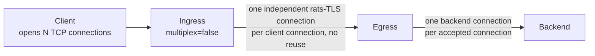
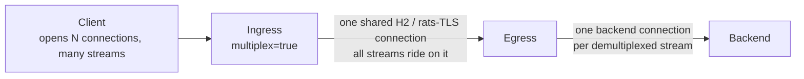
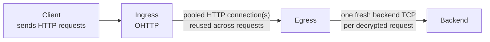
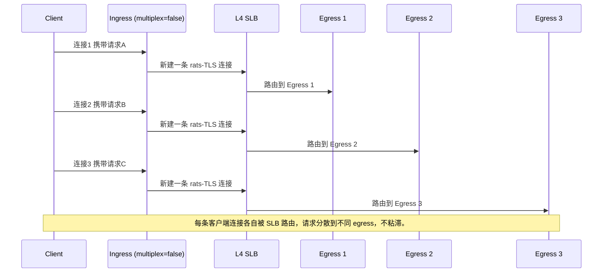
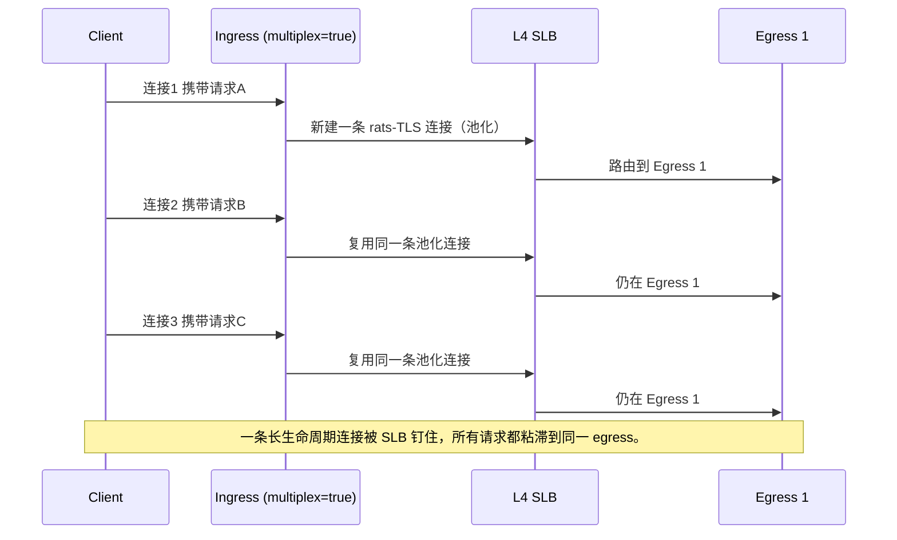
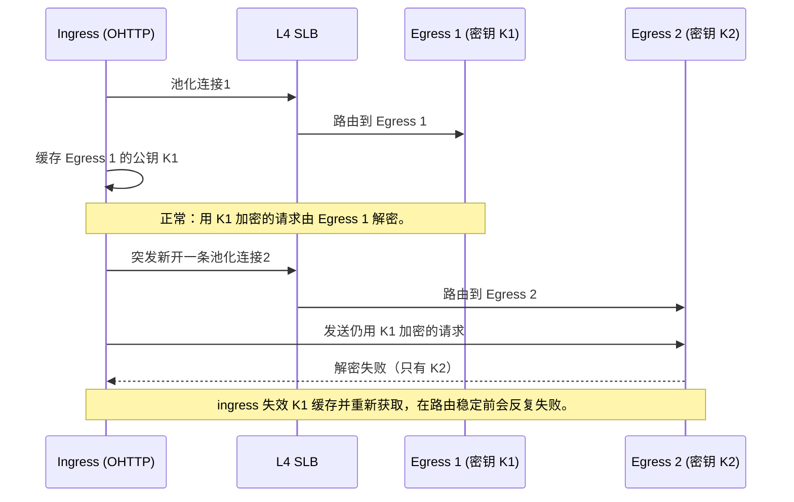
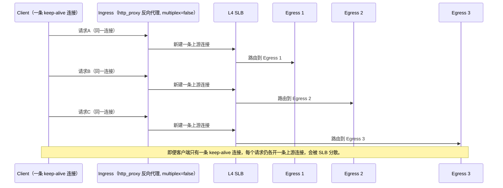

# 在四层负载均衡器场景下使用 TNG

本文说明当 ingress 和 egress 之间部署了四层（L4）负载均衡器（SLB）时，TNG 的连接行为，以及 TNG 各捕获模式如何把客户端侧的连接转换为 egress 侧的连接。覆盖 ingress 与 egress 之间支持的三种加密传输方式——rats-tls `multiplex=false`、rats-tls `multiplex=true`、OHTTP——以及 TCP 捕获模式（UDP/QUIC 不在本文范围内）。

> **阅读约定。** 某个 TNG 节点的"左侧"指面向客户端或上游流量来源的一侧，"右侧"指面向下一跳后端的一侧。对 ingress，左侧面向客户端、右侧面向 egress；对 egress，左侧面向 ingress、右侧面向后端。

## 1. TNG 请求模型（无负载均衡器）

本节假设一个 ingress 和一个 egress，中间无负载均衡器。描述每种传输方式在 ingress 与 egress 之间建立多少连接，以及如何映射到后端连接。这里假设客户端侧的捕获模式是最简单的 `mapping` 模式；其他捕获模式的影响见第 3 章。

### 1.1 rats-tls `multiplex=false`（默认）

ingress 接收的每条客户端 TCP 连接都对应一条独立的、专用的 ingress→egress rats-tls 连接。这条路径不做连接池化或复用：一条客户端连接 1:1 对应一条 ingress→egress rats-tls 连接，egress 对每条接入连接做一次 TLS 握手并为它打开一条后端连接。

该模式有利于单流吞吐量，推荐用于高带宽场景。代价是每条客户端连接一次 TLS 握手。

### 1.2 rats-tls `multiplex=true`

指向同一 egress 端点的所有客户端流，都作为 HTTP/2 CONNECT 隧道复用在一条共享的 rats-tls 连接上。ingress 为每个目标端点维护一条池化连接并跨多个客户端连接复用，因此 ingress→egress 的 rats-tls 连接数不会随客户端数量增长。

egress 侧对这条接入连接做一次 TLS 握手，然后由 HTTP/2 服务端把每个 CONNECT 隧道解复用为独立的后端连接。该模式适合大量短连接、降低握手开销，代价是所有流量都受限于单核的 TLS 加解密能力。

### 1.3 OHTTP

OHTTP 没有暴露 `multiplex` 开关。ingress 使用一个带内建连接池的共享 HTTP 客户端：每个客户端请求以 HTTP POST 转发给 egress，池化连接在请求之间、客户端连接之间复用。egress 把接入连接作为 HTTP 服务端处理，可在 keep-alive 上承载多个请求，并为每个解密后的请求打开一条新的后端 TCP 连接。

OHTTP 还会按 egress 地址获取并缓存该 egress 的公钥配置。这个缓存对负载均衡有影响，见 2.3 节。

## 2. ingress 和 egress 之间有负载均衡器

当 ingress 和 egress 之间部署 L4 SLB 时，ingress 连接到 SLB 的虚拟 IP（VIP），SLB 把每条连接路由到某个后端 egress。L4 SLB 按连接（五元组）路由，并用连接跟踪把已建立的连接在其生命周期内保持在同一个后端上。因此粘滞问题归结为：**对同一个客户端的多个请求，ingress 是复用一条上游连接，还是每次都新开一条？** 复用则 SLB 把它们留在一个 egress 上；每次新开则 SLB 可能分散它们。

下面的时序图展示同一个客户端的三个请求（A、B、C），追踪每个请求是触发新连接还是复用已有连接。

### 2.1 rats-tls `multiplex=false` + SLB

每条客户端连接都让 ingress 新开一条上游连接。SLB 把每条新连接独立路由，于是三个请求落到三个不同的 egress。

只有单条 keep-alive 客户端连接内的请求是粘滞的（一条客户端连接 = 一条上游连接，SLB 在其生命周期内钉住它）。跨多条客户端连接不保证粘滞，除非 SLB 配置了源 IP 持久化（让同一 ingress 源 IP 的所有连接哈希到同一 egress）。`http_proxy` 和 `hook` 反向代理路径是"单 keep-alive 连接即粘滞"这一规则的重要例外，见 3.3 节。

### 2.2 rats-tls `multiplex=true` + SLB

第一个请求新开一条池化连接，SLB 把它路由到 Egress 1。后续请求复用同一条连接，于是 SLB 把它们都留在 Egress 1。

这是获得跨连接粘滞最简单的方式：一条持久连接天然被 SLB 钉住。

### 2.3 OHTTP + SLB

OHTTP 复用池化的 HTTP 连接：当请求到达时若存在到 egress 的空闲池化连接则复用，SLB 把该流量保持在它所钉住的 egress 上。但在突发并发下，连接池可能向同一 egress 地址新开多条并发连接，SLB 可能把每条新连接路由到不同 egress。因此 OHTTP 在稳态（串行或低并发流量）下粘滞，但突发下并非无条件粘滞。

独立于连接亲和之外，OHTTP 还有一个更强的、基于密钥的粘滞约束：ingress 会获取并缓存每个 egress 的公钥配置，每个 egress 只能解密用自己密钥加密的请求。下图展示在 `self_generated` 密钥下，SLB 把新开的池化连接路由到另一个 egress 时会发生什么：

是否需要 SLB 粘滞，取决于 egress 的密钥来源：

| `key.source` | 谁持有解密密钥 | SLB 后是否需要粘滞？ |
|---|---|---|
| `self_generated` | 每个 egress 各自持有唯一的密钥 | 是——SLB 必须把每个 ingress 钉在一个 egress 上，否则发到别的 egress 的请求会解密失败 |
| `file` | 所有 egress 加载同一个密钥文件 | 否——任意 egress 都能解密任意请求 |
| `peer_shared` | egress 共享一个集群级密钥环 | 否——任意 egress 都能解密用任一对端密钥加密的请求 |

## 3. 各捕获模式的连接模型（ingress 左↔右、egress 左↔右）

本章讲 ingress 左侧（面向客户端）与右侧（面向 egress）的关系，以及 egress 左侧（面向 ingress）与右侧（面向后端）的关系，不涉及 SLB。每个捕获模式控制的关键变量是**客户端侧多少条连接或多少个请求会在 TNG 内部产生一个流**，因为这一倍数与第 1 章的传输方式共同决定要开多少条上游连接。

一个核心事实：**没有任何捕获模式独立于 `multiplex` 池化上游连接。** 唯一复用 ingress→egress 连接的机制是 rats-tls `multiplex=true` 的连接池。对所有捕获模式，`multiplex=false` 时每个流各开一条新上游连接；`multiplex=true` 时指向同一目标端点的所有流复用同一条池化连接。

### 3.1 Ingress 捕获模式（左 → 右）

| Ingress 模式 | 客户端侧到 TNG 内部流的对应关系 | `multiplex=false` 时到 egress 的连接 | `multiplex=true` 时到 egress 的连接 |
|---|---|---|---|
| `mapping` | 每条客户端 TCP 连接产生一个流 | 每条客户端连接各开一条新的 rats-tls 连接，互不复用 | 指向同一 `out` 端点的所有流共用一条 rats-tls 连接 |
| `netfilter`（TPROXY，仅 Linux） | 每条客户端 TCP 连接产生一个流，按原始目的地址 | 每条连接各开一条新连接，互不复用 | 指向同一原始目的端点的所有流共用一条 |
| `socks5` | 每个客户端 CONNECT 请求产生一个流 | 每条连接各开一条新连接，互不复用 | 指向同一 socks5 目标端点的所有流共用一条 |
| `http_proxy`（CONNECT 隧道） | 每个 CONNECT 请求产生一个流 | 每个 CONNECT 各开一条新连接，互不复用 | 指向同一目的端点的所有流共用一条 |
| `http_proxy`（反向代理） | 每个 HTTP 请求产生一个流 | 每个请求各开一条新连接，互不复用 | 指向同一目的端点的所有流共用一条 |
| `hook` | 同 `http_proxy`（每个 CONNECT 或每个请求一个流） | 每个请求/CONNECT 各开一条新连接，互不复用 | 指向同一目的端点的所有流共用一条 |

对 `mapping`、`netfilter`、`socks5`，一条客户端 TCP 连接只产生一个流，因此单条 keep-alive 客户端连接在 `multiplex=false` 下只产生一条上游连接——从而在 SLB 后是粘滞的。

### 3.2 Egress 捕获模式（左 → 右）

| Egress 模式 | 接入连接到后端连接的映射 | 说明 |
|---|---|---|
| `mapping` | 每条接入连接做一次 TLS 握手，再开一条后端连接（`multiplex=true` 解复用各隧道时为多条后端连接） | 始终解密 |
| `netfilter`（TPROXY，仅 Linux） | 同 `mapping` | 始终解密 |
| `hook` | 按连接决定是解密还是直接转发 | 跳过解密时不做 TLS 握手，按传输层直接转发字节 |

egress 侧对每条接入 TCP 连接总是做一次 TLS 握手。唯一能从单条接入连接产生多条后端连接的路径是 `multiplex=true`，由 HTTP/2 服务端解复用各隧道。OHTTP 有自己的按请求建立后端连接的模型（见 1.3 节）。

### 3.3 反向代理例外（为何单条 keep-alive 客户端连接不一定粘滞）

对 `mapping`、`netfilter`、`socks5`，一条客户端 TCP 连接映射到一条上游连接，因此 `multiplex=false` 下单条 keep-alive 客户端连接在 SLB 后是粘滞的（见 2.1 节）。

`http_proxy` 反向代理路径和 `hook` 路径行为不同：单条 keep-alive 客户端连接上的每个 HTTP 请求都会在 TNG 内部产生各自的流。`multiplex=false` 时，每个流各开一条新上游连接，因此即便单条 keep-alive 客户端连接，其各个请求也可能被 SLB 分散到不同 egress。

`multiplex=true` 时，这些按请求产生的流共用同一条池化连接，粘滞性恢复。实操建议：如果你的客户端通过 `http_proxy` 或 `hook` ingress 使用 HTTP keep-alive，且需要该客户端所有请求落到同一 egress，请用 `multiplex=true`，或为 SLB 配置源 IP 持久化，或使用不需要粘滞的 OHTTP 密钥配置（`file` 或 `peer_shared`）。

## 速查表：L4 SLB 后的粘滞情况

| 传输方式 | 捕获模式 | SLB 后是否粘滞？ | 原因 |
|---|---|---|---|
| rats-tls `multiplex=false` | mapping / netfilter / socks5 | 仅当客户端复用单条 keep-alive 连接时才粘滞 | 一条客户端连接对应一条上游连接，SLB 在其生命周期内钉住它 |
| rats-tls `multiplex=false` | http_proxy / hook 反向代理 | 否，即便用 keep-alive | 每个请求各开一条上游连接，SLB 会把它们分散 |
| rats-tls `multiplex=true` | 全部 | 是 | 所有流共用一条长连接，被 SLB 钉住 |
| OHTTP | 全部 | 稳态粘滞，突发可能不粘滞 | 池化连接被复用故粘滞；突发新开的连接会被 SLB 分散。`self_generated` 密钥无论如何都要求 SLB 粘滞，`file`/`peer_shared` 则不要求 |

当传输方式不提供粘滞、而你又需要粘滞时：为 SLB 配置源 IP 持久化，使同一 ingress 的所有连接路由到同一 egress；或改用会池化上游连接的传输方式。
